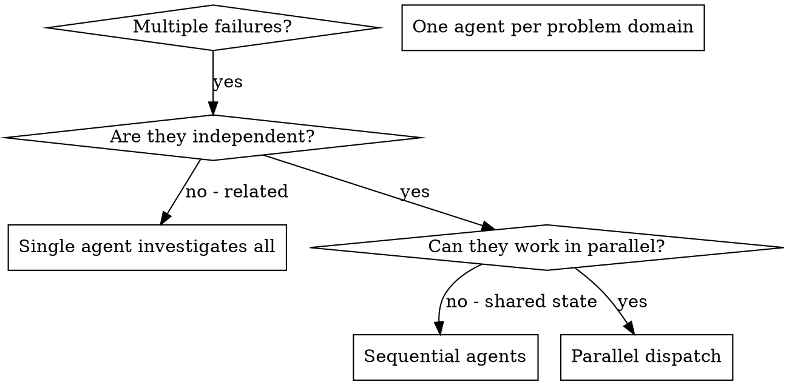

# Dispatching Parallel Agents

## Overview

When you have multiple unrelated failures (different test files, different subsystems, different bugs), investigating them sequentially wastes time. Each investigation is independent and can happen in parallel.

**Core principle:** Dispatch one agent per independent problem domain. Let them work concurrently.

## Concurrency Budget

**No fixed numeric cap.** There is no cross-session accounting and no flat wave-size limit. **Est-min at ceiling is a re-split signal:** any ledger row showing `est-min ≥ 12` must be split before dispatch — at-ceiling estimates always run over.

 Each EM session reasons only about its own dispatches; the human governs aggregate device load organically across open windows.

**Two surviving hard rules:**

**(a) Ramp, don't pre-batch.** This is the expected scaling path, not a timidity gate. Launch a pilot wave, observe *this session's own* responsiveness, and expand until the EM sees its own degradation signal. Pre-scheduling the full batch bypasses the feedback loop that makes ramp-up safe. The pilot→expand shape is the governance mechanism.

**(b) Count your own fanout.** If any agents in the wave are themselves orchestrators (an Opus session delegating to subagents), multiply before dispatching — a wave of 4 orchestrators each spawning 6 sub-agents is a 24-agent wave you own, not a 4-agent wave. Most leaf workers (executors, reviewers, simple file-scoped scouts) spawn nothing and count at face value. Pipeline runners (architecture-survey, bug-sweep), research scouts running web or codebase surveys, and any deep-research subagent ARE orchestrators for counting purposes — apply rule (b) to them. The original "6-8" fear was always about orchestrator-multiplication, not about leaf-worker load; rule (b) addresses the actual risk.

**The `min(16, cpu_cores - 2)` cap is real but scoped to Workflow scripts only.** It is platform-enforced by the Workflow runtime on `agent()` calls inside a Workflow script, per the Workflow tool contract. It does NOT apply to the manual fan-out path (`fan-out-dispatch.sh` / Agent-tool). The manual path has **no automatic structural backstop on concurrency** now that the numeric cap-breach HARD STOP was removed (§ Concurrency Budget, 2026-05-30) — rules (a) and (b) plus the cores-scaled NOTE below are the guards, by design (PM-affirmed 2026-05-30). (This is distinct from the chunk-shape suitability HARD STOP at § Executing a Fan-Out Wave → Step 0.5, which is about *what* a chunk contains, not *how many* agents run.) Do NOT let the Workflow cap appear to cover a path it does not.

A custom research harness has a SECOND, LOWER ceiling beneath the Workflow cap: the **web-tool throttle**. When a Workflow (or any hand-authored fan-out) fans out web-tool/agent research calls — WebSearch, WebFetch, or agents that themselves call them — a concurrency-triggered server-side rate limit (`429 "Server is temporarily limiting requests (not your usage limit)"`) trips well below the `min(16, cpu−2)` Workflow cap. The Workflow cap is exactly the kind of "path it does not cover" warned about above: it bounds total concurrent `agent()` calls, not concurrent web-tool callers. So any hand-authored Workflow that fans out web research MUST respect the same effective ceiling the canonical `/deep-research` skill enforces: **≤5 concurrent web-tool callers**. That is the canonical pipeline's specialist-phase peak — its phases run strictly serialized (scout, THEN ≤5 specialists concurrently, THEN 1 sweep agent (Opus); `../../../deep-research/pipelines/team-protocol.md:14–22`), so the safe number is the ≤5 specialist count, NOT the 7-teammate roster total. Over-cap web fan-out self-throttles **indistinguishably from a platform gate** — see `tool-output-flakiness-protocol.md` § A uniform 429 across a fan-out is self-inflicted overconcurrency for the diagnostic and `coordinator-tripwires.md` § RE-FIRE-INTO-THROTTLE for the re-fire anti-pattern. <!-- Review: code-reviewer F2/F5/F6 — replaced invented "§ 429 self-throttle" shorthand with real heading; changed "1 synthesizer" to match team-protocol.md role name "Sweep"; fixed vim-comma notation :14,:22 to range :14–22 --> The upstream cause is the most common EM failure mode — hand-rolling a workflow with raw `Agent()` calls instead of using the skill (`../../em-operating-model.md:59`): EM bypasses the skill → harness exceeds the ceiling → 429 → misdiagnosis.

**Maximize utilization; memory is the real ceiling, not cores.** Because we optimize for speed, the target is to **maximize** hardware utilization without degrading the machine — not to stay under some agent count. Core count is not a cap: a CPU time-slices far more than `cores` concurrent tasks, so past `~n` agents you do not stop, you begin paying a scheduling-contention tax (returns taper, they don't cliff). CPU and GPU parallelize gracefully under that tax; the dimension that actually degrades the machine is **memory commit (RAM and VRAM)**. So the resource to be careful about is memory, and CPU/GPU saturation is fine. The cores-scaled threshold below is a first-cut proxy for "where parallel returns start tapering"; its higher-value successor — a memory-commit-aware signal — now ships as `bin/probe-memory-headroom.sh` (cross-platform best-effort RAM/VRAM read), wired into `fan-out-dispatch.sh` as the "headroom tight" NOTE below.

**Large-wave NOTE (a speed-taper advisory, not a gate).** When a wave reaches the machine-local `fan_out.large_wave_threshold` (set once at `coordinator:install` as `3 × logical_cores`, overridable via `LARGE_WAVE_THRESHOLD` env var, fallback `16` pre-setup), `fan-out-dispatch.sh` emits a soft NOTE recommending the pilot→expand ramp and reminding the EM to count orchestrator fanout. **The threshold is an advisory, not a cap** — it marks where parallel returns *may start tapering* (per the principle above), a prompt to watch throughput (and memory), not a ceiling to stop at. On the manual fan-out path — which has no automatic structural backstop — this NOTE is the sole hardware-legible signal the EM gets; framed as an offer-shaped nudge per `docs/wiki/eager-agent-calibration.md` (design-as-offers), never a HARD STOP demanding PM authorisation. The **only** HARD GATE in the fan-out path is the file-overlap collision (§ EM File-Overlap Pre-Dispatch Pass) — a real correctness gate unrelated to concurrency.

**Headroom-tight NOTE (the memory-commit-aware successor signal).** Alongside the cores-proxy NOTE, `fan-out-dispatch.sh` runs `bin/probe-memory-headroom.sh` and emits a *distinct* soft NOTE — phrased "memory headroom is tight", never "large wave" — whenever free RAM or free VRAM is below a floor (`fan_out.min_ram_headroom_mb` / `fan_out.min_vram_headroom_mb`, env-overridable via `FAN_OUT_MIN_{RAM,VRAM}_HEADROOM_MB`; defaults 4096 / 2048 MB). This is the higher-value signal because it fires on what *actually* degrades the machine — a loaded machine trips it regardless of wave size, so a 2-agent wave on a memory-starved box gets the nudge a core-count proxy would miss.

*Why no setup-time capture for the floor keys (unlike `large_wave_threshold`):* the cores threshold is `3 × logical_cores`, so it must be machine-derived at `coordinator:install`. The memory floors are *absolute* safety margins — a healthy machine should keep ~4 GB RAM / ~2 GB VRAM free no matter how big it is — so a hardcoded universal default is correct and a per-machine capture helper would be ceremony. Operators tune via the env vars or a one-line `machine-local set` only if their workload's per-agent footprint differs. When the cores-proxy NOTE fires, it now also appends the live headroom readout. The probe degrades gracefully: an unsupported platform or absent GPU yields `unknown` and the path falls back to the cores proxy alone. VRAM is NVIDIA-only (`nvidia-smi`); the two NOTE phrasings are kept disjoint by design so the cores-proxy regression net stays valid on a tight CI runner.

## Anti-Pattern: Dedicated Mechanical-Merge Slots

**Do not allocate a team slot to an agent whose only job is dedup/concat/reformat.** Mechanical merge does not justify a team slot.

When an agent's entire brief is "take these N specialist outputs and combine them," fold that work into the producers (via adversarial peer alignment) or the consumer (the one with judgment — e.g., the Opus synthesizer or the EM directly). A team slot must justify itself with judgment work, not bookkeeping.

**Empirical basis:** In one measured pipeline run, the dedicated consolidator added 4+ minutes wall-clock and was beaten to completion by the downstream sweep that read raw specialist outputs directly.

If you find yourself writing a specialist brief that includes "then consolidate the outputs," stop and ask: does that consolidation require judgment (edge-case resolution, contradiction reconciliation, cross-domain synthesis)? If yes, give it to the consumer-with-judgment. If no, eliminate the role.

## Background by Default

**Any autonomous agent expected to run >2 minutes must run backgrounded.** The EM gets notified on completion and processes results then — it doesn't need to block watching agent output scroll by.

**Mechanism is harness-dependent — and the `run_in_background` param's presence has flip-flopped across builds, so pass it explicitly.** It was absent in the 2.1.176 fork/async-by-default window (dispatches returned a poll handle immediately; nothing to pass) and **re-exposed in 2.1.178**. Don't rely on an implicit default: where the `Agent` tool exposes `run_in_background`, pass `run_in_background: true`. The foreground-dispatch deny hook (`nudge-foreground-agent-dispatch.sh`) handles the flip-flop by **learning the build's capability per session**: it always denies a present-and-`false` value; it denies an absent key once any dispatch this session has carried the param (proving the build exposes it — recorded at `.git/coordinator-sessions/<sid>/.harness-bg-capable`); and it passes an absent key only in an uncalibrated session, so a genuinely param-less build is never bricked. See `hook-best-practices.md` § Capability-gate hooks. Either way the EM gets the same non-blocking, notify-on-completion behaviour described below.

This applies to:
- Enricher agents (10-15 min each)
- Executor agents (5-15 min each)
- Research scouts and verifiers (Haiku/Sonnet phases within pipelines)
- Top-level orchestrator agents (research --mode=structured, architecture-survey)
- Code health reviewers

**Exceptions** (keep foreground):
- Agents whose results you need *immediately* to make the next decision (e.g., a quick Haiku lookup before choosing an approach)
- Agents in a strictly sequential pipeline where the next dispatch depends on the previous result AND you have no other work to do while waiting

When dispatching N independent agents in background, you'll be notified as each completes. Process results as they arrive — don't wait for all N before starting.

**Pass a bare command to `run_in_background` — no `nohup`, no trailing `&`.** `run_in_background: true` already detaches the process and hands the EM a poll handle. Wrapping the command in `nohup … &` double-detaches it: the harness loses the handle to the now-orphaned worker, so the EM can neither poll its status nor reap it on completion. The orphan keeps running with no completion signal. The background flag IS the detach mechanism; adding shell-level backgrounding on top severs the only channel the EM has back to the process. (2026-05-26, project-rag.)

## When to Use



**Use when:**
- 3+ test files failing with different root causes
- Multiple subsystems broken independently
- Each problem can be understood without context from others
- No shared state between investigations
- Mechanical drift cleanup across many single-file edits — narrow per-file briefs run ~5x faster than serial.
- Surgical follow-ups to a novel cluster — full ceremony on the novel item, direct dispatch on the rest with explicit file-scope partitioning.

**Don't use when:**
- Failures are related (fix one might fix others)
- Need to understand full system state
- Agents would interfere with each other

## EM File-Overlap Pre-Dispatch Pass

Plans that claim "fully independent files" are **hypothesis, not ground truth** — the executor brief is the EM's contract, and the EM owns the overlap audit. Before fanning out N parallel executors:

1. **List every file each task will touch** (read the per-task scope explicitly, don't infer from task titles). **Resolve concept-named scopes to actual files before the intersection.** A chunk brief that names a *concept* — "the producers' ledger-write path", "the shared install surface" — instead of concrete paths hides its true write-set: "the producers' ledger-write path" may expand to three producer files, one of which a peer chunk also edits. Grep the concept to its actual file list *first*; a collision read as disjoint because one side named a concept and the other named a file is a real write-overlap that merged cleanly only by luck (2026, project-rag: C1 edited all three structural producers via a concept-named "ledger-write path" concurrently with chunks editing two of those same files — the Edits happened to land in different regions, but that was luck-adjacent, not a cleared overlap).
2. **Compute the intersection across pairs.** Any file touched by ≥2 tasks is an overlap — fold those tasks into one executor or sequence them.
3. **Re-derive parallelism from stub footprints, not README dispatch graphs.** A plan's high-level dispatch diagram describes intended seams, not actual file mutations. The stubs are the contract; the diagram is hypothesis. When the two disagree, the stub footprints win — re-derive the wave map from the actual touched-file sets each stub will produce.

The failure mode this prevents: two parallel executors silently overwriting each other's edits on a "theoretically non-conflicting" shared file (different sections, different functions — still the same file, still a clobber under concurrent fan-out).

## Dispatch-Gate Taxonomy — Narrative Causality Is Not a Gate

The opposite failure of the file-overlap pass: over-sequencing parallel-safe work because the *narrative* of the plan implies an order. A plan with the structure "Chunk 1 explains the root cause; Chunks 2-8 fix the downstream symptoms" tempts the EM to gate Chunks 2-8 on Chunk 1's completion. The plan's narrative is hypothesis about *causation*, not contract about *dispatch order*.

**The only true dispatch gates between parallel-wave executors are:**

1. **File-write overlap.** Two executors *editing* the same path. (Covered by § EM File-Overlap Pre-Dispatch Pass above. Only writes gate — reads never do; see § Read-Overlap Is NOT Write-Overlap below.)
2. **Output-consumption.** Executor B reads a file Executor A writes. (Covered by `coordinator/CLAUDE.md` § Pre-Dispatch Verification: "Dispatch-brief task ordering must be explicit when later tasks reference earlier outputs.")
3. **Contract-change dependency.** Executor A bumps a schema, helper signature, or shared API that downstream executors will misread if dispatched before A lands. Promote shared-API work to a predecessor wave (see § Shared-API Gap in Parallel Waves below).

   **Contract-format changes ripple beyond the import graph — grep producer mocks, not just symbol importers.** When the changed contract is a *serialization format* (CSV column order, JSON envelope shape, wire protocol) rather than a callable signature, the consumers that break are not only the modules that `import` the producer — they include every test that hand-rolls a *mock* of the producer's output (fixture files, inline string literals, `responses`/`nock` stubs). These mocks live outside the symbol-reference graph, so an importer-only impact scan misses them and the format change ships green until the mock-backed test runs against the new shape. The contract-change gate's impact enumeration must grep for the *format markers* (column headers, JSON keys, the literal delimiter) across test/fixture dirs, not just `grep` the producer symbol. (2026-05-27, claude-central.)

### Read-Overlap Is NOT Write-Overlap

Gate 1 is *write* overlap: two executors *editing* the same path. Two — or seven — executors that all *read* a common source module and *write* to entirely disjoint targets have zero write-overlap and parallelize freely. The same holds for a shared *import interface*: when N new modules all import a *pinned* contract (a signature/schema written down per § Author vs. verify), importing it is a read, not a write, and does not serialize their authoring. **The recurring misclassification:** a plan justifies "one executor, N modules, file-overlap blocks parallelism" when the only thing shared is a read-only source plus a pinned import — that is read-overlap dressed as write-overlap, and the correct shape is an N-way fan-out, not one fat executor. The discriminating question is never "do these chunks touch a common file?" but "do these chunks *write* a common file?" — only the second is a gate.

**Empirical motivation.** 2026-05-29, claude-central: a plan handed one executor 7 new modules sharing only a read-only `semantic.py` and an inventory-pinned import interface; the "file-overlap → serial" framing was accepted without challenge until the PM flagged it. The fix added a per-chunk fan-out-suitability gate at both plan-authoring time (`skills/plan/SKILL.md` Branch C) and fan-out-dispatch time (§ Executing a Fan-Out Wave → Step 0.5, below), plus a mechanical fat-chunk NOTE in `fan-out-dispatch.sh`.

**Author vs. verify — output-consumption and contract-change gate *verification*, not *authoring*.**

Gates 2 and 3 are routinely over-applied as hard serial gates on the *whole* of B. They are not. "Does B depend on A" hides two different questions:

- *Can B be authored before A lands?* — **Yes, if the interface is pinned** (a written contract both A and B read: a function signature, a schema, an envelope shape — recorded in the plan or a stub, stable for the wave).
- *Can B be verified green before A lands?* — **No.** B's tests can't pass until A's real surface exists on disk.

So gates 2 and 3 do not force serial *execution* — they force serial *verification*. The aggressive shape they unlock: pin the interface as a written contract, fan out A *and* its consumers concurrently, and **concentrate verification at the merge point** after the wave lands. (Gate 1, file-write overlap, is the only *unconditional* serial gate — pinning an interface doesn't let two agents write the same file.)

**Name BOTH the producer surface AND the verifier surface when writing a ledger output-consumption row.** An output-consumption gate row describes two independent facts: (1) the producer surface that is pinnable, and (2) the surface the verifier actually reads. They are not always the same. If the verifier reads a *derived* or *secondary* surface (e.g. a TS tool-def file that reflects a C++ producer, a generated schema file, a compiled doc artifact), pinning the producer interface says nothing about whether the verifier can pass — the verifier can be blocked by the derived surface even when the producer is correctly pinned. A ledger row with `gate-kind: output-consumption-content (interface pinnable)` must also carry `verifier-reads: <surface>`. If `verifier-reads` is a different file than the pinned interface, the downgrade to parallel-with-verify-at-merge is only safe for *authoring*, not *verification* — the gate is real at the verification step. (2026-06-15, example-game-repo niagara-extensions-suite C9.)

**The guard — the interface must be *pinned*, not merely *intended*.** Parallel-authoring B against an interface still in flux produces churn: A changes the signature, B's authored-against-the-old-shape work is now wrong. *Pinned* means the full signature is written down — name, parameter types and names, return shape, and the error/empty contract — at a precision a consumer author could code against **without asking the producer author a question.** A prose sketch ("adds a helper that takes a kwarg") is NOT pinned; a stub carrying the actual signature and docstring IS. **The test:** could you hand the interface artifact *alone* (not the producer's chunk) to the consumer executor and expect green-on-real-surface authoring? If no, it's *intended*, not *pinned* — gates 2/3 are real serial gates; fall back to the predecessor-wave shape.

**Default vs. fallback — this narrows gates 2/3, it doesn't dissolve them.** The default is **concurrent-with-pinned-interface, verify-at-merge**: pin the shared interface as a written contract, fan out the producer and all consumers in one wave, and concentrate verification at the merge point. At agent speed with cheap reverts, the serialization a predecessor wave costs at *every* dispatch outweighs the occasional merge-point mismatch it would have isolated — so reach for the concurrent shape first. **Fall back to the predecessor wave** — land the shared surface (`C0`), verify it, *then* fan out self-verifying consumers — only when either (a) the interface can't be confidently pinned (still in flux; the producer's design isn't settled), or (b) the surface is high-stakes enough that per-chunk blast-radius isolation (a mismatch surfaces in one chunk, not the whole wave — see § Coupling Rules Out Concurrency) is worth paying the serialization for. The cost the default accepts: no chunk self-verifies, so a contract mismatch surfaces all at once at the merge point instead of per-chunk — which is why the pinned-interface guard (above) is the *hard gate* on the default, not advisory. No pinnable interface, no concurrent authoring.

**Empirical motivation.** 2026-05-27, self: a refactor with a shared `host_probes` surface and three consumers was dispatched fully serial because each consumer "imports C1." Output-consumption was read as a hard gate on *both* authoring and verification; the interface could have been pinned and all three consumers authored concurrently, with verification concentrated after the merge. The serial dispatch obeyed the plan's prose annotation ("C2 depends on C1 → serial") instead of re-deriving from the taxonomy — the plan pre-committed the EM to serial, and conservative self-verification bias (each executor proving itself green is "safer") did the rest.

**Things that are NOT dispatch gates:**

- **Narrative / explanatory causality.** "Cluster A is the root cause of the symptoms in Cluster B" describes why both matter — it does not say B's executor cannot start until A's commits. If their file footprints are disjoint and neither consumes the other's output, they parallelize.
- **Aesthetic ordering of landings.** "I'd rather the fix land before the doc that describes it" is preference, not dependency. At minutes-of-wall-clock scale with per-commit traceability on the workstream branch, cosmetic out-of-order landings cost effectively nothing. A docs commit announcing a forthcoming fix telegraphs the shape and is cheaply re-readable in git log if it lands first.
- **"Review Chunk 1 before fanning out the rest" intuition.** The plan-review gate already approved the plan; re-reviewing the first executor's output before dispatching peers is gating-on-confidence, not gating-on-dependency. Spot-check after the wave returns.
- **"Feels cleaner if A goes first."** If the gate question can't be expressed as a *concrete artifact B would read of A's*, it is not a gate.

**Wall-clock is the goal; per-executor budget is the constraint.** Aim to keep each executor's scope to ~5-10 minutes on a single coherent surface, with 15 minutes as a hard ceiling. Per-executor overload (a sprawling rename, compaction risk, single-failure-loses-batch) is the opposing failure to under-parallelization. The two failures are not symmetric — under-parallelization wastes wall-clock at every dispatch, while over-loading wastes wall-clock only on the failure path. But "always more parallel" is wrong when the executor would meaningfully exceed the budget on a single surface.

**Trigger for the gate-graph computation:** at the seam between plan-review-approved and first dispatch. Before authoring the first dispatch brief, the EM enumerates each task's touched files, marks the three real gate types above, and writes the wave map. This is a few-minute mechanical exercise; it is also exactly the work the EM tends to skip in flow.

**Empirical motivation.** 2026-05-20, self: a plan with 15 enriched chunks across disjoint file scopes was dispatched as "Wave A = Chunk 1, then Waves B+B' = 8 parallel" — gated on the explanatory framing that Chunk 1 was the upstream cause. Chunks 2, 3, 4, 5, 12, 14, 15 had disjoint file scopes from each other and from Chunk 1; the correct shape was a 8-way first wave, not 1+8.

## Coupling Rules Out Concurrency, Not Decomposition

> **Rule of thumb:** a series of small-remit executors beats one executor with a large remit — every time. Ideally the small executors run in parallel; when the gates forbid it, the answer is *more small executors for sub-chunks in sequence*, never one executor for the big task. Small-and-many is the default; large-and-one is the failure mode.

The per-executor budget (~5-10 min on one coherent surface, 15 min hard ceiling) and the parallelism gates are **orthogonal axes**, not one decision. The file-overlap pass answers "can these run *concurrently*?" — it does NOT answer "how many dispatches?" When overlap forces serial execution, the budget axis still applies: a coupled body of work that exceeds the per-executor budget gets split into a **sequence** of dispatches with EM verification between each — not collapsed into one open-ended mega-dispatch.

**"Can't parallelize" ≠ "must be one dispatch."** Coupling removes *concurrency*; it does not remove *decomposition*. Sequencing IS the chunking mechanism when parallelism is unavailable. The shape is `dispatch fresh agent for B2 → EM verifies → dispatch fresh agent for C1 → EM verifies → dispatch fresh agent for C2/D` — **a new agent per chunk, not one agent handed chunk after chunk.** The EM holds the verify-and-commit step between dispatches; each chunk runs on a clean context window.

**One agent grinding a sequence of chunks is itself the antipattern — the overload in slow motion.** A long-lived executor accumulating chunk after chunk piles up context (compaction risk), grows its own blast radius with every chunk, and degrades judgment as its window fills. Prefer a fresh per-chunk agent every time. **Exception — when the only coupling is a pinned-interface dependency (not file-overlap), the default is to author consumers concurrently with verification concentrated at merge** (see § Dispatch-Gate Taxonomy → Author vs. verify), *not* to serialize them. This section's fresh-per-chunk-agent shape governs *genuine* serial coupling — file-overlap, or an interface that can't be confidently pinned. With that carve-out, the rest holds: this is not a fallback for when parallelism fails — it is the default shape for coupled serial work, and it buys back the three things a monolithic or long-lived dispatch throws away:

- **Clean context per chunk** — each agent boots fresh on one coherent surface; no accumulation, no compaction risk, full judgment.
- **Blast radius** — a single failing dispatch reverts one coherent surface, not five chunks' worth of interleaved edits across six files.
- **Visibility** — the EM sees and verifies each surface as it lands, instead of receiving one giant diff to reverse-engineer.

**Empirical motivation.** 2026-05-26, self: five chunks across ~6 coupled files plus a contract test were handed to a single open-ended executor. The reasoning was "the files are shared, so I can't parallelize" — correct about concurrency, but it silently concluded "therefore one dispatch." The file-overlap gate fired and consumed the whole sizing decision; the per-executor budget check dropped out because there was no parallel wave left to "split within." The correct shape was 2-3 sequential dispatches with verification between. This is the serial twin of the over-sequencing failure above: there, narrative causality wrongly *added* a gate; here, a real overlap gate wrongly *absorbed* the budget axis.

**Where the budget check belongs:** after the wave map is computed, walk each serial position (whether forced by overlap, output-consumption, or contract-change) and ask the budget question independently of the parallelism question. A serial chain of one over-budget executor is the same overload as a single over-budget wave — split it the same way, just sequentially instead of concurrently.

## Sonnet Chunk-Sizing Is a Correctness Constraint, Not Just an Efficiency One

The small-remit rule ("~5–10 min on one coherent surface, 15 min ceiling") is usually framed as a parallelism/throughput guideline. It is really a **context-envelope rule**, and the clock is only a proxy for context fill. Oversizing a chunk dispatched to a Sonnet executor degrades its **correctness**, not just its wall-clock: Sonnet's context window is smaller than Opus's, so as a chunk balloons (many files, long edits, high tool-call count) the agent's context fills and its performance degrades *sooner*. The late edits in an over-sized chunk are authored under a crowded, degraded context — which is exactly where the subtle defects creep in: **silent assertion-loosening in test edits, private-access escape hatches, mis-scoped changes** that a fresh-context agent would not have written.

**Two operational consequences:**

- **Size each Sonnet chunk to one heavy file OR one tricky surface** — never bundle a 1500-line file with four others. This is the correctness rationale behind the budget ceiling, distinct from the throughput rationale.
- **An over-taxed chunk earns MORE EM verification, not less.** When a chunk *was* over-budget (high file/tool-call count, ran past the ceiling), a green self-reported test result is *weaker* evidence — it came from a context-pressured agent. Read the late-authored judgment calls (escape hatches, test-file assertion changes, private-access reaches) at diff level; do not trust the reported PASS.

This reinforces — does not replace — the executors-stay-Sonnet rule. The fix for a too-big task is **smaller chunks, never a bigger model**: a bigger model hides the context-fill signal without removing the under-decomposition.

## Executor Brief Content — Enumerate the Full Per-Chunk Contract

A parallel-wave executor verifies and implements only what its brief names. Three recurring gaps in brief *content* (distinct from wave-shape / gate analysis) ship green-looking work with a real hole:

- **Name the tool: use `Edit`/`Write`, never bash heredocs / `sed` / python-scripts to edit files.** An executor left to choose its file-write mechanism will sometimes thrash 20+ min on bash-heredoc and python-script quoting to make an edit that `Edit` does in one call. Every file-editing executor brief must state the tool explicitly: *write with `Write` or `Edit`; do not shell out to heredocs, `sed`, or python to mutate files.*
- **Name the EXISTING regression-net file(s) in the verification step, not just the new test.** An executor that touches a surface with prior tests but whose brief names only the *new* test file creates a green-on-new / red-on-existing blind spot — it runs the new test, sees green, and never runs `tests/test_<surface>.py` that its change also affects. Every brief touching a surface with prior tests must list **both** the existing `tests/test_<surface>.py` **and** the new test in the verification step.
- **When a parity chunk is split for the budget, EACH leg's brief must enumerate the FULL behavior set.** Splitting a `.sh`/`.ps1` (or any cross-platform sibling) pair into separate executors for the 15-min ceiling is correct — but each half's brief must carry the *complete* behavior list, not a subset. The empirical failure (project-rag): a `.sh`/`.ps1` split dropped the `gh-auth` backstop from the PowerShell half's brief; the `.ps1` executor correctly implemented exactly what its (incomplete) brief said, so the backstop silently never shipped. A standing parity test (`test_ps1_parity`) caught it as `xfail`, but the brief was the fix — a per-leg brief that enumerates one leg's behavior while trusting the sibling to "match" drops whatever the author forgot to restate. Pair a per-leg parity test with the split so any brief-completeness gap surfaces at CI, not at merge.

## Shared-Expensive-Substrate — Enrich Once, Don't Re-Pay Per Executor

**The canonical predicate (single definition — all other files cite this section):**

> **Shared-Expensive-Substrate (SES)** fires at `/execute-plan` ledger-construction time when, across the draft chunk set, **both** hold:
> 1. **Shared** — the same source file appears in the read-set (files a chunk must understand to author, distinct from its write-files) of **≥2** chunks; **and**
> 2. **Expensive** — the PRIMARY signal is a **cold-substrate** flag: the shared read-set files have no atlas/wiki coverage OR the EM has not already loaded them this session (genuinely unfamiliar), OR any chunk is flagged **`needs-bespoke-fixture: true`**. SECONDARY corroborating signals (do NOT fire alone on a warm/familiar surface): the shared read-set is **≥3 files**; OR any chunk's read-set exceeds its write-files by **≥3 files**. Breadth alone on a warm/familiar shared surface does **not** fire.
>
> On a fire, route through **one** enrich-once pass: (a) the extended enricher reads the substrate once and emits pinned stubs (CLI signatures + `file:line` loci + algorithm sketch) and a proposed chunk-boundary block (NEEDS_COORDINATOR format — the EM ratifies); (b) when `needs-bespoke-fixture: true` fires, a **separate verify-capable executor** produces AND certifies-passing the **worked fixture template** — the read-only enricher cannot run tests and does not author the fixture. Per-chunk executors clone the verified fixture and *only type* — near-zero exploration. The failure this prevents: N fresh executors each re-paying the same ~15-min shared exploration tax (chain-review-coverage-dag-consumer, 2026-06-30 — C3/C3a executors spent their entire budget re-exploring and wrote zero lines).

**Failure mode.** The problem is invisible at sizing time: `/execute-plan` Phase 1.5 traditionally sizes from the AC list and write-set. It does not see the read-set — the files each chunk must *understand* before writing a line. When chunks share an expensive, unfamiliar read-surface, every fresh per-chunk executor re-pays the full exploration tax. Splitting the work smaller makes it *worse* (N × the tax), inverting the small-remit-and-many rule.

**Evidenced by the chain-review-coverage-dag-consumer episode (2026-06-30).** C3 (8 ACs) was dispatched as one executor and killed at the read-budget boundary having written zero lines. Re-split into C3a, a first attempt died at ~16 min with a 19-line scaffold; a remainder-executor was dispatched and spent its entire budget re-exploring five interlocking files (`walk-handoff-dag.js`, `handoff-has-live-children.sh`, `review-coverage-gate.sh`, `review-coverage-core.sh`, `coordinator-session.sh`) plus inventing a bespoke `bats` DAG-fixture recipe — last transcript line again: *"now I have everything I need to write the implementation. Let me start."* The EM wrote C3a inline.

**SES is a cost signal, not a dispatch gate.** This is the key contrast with § Read-Overlap Is NOT Write-Overlap: read-overlap never gates parallelism, and neither does SES. Chunks that share an expensive read-surface still parallelize freely when their write-targets are disjoint. SES fires an *enrichment pass* so those chunks receive pinned specs instead of re-paying the exploration tax. Parallelism is unchanged; the exploration cost is amortized once across the whole wave.

**Runtime-tripwire complementarity.** SES is the upstream **preventive** gate, evaluated at ledger-construction time before any dispatch. The runtime tripwire (executor crosses ~15 min without landing) is the downstream **detection** layer — it catches the symptom after it fires. SES prevents the condition the tripwire would otherwise detect; both layers are needed and neither substitutes for the other.

## Pin the Spec, Never Go-Read

**Rule: executor briefs for exploration-heavy work MUST pin the spec inline** — literal CLI signatures, algorithm pseudocode, a fixture template — rather than instructing *"read plan §X + read all the source files."* A "go read" brief is an instruction to spend the budget exploring. The exploration cost is a per-dispatch fixed overhead; a "go read" brief converts it from a one-time EM cost (paid once when the plan was authored) into a per-executor cost paid fresh at every dispatch.

This is the **implementation-brief analog** of § Brief Shape Determines Finding Shape (which governs investigation briefs): just as a vague investigation brief ("also look at the error-handling paths") produces a prose acknowledgement rather than a sweep, a vague implementation brief ("read plan §X and the relevant source files") produces exploration rather than implementation. The precision of the brief is the floor on the precision of the output; for implementation briefs, precision means *how much of the spec is already written down inline for the executor to type against*.

**How to pin the spec:** extract from the plan the exact CLI signatures, `file:line` loci, algorithm sketch, and fixture template the executor will type against. Place them verbatim in the brief. The executor reads only the brief and types — it does not rediscover what the EM already knows. When the shared substrate is expensive (SES fires), the enrich-once pass authors the pinned stubs and hands them to per-chunk executors. For exploration-light plans, the EM author pins inline at plan-write time — the pattern applies regardless of whether SES has fired.

**Co-pillar:** `delegate-execution.md § Briefing Concreteness` carries the brief-construction detail; this rule is the dispatch-economics framing of the same principle. The two together are the implementation-brief doctrine: pin the spec (here), and make the pinned content concrete enough that the executor needs no follow-up questions (`delegate-execution.md`).

## Load-Bearing Scalars — Pin Shared Fan-Out Constants in the Serial Keystone

When a fan-out wave shares a numeric constant across chunks — a concurrency cap, a per-executor
file budget, a chunk count, a token threshold — that scalar is **load-bearing**: if two chunks
disagree on its value, the wave's budget model is silently wrong. The failure mode is each chunk's
brief (or each integrator filling a chunk's cell) carrying its own copy of the number, which drifts.

**Rule:** pin every shared fan-out scalar ONCE as a named constant in the serial keystone — the
single artifact the whole wave reads (the plan's wave-map table, or the `fan-out-dispatch.sh`
TSV header). Downstream chunks and integrators *reference* the named constant; they do not restate
its value. **Integrators fill cells against the pinned authority; the EM owns the budget model** —
changing a load-bearing scalar is an EM-level edit to the keystone, not a per-chunk edit. This is
the scalar analog of the pinned-interface rule (§ Dispatch-Gate Taxonomy → Author vs. verify): a
shared value, like a shared interface, must be written down in one authoritative place before the
wave fans out, or concurrent authors drift against an unstated number.

## Executing a Fan-Out Wave — The Canonical Mechanism

> **Executing a plan? Author a Workflow, not this hand-driven wave.** As of 2026-07-09 doctrine, a background Workflow is the DEFAULT execution vehicle for executing ANY plan — one wave or many, including a single-`agent()` plan (`workflow-orchestration.md`). This hand-driven fan-out methodology below is for genuinely *non-plan* ad-hoc waves (a quick multi-file sweep, a scout fan-out). If you arrived here from `/execute-plan` while deciding how to dispatch your ledger chunks, stop and encode them as Workflow phases instead — the ledger's wave map transcribes directly into `phase()` groups, you keep per-wave oversight (results return to you) and commit control (executors return uncommitted; you commit each phase), and the orchestration survives your compaction.

**Fan-out is a methodology execution follows, not a skill to invoke.** There is no `/fan-out`
command — that verb collided with native Claude Code vocabulary and was demoted (2026-05-30). The
dispatch ceremony lives in two places: the compiler (`fan-out-dispatch.sh`, a bin script) and
*these steps*, which the EM follows from `execute-plan` Phase 1.5 (the plan-mediated path) or
inline whenever it has ≥2 independent tasks with no plan doc (the ad-hoc path). Both paths run the
same steps; only the entry differs.

**Dispatch-ledger granularity must equal actual dispatch granularity.** Splitting ledger rows for budget visibility then collapsing to one executor is theater. If the ledger says N chunks, N executors must be dispatched. A ledger row that never becomes an actual dispatch is a planning artifact that misleads future sessions.

**Do not author fan-out prompts by hand.** The compiler does the mechanical ceremony:

- **`fan-out-dispatch.sh` (compiler)** — takes a TSV wave-spec (one row per chunk: `<chunk-id>\t<brief-or-@file>\t<comma-separated-files>` with an optional 4th column, see below), runs the file-overlap intersection and fails loud on any collision, then emits paste-ready scoped executor prompts — each containing the chunk brief, an In/Out-of-scope peer block (sourced from `snippets/peer-scope-block.md`), the destructive-action prohibition, the disk-first verification preamble, and `expected_branch: <current-branch>`. Run once per wave; paste the emitted blocks as executor dispatch prompts.

**Optional 4th-column `@interface` pin.** A TSV row may carry a 4th tab-separated field of the form `<symbol>@<producer-relative-path>`. This declares that the chunk is a consumer of a pinned interface (`<symbol>`) that the producer chunk is expected to have written to `<producer-relative-path>`. The compiler greps the symbol in that path and, if absent, emits an **offer-shaped NOTE** on stderr naming the serial-predecessor-wave shape as the remediation. This is a **post-hoc observer, not a gate**: exit code is 0, and dispatch blocks are emitted regardless. If the interface is present, no NOTE is emitted (silent on pass). Three-field rows (no pin) are unchanged — the 4th column is fully backward-compatible. For the pinned-interface concept and when it matters, see § Read-Overlap Is NOT Write-Overlap and § Dispatch-Gate Taxonomy → Author vs. verify.

Running the helper collapses the ceremony (overlap audit, peer-block authoring, branch capture,
large-wave NOTE, pinned-interface check) into one EM-side call — the path of least resistance is the correct path. The
helper cannot call `Agent`, so the dispatch and the EM-serial commit are the EM's steps below.

### The Steps

**Step 0 — Collect the wave spec.** One TSV row per chunk. If invoked from `execute-plan`
Phase 1.5, the spec is that phase's gate-graph output. If ad-hoc, decompose the work into chunks
of ~5–10 min on one coherent surface (15 min hard ceiling) and mark the three real gate types
(file-write overlap / output-consumption / contract-change — § Dispatch-Gate Taxonomy). Budget-
sizing is EM judgment the helper cannot do: small-remit-and-many beats large-remit-and-one.

**Step 0.5 — Fan-out suitability gate (HARD STOP — re-chunk before dispatch).** Before running
the helper, scan **every chunk** for the **fat-chunk** shape: one chunk handing ONE executor
multiple independent deliverables (N modules, N disjoint files, N separable sub-tasks whose
**write** targets do not overlap). This is the "yeet one executor at 7 deliverables" failure — a
fan-out candidate masquerading as a single dispatch. **For each chunk, ask: does its remit
decompose into ≥2 deliverables with disjoint WRITE targets?** The ONLY legitimate reasons to keep
a multi-deliverable chunk as one dispatch are (a) genuine write-overlap (and even then it is a
*sequence* of small dispatches, never one fat executor) or (b) an unpinnable shared interface.
**Read-overlap is NOT write-overlap** — a shared read-only source or a pinned import is a read,
not a gate (§ Read-Overlap Is NOT Write-Overlap). **If a fat chunk is found, STOP and re-chunk
into N chunks before dispatch** — never dispatch it whole; if it arrived from a plan, the plan's
chunking was wrong (re-split inline, or route a larger substrate drift back through
`coordinator:plan` Branch D). This is the gate whose absence produced the **2026-05-29 "one agent
authors 7 modules" failure** (a plan handed one executor 7 modules sharing only a read-only
`semantic.py` + a pinned import; see § Read-Overlap Is NOT Write-Overlap). The mechanical backstop:
`fan-out-dispatch.sh` emits a per-chunk `NOTE:` when a chunk lists ≥4 files — a soft offer-shaped
prompt to confirm coherence or re-chunk. **The plan-authoring twin of this gate lives in
`skills/plan/SKILL.md` Branch C** (caught at plan-write time); this is the dispatch-time twin.

**Step 1 — Run the overlap pass.** `bash fan-out-dispatch.sh --spec <spec-file>` (or pipe TSV).
**HARD GATE:** non-zero exit = file-overlap collision — print the report, STOP, do NOT dispatch;
the only valid next actions are revise-the-spec-and-re-run or split into sequenced waves. This is
the only HARD GATE in the fan-out path (a correctness gate, unrelated to concurrency).

**Step 2 — Organic ramp (pilot→observe→expand, soft).** Small wave (≤ the machine-local large-
wave threshold) → dispatch all at once. Larger wave → dispatch a pilot cohort (3–5 chunks),
verify output quality and executor health, then expand. **Count your own fanout** — an
orchestrator chunk that spawns sub-agents multiplies the concurrent load (§ Concurrency Budget).
No fixed numeric cap; the large-wave `NOTE:` is an advisory speed-taper signal, never a HARD STOP
demanding PM auth.

**Step 3 — Dispatch the wave.** One `Agent` call per compiled prompt block, **all concurrent** —
do not await one before firing the next. Verify each emitted block carries the destructive-action
prohibition before dispatching. Dispatch all with `mode: "auto"`.

**Step 4 — EM-serial commit (after the wave returns).** Collect every file each executor touched
(verify with `git status`); verify each output **on disk** (non-trivial size, correct content —
never accept a `DONE` chat message as proof). Commit the wave as one scoped commit with plain
`git add -- <paths>` — **never `git add -A` / `git add .`** (sibling sessions may have unrelated
dirty files). **Executors do NOT commit;** if one reports it did, inspect `git log` and revert
out-of-scope additions before the wave commit.

**Step 5 — Next wave (if any).** Verify the prior wave satisfied the gate that made the next wave
serial (output-consumption: the expected file exists and is non-trivial; contract-change: the
shared surface is updated correctly), then return to Step 0 with the next wave's spec.

**Spec backlinks:** `docs/plans/2026-05-27-fan-out-default-doctrine.md §Chunk 4` (the compiler +
canonical-mechanism origin); `docs/plans/2026-05-30-fan-out-skill-to-methodology-demotion.md`
(the skill→methodology demotion these steps absorbed).

## Scripted-Orchestration Escalation — When Fan-Out Should Outlive Your Context

Ad-hoc fan-out (the mechanism above) is the right tool for a single parallel wave *of genuinely non-plan work* — even a large one — as long as it is one barrier and one EM-serial commit. **The primary tell to escalate: you are executing a plan (any wave count) ⇒ Workflow.** As of 2026-07-09 doctrine, a background Workflow is the DEFAULT execution vehicle for executing ANY plan, one wave or many, including a single-`agent()` plan — see the banner above and `workflow-orchestration.md § When to reach for it`. For genuinely non-plan ad-hoc work, a secondary signal still applies: when the job is multi-phase and context-heavy — ≥3 sequential waves,
each gated by the prior wave's output — the orchestration logic itself becomes the liability: it
lives in the EM's context window and dies with it on compaction. The escalation is a **Workflow
script**: the same fan-out doctrine (independent agents, file-disjoint briefs, EM-serial commits),
but the if-gates and wave sequencing live in a deterministic script on disk rather than in the EM's
turn-by-turn dispatch discipline.

**The tell to escalate (non-plan ad-hoc case):** you are authoring wave 1 and can already see waves 2–5 coming, or the
job carries ≥3 gates where one wave's output is consumed by the next. Either condition means the
orchestration will outlive a single context window; reach for a Workflow script before dispatching
the first agent, not after compaction has already erased the wave map.

**Scope of this file:** ad-hoc fan-out for a single parallel wave stays here. Workflows are the
escalation path, NOT a replacement — for the when-to-use taxonomy, chunking rule, commit
discipline, agent-call ceiling (`min(16, cpu_cores − 2)`), and skeleton, see →
`workflow-orchestration.md`.

## Peer-Scope Prohibition in Parallel-Wave Prompts

Concurrent executors see disk state, not each other's intent. When Executor B is dispatched for Chunk 5 in parallel with Executor A for Chunk 3, B may "helpfully" extend scope on noticing Chunk 3's expected output not yet on disk — either redoing A's work, fixing what looks broken at A's seam, or papering over an unfinished contract. The result is overlapping writes on what was meant to be disjoint scope.

**Mitigation:** every dispatch prompt in a parallel wave carries an explicit **In-scope / Out-of-scope** block that names peer chunks by ID. The canonical template for this block lives at `snippets/peer-scope-block.md` — `fan-out-dispatch.sh` injects it automatically. When authoring prompts manually, source the block from that snippet rather than duplicating it inline.

This composes with the existing destructive-action prohibition and the disk-first verification preamble. All three are non-optional in parallel-wave prompts.

**Plan frontmatter is also peer-scope — OOS it explicitly.** When N executors fan out from a single governing plan, they will race on the plan's frontmatter `status:`/`progress:` lines unless those fields are named out-of-scope in every brief. EM owns the plan's status; executors own only their declared in-scope files. Empirical (2026-05-28 distill-manifests, 3× in one session): every chunk whose brief omitted the plan-doc OOS line flipped `status:`; the one chunk that included it did not. **Structural fix:** `fan-out-dispatch.sh` injects `docs/plans/<this-plan>.md` (frontmatter especially) into the DEFAULT out-of-scope block automatically — don't rely on EM-per-brief discipline under fan-out load.

**Why this is structural, not cosmetic:** Sonnet executors at wave-time are pattern-matching for "what does this codebase expect to exist." A missing file at a known path reads as "broken state, fix it" rather than "peer wave hasn't landed yet, unrelated." The prompt is the only signal that distinguishes the two.

**Translate reviewer risk warnings into per-executor preambles, not just integrated spec text.** When a reviewer flags a rule-specific risk (e.g. "this matcher requires CXXMemberCallExpr traversal — verify framework support before implementing") and the next wave is a parallel fan-out, integrating the warning into the shared spec body is insufficient. Executors re-derive implications under their own context budget and can miss it. Add an explicit "Special handling for rule-X" section *inline* in the affected executor briefs, naming the `file:line` the executor must read before deciding. Cost: ~100 words per affected executor. Payoff: prevents post-execution rework on highest-risk rules. (2026-05-27, project-rag-ue-addon tc-2 V1.1 W-C'.)

## Worktree vs. Same-Worktree Dispatch

**Default: dispatch into the current worktree.** Do NOT create separate git worktrees for parallel agents unless there is a genuine need for branch-level isolation (e.g., separate PRs targeting different base branches).

**Decision rule:**
- **Disjoint file sets → parallel, same worktree.** Agents write to different files; the filesystem is the coordination mechanism. No merge ceremony needed.
- **Overlapping files → sequential, same worktree.** Run agents one after another so each sees the previous agent's changes. This is almost always cheaper than worktree creation + merge conflict resolution at agent execution speed.
- **Overlapping files with different insertion points** (e.g., appending to different sections of the same file) → still sequential. "Theoretically non-conflicting" edits in the same file are fragile; sequential execution eliminates the risk for negligible time cost.
- **True branch isolation needed** (different base branches, separate PRs, long-lived parallel features) → worktrees are forbidden; use sequential execution on the active workstream branch instead.

**Why not worktrees by default?** Worktrees solve a human-scale problem: needing days of isolation on parallel features. At agent execution speed, the merge overhead (branch creation, conflict resolution, integration verification) exceeds the time saved by parallelism. Sequential execution on overlapping files is almost always the cheaper path.

## The Pattern

### 1. Identify Independent Domains

Group failures by what's broken:
- File A tests: Tool approval flow
- File B tests: Batch completion behavior
- File C tests: Abort functionality

Each domain is independent - fixing tool approval doesn't affect abort tests.

### 2. Create Focused Agent Tasks

Each agent gets:
- **Specific scope:** One test file or subsystem
- **Clear goal:** Make these tests pass
- **Constraints:** Don't change other code
- **Expected output:** Summary of what you found and fixed

### 3. Dispatch in Parallel

```typescript
// In Claude Code / AI environment
Task("Fix agent-tool-abort.test.ts failures")
Task("Fix batch-completion-behavior.test.ts failures")
Task("Fix tool-approval-race-conditions.test.ts failures")
// All three run concurrently
```

### 4. Review and Integrate

When agents return:
- Read each summary
- Verify fixes don't conflict
- Run full test suite
- Integrate all changes

## Agent Prompt Structure

Good agent prompts are:
1. **Focused** - One clear problem domain
2. **Self-contained** - All context needed to understand the problem
3. **Specific about output** - What should the agent return?

```markdown
Fix the 3 failing tests in src/agents/agent-tool-abort.test.ts:

1. "should abort tool with partial output capture" - expects 'interrupted at' in message
2. "should handle mixed completed and aborted tools" - fast tool aborted instead of completed
3. "should properly track pendingToolCount" - expects 3 results but gets 0

These are timing/race condition issues. Your task:

1. Read the test file and understand what each test verifies
2. Identify root cause - timing issues or actual bugs?
3. Fix by:
   - Replacing arbitrary timeouts with event-based waiting
   - Fixing bugs in abort implementation if found
   - Adjusting test expectations if testing changed behavior

Do NOT just increase timeouts - find the real issue.

Return: Summary of what you found and what you fixed.
```

## Brief Shape Determines Finding Shape

*2026-05-19, example-game-workbench-repo.* An explicit brief *mention* of an under-covered axis does not guarantee the dispatched agent covers it. "Also look at the error-handling paths" / "pay attention to the concurrency story" reads as a hint the agent satisfies with a sentence, not a sweep. The finding shape mirrors the brief shape: prose hints produce prose acknowledgements; concrete enumeration produces concrete findings.

**Rule:** when an axis matters, ship the *exact* greps, globs, and file-lists the agent should run — not "also look at" language. `Grep for \bFooBar\b across plugin/commands/ and tests/fixtures/` produces a real sweep; "consider the command surface too" produces a hand-wave. The precision of the instruction is the floor on the precision of the finding. This is the dispatch-brief analog of `pre-dispatch-verification.md` § Reference-Sweeps Must Enumerate ALL Context Shapes — the EM enumerates the shapes, the brief carries them verbatim.

## Findings-Deliverable Outputs: Self-Persist by Default, EM-Persist as Labeled Fallback

<!-- Review: code-reviewer — reframed from tool-surface ("any agent without Write") to deliverable-type ("findings/report/audit brief"), matching the discriminant in CLAUDE.md § Scouts and the corrected line-381 paragraph below -->
*2026-05-19, example-game-workbench-repo.* The anti-hallucination failure mode is real: the EM reads inline findings, mentally notes them, continues other work, and the findings evaporate under context pressure before they land anywhere durable. The fix is **agent self-persist via Bash-redirect** — a findings/report/audit agent with scaffold-Bash writes findings directly to disk (heredoc `cat > file`, per `snippets/findings-self-persist-bash.md`) and returns `DONE: <path>`. The harness blocks the subagent *Write tool* for report files; it does **not** block Bash-redirect writes — that is the self-persist path. Self-persisting findings agents carry the same disk-first DONE gate as executors: ~30% Haiku / ~10% Sonnet under load hallucinate TEXT ONLY and dump inline; the gate surfaces this before the EM relies on a phantom file.

**Decision rule:** self-persist requires EITHER (a) an agent with scaffold-Bash on its tool surface, OR (b) an EM-pre-scaffolded sentinel file the agent Edits. Absent BOTH, EM-persist is the labeled fallback. When condition (a) or (b) holds, append `snippets/disk-first-done-preamble.md` to the agent brief and instruct it to write findings via Bash-redirect and reply `DONE: <path>`. **Two named residual EM-persist cases:**
1. **Runtime-only-fact capture** — irreducible; the fact exists only in the live session, not on a writable surface.
2. **Findings agent dispatched with neither scaffold-Bash nor a pre-scaffolded sentinel** — cannot self-persist by either mechanism; EM receives inline output and persists immediately at dispatch-completion (`TaskCreate` per actionable finding, or write to the relevant tracker/findings file). Treat dispatch-completion as the trigger, the same way an executor's commit is a trigger.

**Dispatch framing for the residual EM-persist cases.** Announce the persistence step at dispatch time — "I'll persist your inline output to `<path>` after you reply" — rather than asking the agent to write `DONE: <path>`. The correct discriminant is deliverable type + tool surface together: the harness gates on the *Write tool* for report-file intent, not Bash-redirect capability; a Write-capable agent dispatched with neither Bash nor a sentinel is still blocked from self-persisting via the Write tool. (2026-06-15, project-rag daemon-bringup. 2026-06-30, deliverable-type correction: tool-surface heuristic is insufficient — harness gates on the *Write tool* for report files; Bash-redirect is the self-persist escape, not blocked.)

## Common Mistakes

**❌ Too broad:** "Fix all the tests" - agent gets lost
**✅ Specific:** "Fix agent-tool-abort.test.ts" - focused scope

**❌ No context:** "Fix the race condition" - agent doesn't know where
**✅ Context:** Paste the error messages and test names

**❌ No constraints:** Agent might refactor everything
**✅ Constraints:** "Do NOT change production code" or "Fix tests only"

**❌ Vague output:** "Fix it" - you don't know what changed
**✅ Specific:** "Return summary of root cause and changes"

**❌ Verb-style mechanical brief:** "Read file A, then Write the same content to file B"
**✅ Shell idiom:** "Run `cp A B`" — bulk file ops belong in shell, not Read+Write verbs.

**❌ Hidden shared API:** parallel waves edit callers of an unwritten helper, surfacing as footprint violations
**✅ Promote shared API to predecessor wave:** land the shared surface before fanning out callers.

## When NOT to Use

**Related failures:** Fixing one might fix others — investigate together first
**Need full context:** Understanding requires seeing entire system
**Exploratory debugging:** You don't know what's broken yet
**Overlapping files:** Agents editing the same files — run sequentially instead (see Worktree vs. Same-Worktree Dispatch above)

## Real Example from Session

**Scenario:** 6 test failures across 3 files after major refactoring

**Failures:**
- agent-tool-abort.test.ts: 3 failures (timing issues)
- batch-completion-behavior.test.ts: 2 failures (tools not executing)
- tool-approval-race-conditions.test.ts: 1 failure (execution count = 0)

**Decision:** Independent domains - abort logic separate from batch completion separate from race conditions

**Dispatch:**
```
Agent 1 → Fix agent-tool-abort.test.ts
Agent 2 → Fix batch-completion-behavior.test.ts
Agent 3 → Fix tool-approval-race-conditions.test.ts
```

**Results:**
- Agent 1: Replaced timeouts with event-based waiting
- Agent 2: Fixed event structure bug (threadId in wrong place)
- Agent 3: Added wait for async tool execution to complete

**Integration:** All fixes independent, no conflicts, full suite green

**Time saved:** 3 problems solved in parallel vs sequentially

## Coordinator-Supervised Sequential Pattern

For chunks that are too large for any single executor but have natural seam boundaries, use the **coordinator-supervised sequential** pattern instead of pure parallel dispatch.

**When to use:**
- Stub has 10+ human-indexed hours of estimated work
- The work has natural seam boundaries (independent API endpoints, separable subsystems)
- Each sub-part is independently correct but the whole must cohere
- A single executor would run out of context

**The pattern — Opus tech lead with Sonnet executors:**
1. **Dispatch a dedicated Opus agent as tech lead** — not the coordinator itself. The coordinator's context is the scarcest resource in the system; don't fill it with sub-task orchestration for one deliverable. Think of it like an EM delegating to a senior technical lead rather than managing individual contributors directly.
2. The tech lead holds the full enriched spec and owns the deliverable:
   - Decomposes into sequential sub-tasks at seam boundaries
   - Dispatches Sonnet executors one at a time for each sub-task
   - Verifies each executor's output against the master spec before dispatching the next
   - Makes micro-decisions within the spec's intent without escalating
   - Can handle a complex sub-task directly if a Sonnet executor would struggle
3. The tech lead reports back to the coordinator with a single completion report
4. Escalation to coordinator only for: spec ambiguity, out-of-scope architectural decisions, or PM-level blockers

**Why not supervise from the coordinator directly?** The coordinator session may have many parallel workstreams, an ongoing PM conversation, and portfolio-level context. Routing every sub-task completion through that session fragments its attention on implementation minutiae. A dispatched Opus tech lead has fresh context, full focus on one deliverable, and the judgment to make micro-calls autonomously.

**When NOT to use this — use a single Sonnet executor instead:**
- The stub is small enough for one executor (the common case)
- The system is tightly coupled but the enriched spec has exact code sketches — a single Sonnet can follow a well-specified blueprint regardless of coupling
- If the spec is genuinely incomplete, fix the spec first or have the EM handle it directly — don't dispatch an Opus executor (see `docs/wiki/delegate-execution.md` Phase 2 rubric)

See `docs/wiki/delegate-execution.md` Phase 2 for the full model selection rubric.

## Long-Running Dispatched Process

> See coordinator/CLAUDE.md § Subagent Dispatch for background dispatch doctrine.

When a dispatched agent spawns a background shell process (installer, pipeline runner, long-running executor) that must run beyond the agent's own turn, that process needs machine-parseable progress output — not just a log file the EM reads at the end.

**Why prose logs aren't enough:** the EM can't interrupt a running background process to ask "where are you?" It polls a status artifact. If the artifact only contains prose, the EM has to parse it. If parsing fails or the format drifts, the EM can't distinguish "still running — phase 3 of 7" from "hung silently."

**Required pattern for long-running dispatched processes:**

1. **Status file** — the process writes a structured status file at a known path (e.g., `<output-dir>/install-status.json` or `tasks/<slug>/status.json`). The EM polls this file.

2. **Heartbeat** — the process updates a `last_heartbeat_utc` (or similar) timestamp every N seconds. A stale heartbeat is the EM's signal that the process has hung or crashed — distinct from "still running but quiet."

3. **Tagged stdout** — every phase boundary emits a parseable tag:
   - `PHASE-START:<phase-name>` — phase is beginning.
   - `PHASE-END:<phase-name>` — phase completed successfully.
   - `PHASE-SKIP:<phase-name>:<reason>` — phase was skipped (idempotency, precondition not met, etc.).

   These tags enable the EM to reconstruct "what has run, what is pending, what was skipped" from a log tail without parsing prose.

**Status file schema (minimum):**

```json
{
  "phase": "<current-phase-name>",
  "status": "running | success | failed | skipped",
  "last_heartbeat_utc": "<ISO-8601>",
  "phases_completed": ["phase-1", "phase-2"],
  "phases_skipped": [],
  "error": null
}
```

**EM polling protocol:**
- Poll `last_heartbeat_utc` — if stale by >2× the expected heartbeat interval, treat as hung.
- Check `status` field before reading `phases_completed` — a `failed` status with a non-empty `phases_completed` means partial work was done; use this to resume from the last checkpoint, not re-run from scratch.
- Do NOT derive status from log file size or line count — these are unreliable proxies.

**Empirical source:** `state/lessons.md:358` — generalizes the `install_status_writer` pattern from the example-game-repo plugin installer, 2026-05-07.

## Parallel Executors Authoring Cross-Referencing Artifacts Own No Contract By Default

**When fanning out a scaffold-executor and a code-executor (or any N executors whose outputs reference each other), the shared contract (build deps, include paths, type signatures at the seam) belongs in EVERY brief that touches it, not assumed by one — and when the host can't compile, the EM MUST verify cross-artifact coherence on return.**

Each parallel executor is blind to the others' output at authoring time. If Executor A authors a module scaffold (`.Build.cs`, dir layout) and Executor B authors code that imports from that scaffold, the cross-module include/link contract is owned by neither executor unless it is pinned verbatim in both briefs. On macOS hosts that cannot compile Unreal or Windows C++ in-process, there is no compiler to surface the gap at dispatch time — the EM is the verification layer.

**EM verify on return (no-compiler environments):**
- Grep that the `#include` path B authored resolves against what A's module exposes (Public dir, out-of-line symbol exports).
- Confirm B's Build.cs dep entry matches A's module name exactly.
- Check that any type B uses from A is actually declared in A's produced headers.

**Distinction from § Shared-API Gap in Parallel Waves.** That section covers the serial case — a shared helper not yet written that all executors try to create. This section covers the *parallel dispatch coherence-ownership* gap: two executors each writing their own file, where the outputs reference each other but neither brief specifies the seam. The fix is not a predecessor wave (the artifacts don't share a file) — it is pinning the cross-artifact interface in both briefs. (2026-06-18, example-game-repo tc-1 transpiler C-MOD ∥ C-CORE-IR.)

## Shared-API Gap in Parallel Waves

*2026-04-29, example-game-workbench-repo.* When a parallel wave dispatches executors that all call a shared helper that hasn't been written yet, the executors surface the gap as footprint violations — each tries to create or reference the missing surface and collides. This is the diagnostic signal, not a wave-sequencing failure.

**Rule:** Promote shared-API work to the predecessor wave. The shared surface must land and be verified before any consumer executor fans out. Never schedule shared-API work parallel-with-consumers — the writes will interleave against an absent contract.

**Diagnosis:** if a fan-out wave produces footprint violations across multiple independent executors touching the same path, the likely cause is a missing shared surface that each executor assumed was already present.

## Parallel Executor Fan-Out on Same Test File Races

*2026-05-17, project-rag-ue-addon.* When N parallel executors all edit the same test file, their writes interleave regardless of how disjoint the logical sections are. The result is a partially-written file where the last writer wins and earlier writes are silently lost. Standard worktree vs. same-worktree analysis (see § Worktree vs. Same-Worktree Dispatch) applies — but test files are a recurring collision point because executors often add test cases to a shared suite file rather than creating new files.

**Rule:** when dispatching parallel executors that all need to extend the same test file, choose one of:

1. **Per-class test files** — the cleanest break. Assign each executor its own test file; no overlap, no ceremony. This is the preferred approach when the test suite is new or the executor scope maps naturally to a class boundary.
2. **Serialize the test-file edits** — sequence the executors so each sees the previous executor's test additions before writing its own. Adds latency but eliminates the race for an existing test file that can't be easily split.

Do NOT dispatch N executors with "append to `tests/foo.test.ts`" in parallel. The overlap analysis in § EM File-Overlap Pre-Dispatch Pass applies — test files are files.

**Per-class test files break the race cleanly; sequential consolidation wave handles the shared suite.** When 3+ scanner-shaped waves each produce an independent test class, assign each its own `tests/test_<feature>_<scanner>.py`. A final consolidation wave (single executor, sequential) adds the end-to-end integration test to the shared file — the only append that can't be parallelized. Waves that share a test-file seam only in the consolidation step can run in parallel for the bulk of work. (2026-05-27, project-rag-ue-addon tc-7 Waves B W3/W4/W5.)

## Don't Delegate Opaque Long Test-Runs — Background In-House + Branch-Check Before Dispatch

**Running a long test suite has no judgment content — don't delegate it; background and monitor it in-house.** A dispatched executor running a test suite runs opaque for 20-30 minutes, can't be interrupted, and may conflict with concurrent peer work on the same shared branch. Use `run_in_background` + Monitor instead, keeping results in hand for the fix-wave dispatch (where judgment actually is needed).

**Check the shared branch before any dispatch.** Before dispatching any executor on the shared `work/{machine}/{date}` branch, run `git log --oneline` since session start. Adjacency on a shared branch is collision, not coincidence — a concurrent peer working the same surface invalidates the executor's baseline. (2026-05-28.)

## Fan-Out Fuzzy-Boundary Classifications Must Be Pinned Verbatim in Every Brief

**Fan-out boundary classifications drift between workers and survive review — only executable assertions force the contradiction to the surface.** When a parallel wave classifies items (nodes, events, assets, layers) into categories, the category *definitions* must be pinned **verbatim** in every worker brief, not described in prose or referenced by name only. Prose drifts under paraphrase; verbatim pinning holds. Add a cross-worker consistency assertion to the regression net so future drifts surface at CI, not at reviewer-review.

*2026-05-27, example-game-workbench-repo.*

## Haiku Subagents Do NOT Inherit the Parent's 1M-Context Flag

*Source: example-game-repo state/lessons.md:5, 2026-05-29. [universal]*

**Only Opus has a 1M-context tier.** A parent session running with the 1M-context flag does NOT pass that flag to Haiku subagents — Haiku operates at its standard context ceiling regardless of the parent's tier. This is distinct from the billing-gate bypass (Haiku bypasses the 1M-context billing gate that blocks Sonnet/Opus subagent dispatch) — the bypass is about *dispatch permission*, not *context window size*.

**Implication:** size Haiku dispatch prompts to fit within Haiku's actual context ceiling. A prompt that works when dispatched as Sonnet under a 1M-context parent may silently fail or be truncated when the same parent dispatches it as Haiku. Enumerate tool schemas and long context payloads carefully; lean on tool-bounded subagent types rather than catch-all dispatch when the prompt envelope is large.

## Mechanical Multi-File Migrations Fan Out, Never Serial

*Source: rag-ue-addon state/lessons.md:14, 2026-05-29. [universal]*

When migrating, renaming, or reformatting N files with the same mechanical transformation (move + path-update, rename + import-fix, format-convert), **fan out across files in parallel, never assign one executor to grind them serially**. One executor handed a list of 10 files and told "do each in sequence" accumulates context, extends its blast radius with every file, and degrades judgment as the window fills — the overload in slow motion.

The correct shape: break into file-bounded chunks of ≤5 files per executor, dispatch in parallel waves, EM commits serially after each wave. This is the mechanical-migration instance of the HARD RULE ("small-remit-and-many beats large-remit-and-one, every time"). Serial is correct only when files have a content dependency (file B imports the renamed symbol from file A and must see the updated name). Content-independent renames and format conversions have no such gate — parallelize by default.

## Haiku Dispatch on `claude` Catch-All Fails With "Prompt Is Too Long"

**Haiku scout/inventory dispatch on the `claude` catch-all subagent_type fails with "Prompt is too long" — the ~250-tool deferred-MCP schema surface overruns Haiku's system-prompt headroom; Sonnet is unaffected.** This is the same root cause as the `general-purpose` Haiku envelope ceiling: Haiku has no 1M context tier, so a parent session with a heavy MCP tool envelope (100+ deferred tools) pushes the effective system-prompt past Haiku's limit before the first tool call.

**Rule:** For Haiku scouts and inventory dispatches, default to a tool-bounded subagent type (`coordinator:repo-scout` or similar) rather than the `claude` catch-all. Reserve the `claude` catch-all for Sonnet/Opus dispatches where the context headroom is sufficient.

*2026-05-28, project-rag (`state/lessons.md:67`) and example-game-workbench-repo (companion entry, same root cause).*

## Chunk-Size Signal — 14-Minute Single-Executor Run Is Under-Decomposed

**A 14-min single-executor run is the primary signal of under-decomposition.** The EM owns the gate-graph at dispatch time — split a plan "chunk" further when it spans multiple distinct surfaces or concerns. A chunk that touches 6 files across 3 concerns in ~14 min is at minimum 2-3 separate dispatches; "the plan called it one chunk" is not a reason to dispatch it whole. Target ~5-10 min on ONE coherent surface — 15 min is the hard ceiling, and a run approaching it (like this 14-min example) is already the signal to split; the plan's chunk boundaries are a starting point for the overlap/gate-graph analysis, not the final word. (2026-05-28, git-root-resolution Wave 2.)

## Inspiration-Audit / "Compare to Upstream X" — The Three-Agent Fan-Out Recipe

*2026-05-30, central-promoted from sibling-repo `state/lessons.md`.* For "compare our work to upstream X" / inspiration-audit tasks — auditing our coverage against an external reference system, skill suite, plugin, or body of prior art — the natural shape is a **three-agent parallel fan-out into a synthesizer**, not one agent grinding the comparison serially. The three reads are independent (disjoint sources, no write-overlap, none consumes another's output) so they parallelize freely under § Dispatch-Gate Taxonomy.

**The three parallel agents:**

1. **Upstream deep-read.** Read the full reference corpus — every `SKILL.md` (or equivalent unit) plus its assets — and extract what it does, its themes, and its coverage.
2. **Our-coverage audit.** Audit *our* coverage across the enumerated themes — which the upstream deep-read names, or which the brief pins — surfacing what we have, what we lack, and where we diverge.
3. **Prior-meta-research check.** Check what has *already been said* about this comparison (existing wikis, research docs, lessons, decision records) so the audit doesn't re-derive settled ground.

**The synthesizer.** A single synthesizer reads all three outputs **from disk** and writes the audit document, the relevant INDEX entry, and a recheck marker (`tasks/*-recheck-due-YYYY-MM-DD.md`) if the comparison should be revisited. Per § Synthesis Discipline it assesses/fills/frames — it does not re-author the three specialists' content.

**Disk-first hand-off is load-bearing here.** Each of the three agents writes its output to a known path and the synthesizer reads from disk, not chat. In the source run this kept TEXT-ONLY hallucination at zero (see `coordinator/CLAUDE.md` § Scouts and Disk-First Verification). When any of the three is a read-only auditor (Explore), persist its inline output EM-side at dispatch-completion (§ Read-Only Auditor Outputs Need EM-Side Persistence).

**Note on provenance.** The skill that originally embodied this recipe was retired; the *dispatch shape* is reusable and is documented here as a named fan-out recipe so future "compare to upstream" tasks reach for the three-agent-into-synthesizer shape rather than reinventing it.

## Key Benefits

1. **Parallelization** - Multiple investigations happen simultaneously
2. **Focus** - Each agent has narrow scope, less context to track
3. **Independence** - Agents don't interfere with each other
4. **Speed** - 3 problems solved in time of 1

## Dispatch-Prompt Convention: `expected_branch`

When dispatching an executor that will commit, the EM **must** capture the active branch
at dispatch time and inject it into the prompt. This is the input that feeds the helper-
level deterministic gate (`coordinator-safe-commit --expected-branch <name>`) — the only
thing that fails closed if the branch flips mid-dispatch.

**EM-side** (at dispatch authoring):

```bash
# Capture current branch at dispatch time
EXPECTED_BRANCH=$(git branch --show-current)

# Include in the prompt body verbatim
prompt="""
... (your task brief) ...

expected_branch: ${EXPECTED_BRANCH}
"""
```

**Executor-side** (Standing Order in `agents/executor.md`): if the dispatch prompt
includes `expected_branch: <name>`, pass `--expected-branch <name>` to every
`coordinator-safe-commit` invocation in this dispatch. The helper aborts before staging
on mismatch (current vs expected) — load-bearing deterministic gate, not LLM-side
discipline.

**Why:** the working tree is shared across concurrent EM sessions and (per `One branch
per machine per day, always` policy) sibling sessions can flip the active branch via
`/workday-start`. Without `--expected-branch`, an executor's commits land on whatever
branch is active at commit time — which may not be the branch the dispatching EM
intended. The helper flag is the deterministic gate; doctrine alone is insufficient
because executors are LLM agents and prose instructions can be dropped under context
pressure.

Source plan: `archive/specs/2026-05-05-issue-b-expected-branch-flag.md`.

## Wall-Time Cap and Chunking Threshold for Bulk-Mechanical Dispatches

*2026-05-17, project-rag.* A single executor handed >5 files of mechanical edits accumulates wall-clock latency and context risk linearly. At >10 files, a single mid-run failure costs the entire batch.

**Default policy for bulk-mechanical dispatches** (rename, refactor pattern, doctrine sweep, format conversion):

- **Chunk at ≤5 files per executor.** Any batch whose unit-of-work is file-bounded and exceeds 5 units gets split before dispatch.
- **Dispatch in parallel waves of 5–10 executors.** Executors cannot observe their own wall-clock latency from inside the dispatch — wall-time caps written into briefs are unenforceable. The real leverage is file-count chunking (≤5 files per executor) plus an EM-side wave-level timeout: the EM sees elapsed wall-clock at dispatch time and re-dispatches survivors with a smaller chunk on slow waves. A CHECKPOINT-file recovery protocol is a future direction, not a current primitive.
- **EM serializes only the commit step.** Parallel executors write their files; the EM performs one scoped commit per wave after all executors in the wave return. Never let parallel executors each invoke a commit helper (→ § Concurrent-EM Git Operations rule: "Parallel executors must NOT each call a touched-files-aware commit helper").

**Generalizes to:** any task whose unit-of-work is a file (or file-bounded chunk) and whose total exceeds 5 units. Prefer fan-out + EM-serial-commit over single-executor sequential.

**Source:** `state/lessons.md:1057` (2026-05-17).

**One executor = one coherent task; split by *kind of work*, not just file count.** A chunk that fuses judgment/design + wide mechanical sweep + docs into one dispatch is under-decomposed even if file count is below 5. The tell: a long, hard-to-spot-check tail AND a completion criterion that requires three different verification methods (probe test + sync-inventory test + doc grep). That is three chunks, not one. Split at dispatch time — judgment as its own chunk, wide N-surface mechanical sync as its own, docs as its own — each sized to ~5-10 min (15 min hard ceiling) and independently verifiable by a single method. (2026-05-28, unified-unreal-path-seeding Chunk 5: 32-min bundled dispatch vs 10-15 min peers.)

## Parallel Wiki-Append Fan-Out

*2026-05-18, self.* Parallel executor waves for wiki-append work scale cleanly when each executor edits exactly one wiki and does no queue touches and no commits. The EM holds the queue-delete + commit step serially after each wave. Wiki-append briefs are short (1-3 lines of doctrine appended to a named section), making per-executor work small but parallelism gains substantial when ~30+ named-destination entries need landing.

**Rule:** for `learn-lessons` central-clear runs with ≥10 wiki-append entries across ≥5 distinct destination wikis, prefer fan-out over EM-direct serial editing. Each executor's brief:
- Names the exact wiki path and section anchor.
- Carries the substance to append verbatim.
- Explicitly forbids queue edits and commits.
- Returns `DONE: <wiki-path>` after `ls -la` verification.

The EM-side post-wave step deletes the corresponding queue entries and commits once. This is the wiki-append generalization of the bulk-mechanical dispatch pattern in § Wall-Time Cap and Chunking Threshold.

## Review the Convention-Locking Template BEFORE Fanning Out the Copies — Blast-Radius N Sets the Review Tier

**Review the convention-locking artifact BEFORE fanning out the copies — the propagation factor outweighs normal review-budget discipline.** When N future units will copy a just-built artifact by template, the review tier is set by N (the blast radius), not by the artifact's own size — a one-subsystem diff that 10 siblings inherit earns Opus depth even though budget discipline would normally say one reviewer. Sequence: review + harden the template, THEN fan out.

*2026-05-27, example-game-workbench-repo.* The handoff listed widget-extract as step 1, but the foundation (H-2 classifier + bt-extract) was the template the other 10 extractors would copy by convention. The predecessor warned "4 reviewer greens each hid a real defect." Running the waived foundation review first — before any fan-out — the Game Dev Reviewer (Opus) returned REQUIRES_CHANGES with 3 P1 + 4 minor, including two masked-skip tests (vacuous green) and a doc gap where `Classify(->GetClass())` (class-provenance) vs `Classify(asset)` (asset-provenance) emit structurally different payloads from "the same locked convention." A single uncaught convention defect would have been miscopied 10×.

Also: de-escalate cross-repo wire-contract findings by reading the consumer's actual parse path — if the consumer keyed off field-presence rather than schema_version, a version-field divergence is a doc-only fix, not a wire break.

## Pre-Derive and Commit the Load-Bearing Design Before Fan-Out — Park with Links on Supersession, Never Orphan

**Pre-derive the load-bearing design before fan-out so a mid-flight supersession leaves reference, not waste — then park-with-links, never orphan or delete.** Commit the Opus-tier design artifact (frontmatter-graph, interface stubs, budget model) before dispatching cheap Sonnet executor bodies; when supersession strikes, it costs only the executor bodies, not the architecture. On stand-down, relocate uncommitted artifacts OUT of `state/handoffs/` into the roadmap/plan dir, add a README with provenance and supersession note, and bidirectionally link from the canonical surviving spec.

*2026-05-26, example-game-workbench-repo.* A roadmap Phase-2 session committed the per-stub frontmatter-graph template BEFORE dispatching stub-body executors. When a concurrent EM absorbed the workstream and the PM pivoted to build-now, the design survived as durable reference; the half-written stubs were relocated into the roadmap dir and cross-linked from surviving canonical surfaces. Relocating-and-linking (vs deleting or leaving in-queue) preserved a head-start without polluting the concurrent session's `/workday-start` triage with contradictory live items.

## Load-Bearing Scalar Shared Across Parallel Chunks Must Be Pinned in the Serial Keystone

**A load-bearing scalar shared across parallel fan-out chunks must be PINNED as a named constant in the serial keystone before the wave dispatches — never left to per-executor derivation.**

*2026-05-27, project-rag-ue-addon (whoami-consolidation).* The aggregate-commit invariant's `fraction` was used in 5 chunks but undefined; the Staff Engineer caught that two parallel executors would each pick a different fraction for the same commit pool. Worse, the review-integrator, asked to "pin it," invented contradictory numbers (`LIBCLANG_FLEET_FRACTION=0.50` / `CLANG_BATCH_FRACTION=0.20`) because it modeled two nested budgets as two independent fractions of one pool.

Three corollaries:

- **(a)** Any quantity referenced by ≥2 parallel chunks gets a single named-constant authority module (e.g., `lib/capacity_budget.py`) pinned in the keystone predecessor.
- **(b)** When a nested resource relationship exists, size the inner budget FROM the outer (containment by construction) — don't reconcile two independent fractions post-hoc.
- **(c)** When an integrator pins numbers, the EM verifies the model against the real spawn topology — integrators fill cells, they don't design budget models.

**Nested-resource containment.** When two budgets have a containment relationship (the inner fleet lives *inside* the outer resource ceiling), sizing them as independent fractions of a shared pool produces guaranteed over-commitment. Containment by construction — inner derived from outer — is the only shape that can't produce a contradiction, no matter how the integrator fills the cells. If a review integrator is asked to "pin the numbers" and returns two fractions without checking containment, the EM must verify the model against the real spawn topology before landing the value.

## Sizing pass before deep research saves multiple Pipeline B runs

**Dispatch parallel sizing scouts before committing to full deep-research pipelines — converts "unknown depth per candidate" into "decided depth per candidate" cheaply.**
**Why:** Three parallel sizing sweeps in one session matched each candidate repo to its right intervention shape (catalog→prototype, system→port, off-domain→skip). Pipeline B is heavyweight; running it on all candidates before sizing wastes 2-3× the token budget.
**How to apply:** before `/deep-research --pipeline=repo`, dispatch a sizing scout (`general-purpose` Sonnet, ~30 min, structured brief) per candidate. Fire full deep research only where sizing recommends. Scout briefs should produce a structured verdict (RECOMMEND_PIPELINE_B / PROTOTYPE_ONLY / SKIP) with one-paragraph rationale.

*Source: example-game-repo `state/lessons.md` (example-game-repo-L113, central-promoted 2026-05-28).*

## Load-Bearing Prose Doctrine Gets Read-and-Skipped — Convert to a Disk-Artifact Forcing Function

**A load-bearing dispatch rule expressed only as prose gets read-and-skipped under flow; the durable fix is a disk-artifact forcing function, not louder wording.** The "can't parallelize ≠ one dispatch" rule was present in doctrine and still produced a 23-minute bundled single-executor run because prose, however emphatic, competes with everything else in the EM's context and loses. Restating it louder or in more places does not change the read-and-skip dynamic. What changes behaviour is a **mechanical artifact the EM must produce and a checker can verify** — e.g. a mandatory dispatch ledger written into the plan file whose invariant (`#dispatches == #chunks`) is machine-checkable, so a bundled-everything run is structurally impossible to file as "done."

**Rule:** when a load-bearing dispatch/parallelization rule keeps getting violated despite being documented, stop re-wording and convert it to a forcing function: a required on-disk artifact (ledger, wave-map TSV, per-chunk dispatch record) plus a checker that fails when the artifact contradicts the rule. Audit the other load-bearing prose rules in this wiki for the same conversion. This is the dispatch-discipline instance of the general "doctrine alone is not enough — guard at the tool boundary" principle (`tool-output-flakiness-protocol.md` § the enforcement floor). (2026-05-30, claude-central.)

## Parallel Fan-Out Into One New Package Dir Bleeds Scope — Reconcile EM-Side or Predecessor-Skeleton First

**A parallel wave that fans out into a single *new* package directory bleeds scope even with disjoint write-targets and explicit out-of-scope blocks — the first-started executor scaffolds the whole tree (package `__init__`, shared config, dir skeleton) and collides with its peers.** The standard file-overlap pass clears this wave (each executor's *named* write-target is disjoint), but a brand-new package has implicit shared substrate no executor owns: the directory itself, the package marker, the shared `conftest`/`index`/`mod.rs`. Whichever executor starts first creates them; the rest either duplicate or clobber. Disjoint *declared* targets + a nonexistent shared parent = hidden write-overlap on the scaffolding.

**Rule:** for a fan-out whose targets all live in a not-yet-existing package/module dir, pick one:
1. **Predecessor-skeleton-then-fan-out** (preferred) — a tiny predecessor wave lands the package skeleton (dir, `__init__`/marker, shared config) and is verified, *then* the consumer executors fan out into the now-existing tree with no scaffolding ambiguity. This is the § Shared-API Gap pattern applied to *directory* substrate rather than a symbol.
2. **EM-side reconcile** — let the wave run, then the EM resolves the duplicated/clobbered scaffolding files at merge via `git` (dedup the `__init__`, pick one shared config) before the wave commit.

The tell at plan time: every chunk's write path shares a parent directory that does not yet exist on disk. (2026-05-30, claude-central.)

## Cross-Plan Coordination — Sibling EMs Fold Each Other's Plan Work Off Disk

**Before dispatching executors against a file a sibling plan also names, grep for the sibling's plan-slug in commit messages and code comments — if your work is already there, mark the chunk DONE-by-sibling in your ledger; do not re-author.** When you are the second-to-execute on a shared surface, write the sibling's spec backlink into your code comment so audit trails resolve both directions.

Concurrent EMs on a shared branch can fold each other's plan work simply by reading plan bodies off disk. (case: project-rag 2026-06-09) Cluster A's `_embed_string` hard-fail chunk was already on disk before its executor dispatched, landed in a sibling queue-primitive plan's commit with an explicit `Spec backlink: docs/plans/2026-06-09-daemon-rss-budget-fix-cluster-a.md §AC4`; the dispatched executor found the work already done and reported DONE without re-editing. Cross-plan coordination via on-disk plan bodies + commit-message spec backlinks preserves review provenance and prevents duplicate work — provided each EM grep-checks before dispatching on a shared surface.

## TEXT-ONLY Hallucination Rate Spikes at Fan-Out > 5

The doctrine floor in `coordinator/CLAUDE.md` § Scouts and Disk-First Verification names ~10% Sonnet under load hallucinating TEXT ONLY. **At parallel write-capable fan-out > 5, that rate spikes hard — to 50–60% on small-many-subdir sweeps under concurrent load.** (case: project-rag 2026-06-09) A 9-parallel-Sonnet wave with disjoint scope and identical brief shape produced one executor that wrote ZERO marks despite a `DONE: 39 marks across 8 files` report, plus two more whose reports overstated landed-file counts by 3–4×. Pattern correlates with chunk size (small + many subdirs → high hallucination rate) and parallel-load.

**How to apply:** (1) hard-cap parallel write-capable executor fan-out at 5; for larger surfaces, dispatch in waves of 5 with EM-verification between. (2) On any fan-out, EM verifies actual on-disk state via `grep -lr <expected-token> <scope>/ | wc -l` and compares to reported counts — disk is the only signal that counts; reports merge what was *attempted* with what *landed*. (3) For homogeneous-shape mechanical sweeps, prefer a single deterministic script over N agent dispatches — agents are appropriate for judgment, not bulk mechanical marking.

## Diagnose-Then-Fix — Split the Brief; Frame the Cause as Hypothesis

**A Sonnet executor asked to BOTH diagnose a non-trivial bug AND apply the fix will burn most of its context on investigation and compaction-hit at the moment it needs to write the fix.** Split: read-only scout returns a structured root-cause + locus brief to disk; focused executor takes the brief + named fix + tests + commit. Scout ~5–10 min, executor ~5–10 min; total ≈ one-shot wall-clock without the compaction risk. Diagnosis is a scout-altitude task (read-only, wrong fix impossible); executors are write-capable (wrong fix lands a doctrine violation). A "diagnose-and-fix" brief is a smell of the same shape as a 30-min open-ended executor — the remit is genuinely two remits; size them as two. Killed-executor output is salvageable diagnosis substrate — the last printed text often contains the root cause (the killed agent dumps its working theory before exit); read it and use it to write the focused-fix brief rather than re-dispatching the same open-ended remit. (case: project-rag 2026-06-09 — 20-min killed diagnose-and-fix executor + 10-min focused refire beat a single open-ended remit that never reached the fix phase.)

**Framing the split-brief is also load-bearing — name hypothesis as hypothesis when killer evidence isn't yet on disk.** When the focused-fix brief is built on a partial diagnosis (killed executor's last output, scout's likely-cause finding), frame the cause as `"evidence suggests X is the cause; verify by Y, then fix Z"` — not `"the root cause is X, here's the fix."` Otherwise the executor applies the fix without realizing a second bug is masking verification, the re-measurement appears to fail, and you are back to diagnosis. Specify the verification shape (instrumentation, trace, ground-truth log) explicitly, with the fix conditioned on verification passing; brief multiple completion signals together (e.g. `result_count > 0 AND grep schema_mismatch shows zero matches on live-query lines`) so a second bug masking the first surfaces immediately. The diagnosis scout and the fix executor each need their own verification step — scouts verify the hypothesis is correct; executors verify the fix lands. (case: project-rag 2026-06-09 — focused-fix brief named cosine `configuration_json` fallback as named root cause; the fix WAS correct but a boot-guard mock masked the verification path, producing apparent fix-failure and a wasted re-measurement cycle.)

## Trust-but-Verify on the BRIEF — Calibrated Executor Deviation Is Load-Bearing Signal

**A competent executor's "I deviated from the brief because <reason>" report is signal, not polish to patch over. Welcome the deviation and surface it in the EM commit message so future archaeology sees it.** The standard trust-but-verify discipline targets executor *output*; this is its inverse — trust-but-verify on the *brief itself*. The EM's broader-context read of the dispatch plus the executor's narrow-context read of one file together catch what either alone misses; an executor with one file's full context routinely notices a wrong API name, an ESM-vs-CJS mismatch, or a parity-anchor naming the dispatch brief got wrong. (case: example-game-workbench-repo 2026-06-09 — four executor-side dispatch-brief corrections in one session, including `mockImplementationOnce` for test-bleed avoidance, ESM dynamic `import()` where the brief specified `require()` on a `"type": "module"` package, and a `_BASELINE_MANIFEST_PROBE_COUNT` parity-anchor naming caught via the bump-detection mechanism.)

**Registry-bump parity-gate corollary — adding a row to a versioned registry forces same-commit-window bumps in N other files.** When an executor brief touches a registry, enumerate ALL parity gates BEFORE dispatch — either name them all in scope, OR plan a corollary-fixes chunk in the dispatch ledger from the start. Failing manifest-parity tests outside the executor's declared write scope are the structural tell that a corollary chunk was missing. (case: example-game-workbench-repo 2026-06-09 — adding `probe_threshold_overrides` to `doctor-probes.toml` required six same-commit-window bumps; the corollary chunk landed retroactively, the ledger should have carried it from the start.)

## Executors Silently Edit "Their" Chunk-Section of the Plan Doc — Plan-Doc Negative-Spec Is Required

**Every executor brief dispatched under `coordinator:execute-plan` MUST carry an explicit "Do NOT touch the plan document — plan-status hygiene is owned by the EM via the dispatch ledger" negative-spec.** The `Write ONLY to <path>` form is necessary but insufficient — agents read the plan as "ours" and silently flip their chunk-section's `**Status:** Execution in progress / complete` metadata, despite the hard-constraint naming a different write target. They mis-interpret the EM's write-ahead pattern (Phase 3a) as their own. Identical confabulation across multiple briefs in one session = pattern, not coincidence; cleanup at end-of-wave (`git checkout HEAD -- <plan>`) is a band-aid, the brief is the fix. (case: example-game-workbench-repo 2026-06-09 — three of four Wave 1 executors independently added a status line to their own chunk section despite explicit `Write ONLY to <path>` constraints.)

<!-- DoE resolved: 2026-06-15 — commit 2cae346f. Plan-doc OOS injection wired into fan-out-dispatch.sh via snippets/plan-doc-oos-block.md; executor.md § Standing Orders surfaces the rule; coordinator-tripwires.md § Snippet-sync now distinguishes script-consumed snippets. Hook block-subagent-plan-body-write.sh remains the enforcement layer (covers case unchanged; 11-case test passes on HEAD). See docs/plans/2026-06-15-execute-plan-plan-doc-oos-injection.md. -->

## MCP/RPC Verb Plans Need a Producer-Side Dispatcher AC Before Any Smoke AC

**For any plan whose intent is "port verb X" or "expose Y as MCP/RPC/IPC," the AC table must include a producer-side dispatcher route AC BEFORE any smoke AC.** TS-side verb registration proves the verb is callable from the client; it does NOT prove the server has a route. These are two independent facts — both must be in the AC table.

**Minimum AC set for a new MCP verb:**
1. `grep:<verb>@<module>/RegisterHandlers` (or equivalent registration surface) — proves the producer registered it.
2. `grep:<verb>@<module>/ProcessRequest` (or equivalent dispatch surface) — proves the producer can route it.
3. Smoke AC (end-to-end call from client) — proves the full chain.

Ordering is load-bearing: smoke ACs require the server to run; a missing-dispatcher gap causes the smoke to fail for a reason orthogonal to the implementation. Without the producer-side ACs, four pickup sessions can chain on the missing seam without HEAD-verifying the C++ dispatch path, each diagnosing downstream symptoms while the root cause is the missing route. (2026-06-16, example-game-repo uv-mapping-service-port — 4 pickup sessions missed the gap; smoke ACs AC7–AC10 were the first to detect it.)

**Sister to the verifier-surface naming rule (§ Dispatch-Gate Taxonomy → "Name BOTH the producer surface AND the verifier surface") — both are "what does the AC actually verify?" disciplines.**

## Plan's Own Narrative Chunking Primes Execution Ordering — Recheck Gate-Types Before Dispatch

**Reading the dispatch-gate doctrine does NOT equal applying it — the plan's narrative chunking (written for human readers) silently primes execution-phase ordering at dispatch time.** Before dispatching, recheck: of the gates you imposed, which are file-write overlap, output-consumption (content), or contract-change — and which are theme / phase / cluster? Strip everything that is not a real gate. Output-consumption gates *verification*, NOT *authoring* (see § Dispatch-Gate Taxonomy → Author vs. verify). When the plan author and the executor are the same Claude session, the narrative chunking written FOR HUMAN READERS can carry more weight than the gate-taxonomy doctrine the EM just read.

(case: project-rag-ue-addon 2026-06-09) embed-pipeline-hardening Phase 1.5 walked the dispatch-gate graph and concluded "5 strictly-serial dispatches; zero parallel lanes." Honest re-read after PM challenge found the actual graph was 8 dispatches across 5 waves with 3 concurrent Wave-1 lanes — *execution* gates (C5 needs C2+C3 live) had been conflated with *authoring* gates (C2-audit needs nothing from C1 to be written). A gate-kind enum column on the Phase 1.6 ledger is a candidate mechanical enforcement; the doctrine alone is not the floor.

## Verification

After agents return:
1. **Review each summary** - Understand what changed
2. **Check for conflicts** - Did agents edit same code?
3. **Run full suite** - Verify all fixes work together
4. **Spot check** - Agents can make systematic errors

## Multi-Tool Wiring Is N Executors With Sidecar-Then-Merge, Not One Bundled Executor

**Even when each per-tool delta is 1-2 lines in the same aggregator file, bundling all tools into one executor violates small-remit-and-many.** The shared aggregator file is NOT a reason to bundle — it is a reason to put the merge step at the EM seam. Fan out N producers each writing a per-tool sidecar (the snippet + a short rationale); EM serially merges them into the shared aggregator file in one commit.

**Pattern:** for any fan-out where each chunk registers into a shared aggregator (a registry, a router whitelist, a `handler-map.ts`, a `switch` block), the file-overlap on the aggregator does NOT force a single bundled executor — it forces the merge step to the EM, not into one chunk. The correct shape is: N parallel per-tool sidecar executors → EM collects sidecars → EM authors the aggregator merge commit in one scoped step.

**Why this matters at runtime, not just at dispatch:** a shared-dispatcher fan-out where each chunk registers into the SAME aggregator/router/whitelist creates a second hazard beyond write-overlap — each executor may verify only their own registration entry, not the full dispatch chain. Verify each registration end-to-end (entry point → dispatcher forward → backing handler reachability) at EM-merge, not per-executor. (2026-06-16, example-game-repo tool-registry-audit-fixes Phase 1.)

## stub-lay + slot-anchor pattern for file-overlapped parallel fan-out

Stub-lay before parallel fan-out turns file-overlapped chunks into write-disjoint parallel slots. Before dispatching executors that all write to the same large file: author placeholder stubs (empty section headers, stub function skeletons) for each executor's target zone — now each executor fills its own pre-existing slot and never needs to restructure the file. This converts a serial-gate (file-overlap) into a parallel-safe dispatch. Apply: whenever a fan-out plan lists ">1 executor writing to the same file," insert a stub-lay step before the fan-out.

## Hand-Enumerated Fan-Out File Lists Miss Files — Derive From Glob, Assert Coverage

**When fanning out per-file, derive the work-list mechanically (ls/glob) and assert coverage (every file in the glob appears in exactly one dispatch chunk), OR land a standing invariant test that fails on any uncovered item. Hand-typed batch lists are a coverage-gap generator.**

The failure mode: when batching ~N files across waves by hand, 1-2 files silently slip out of every batch. No error signal fires — the missing files simply never get a dispatch, and the coverage gap is invisible until a standing parity test runs against the full directory. (2026-06-17, example-game-repo search_tools population — `paper-2d` and `state-tree-split` slipped out of both Wave A and Wave B batch lists; the `actions-enum-parity.test.ts` standing test caught them.)

**Structural alternative:** generate every dispatch row FROM the glob output so coverage is total by construction. `fan-out-dispatch.sh` with a glob-derived TSV spec closes this gap on the compiler side; the standing invariant test closes it on the verification side. Pick at least one.

## fan-out wave sizing by file count not alpha-halving

Size fan-out waves by file-count-per-executor (~30–40 files, ~5–10 min), not by a coarse alphabetical halving. Alpha-halving produces uneven work distribution when file complexity is non-uniform. Rule: count total files, divide by 30–40 to get wave width, then assign by natural clustering (module/directory boundary), not alpha range.

## sh+ps1 lockstep dispatches chronically under-budgeted — pre-split at ledger time

Shell-script + Windows lockstep dispatches (`.sh` leg + `.ps1` leg of the same operation) are chronically under-budgeted when coalesced into one executor. Pre-split at ledger time: separate executor row per leg, label them `<feature>-posix` and `<feature>-windows`. At-ceiling estimates (≥12 min) on a lockstep dispatch are a mandatory re-split signal.

## DAG-driven dispatch — fire unblocked chunks immediately not at wave-boundary

DAG-driven dispatch beats wave-shape: fire any chunk the moment its dispatch-graph predecessors land, rather than waiting for all sibling-wave-mates to complete. "Wave" is documentation shorthand for a cohort of simultaneously-unblocked tasks — not a synchronization barrier. Apply: after each executor returns, check the dependency graph and dispatch any newly-unblocked chunk immediately rather than waiting for the full wave to land.

## Dispatch-ledger granularity must equal actual dispatch granularity

Splitting ledger rows for budget visibility then collapsing them to a single executor is theater — the ledger must mirror the actual dispatch count one-for-one. If the ledger says N chunks, dispatch N executors. A ledger row that never becomes an actual dispatch is a planning artifact that misleads future EM sessions reading the record.

## Fan-out aggression matches plan substrate enrichment — disjoint-write-targets is the wave-width count

When a plan has named write-targets, wave width equals the count of disjoint write-targets — not "a manageable number of chunks." Chunk-sizing failures surface as runtime tripwires (>15 min per executor). Apply: count plan-named write-targets; if they are disjoint (no two executors write the same file), that count IS the fan-out width.

## Chunk by 5-10 min sizing, not adaptation-similarity

Grouping disjoint-write files by how similar they look (all "same type of change") inverts the small-remit-and-many HARD RULE. One executor per disjoint file when writes are structurally independent. Apply: adaptation-similarity is NOT a dispatch coherence criterion — only file-overlap and output-consumption create coherence requirements.

## Cross-tool-consistency ACs are merge-time verification, not author-time bundling

When a doctrinal shift applies the same shape across N independent files (an exception-verdict reclassification, a taxonomy rename, a registry-field migration), the temptation is to author one chunk with a "cross-tool consistency" AC covering all N. **Cross-tool consistency is a verification property at merge, not an authoring property at ledger time** — the disjoint-write-targets expansion (§ Fan-out aggression matches plan substrate enrichment) applies regardless of the unifying AC. Bundling produces the slowest chunk in the wave (one executor sweeping N files) and hides doctrinal-shift fallout (e.g. stale assertions in sibling tests) until merge, when the bundle is too late to re-split. Apply: each disjoint file gets its own chunk; the cross-tool consistency claim is verified at merge by the EM against the union of shipped chunks, not asserted as a single executor's AC. (case: project-rag 2026-06-14 — undated; lesson L135. Empirical: a bundled 6-production + 2-new-test + 1-e2e chunk became the slowest in its wave and surfaced 5 stale e2e assertions only after a sibling chunk hit them.)

## dispatch-ledger est-min at ceiling is a re-split signal, not a pass

A dispatch-ledger `est-min` at or near the 15-min hard ceiling is a mandatory re-split signal. At-ceiling estimates always run over — the executor hits the ceiling and leaves work incomplete. Apply: if any ledger row shows `est-min ≥ 12`, split the row before dispatching; never dispatch an at-ceiling chunk as-is.

**Validation floors must derive from emission shape, not author intuition.** Dispatch briefs that gate executor completion on `≥N items emitted` invite false-negatives when the floor is set from "feels about right" rather than from the actual emission path. Before setting a count floor: trace the emission path end-to-end and pick the number from the actual cardinality of what flows through — not the feeling of "should be a lot." A floor derived from the wrong emitter level (e.g. class bodies when the pipeline emits one dict per class, not one entry per field) produces a false-fail even when the executor is correct. (2026-05-27, project-rag-ue-addon tc-8 Phase E.)

## Memo/Docs Chunks Are Verification-Gated, Not Authoring-Gated

A memo describing shipped work plus its lockstep wiki update *feel* like "after everything" deliverables — the prose narrates a fait accompli, so the chunks tend to be serialized to the tail of the wave map. This is the gate-taxonomy specialization of § Dispatch-Gate Taxonomy → Author vs. verify, restated for docs/memo chunks because the failure mode keeps recurring: the prose-tense of the deliverable ("memo announcing the shipped fix") gets read as a runtime gate, not as an authoring property.

**The AUTHORING of memo and wiki chunks can run concurrently with the code chunks they describe, provided the interface they cite is pinned in the plan body.** Only the VERIFICATION step (post-execution check that the shipped surface matches the doc claim — symbol names, signatures, file paths, behaviour) is genuinely serial. Treat `output-consumption-runtime` as a verification gate, not an authoring gate, unless the runtime artifact must literally exist for the document to render (e.g. a wiki that embeds generated output, a memo whose body quotes a build log).

*Empirical motivation.* daemon-perf C12 (memo) and C13 (wiki lockstep) were serialized in the original ledger because the prose narrated shipped work. In practice they could have run in parallel with Wave 3's code chunks once the interface shapes were pinned in the plan body; only the final merge-point verification was a real serial gate. (case: project-rag 2026-06-14 — undated)

## Fan-out prompt hygiene — deliverable-only constraint phrasing

Fan-out prompts (especially Haiku inventory dispatches) carry a deliverable-only constraint as a single phrasing rule: "Produce <artifact at <path>>. Out-of-scope: everything else." The constraint must name the artifact and its disk path, never the negative space alone.

Empirically (2026-06): inventory prompts framed as "do NOT do X, Y, Z" produce TEXT-ONLY dumps at 2-3× the rate of prompts framed as "produce <artifact>". Haiku-on-write tasks confabulate the artifact when the constraint reads as a list of prohibitions rather than a single positive deliverable. The phrasing is enforced in the producer skill (fan-out-dispatch.sh templates), not in per-call EM judgment.

## Synthesizer / integrator discipline — read-in-full before append

Mirror of the writing-plans rule applied to dispatch synthesizers: before any ADD_SECTION op, the synthesizer Reads the target wiki in full and emits per-nugget NEW / ALREADY-COVERED / SUPERSEDES-EXISTING dispositions. 2026-05-27 S4 sprint surfaced 8/N already-covered entries appended blindly — the failure produces guide drift, not new knowledge.

## Executor commit-fidelity and ground-truth verification

Executor reports fabricate commit attribution under load (~30% Haiku, ~10% Sonnet). Git log is authoritative; chat is hypothesis. After every executor-ending dispatch:

1. `git show --stat <sha>` against the executor's claimed commit — verify file set, not just count.
2. `git diff --stat` between executor's `before` and `after` SHAs — verify diff matches the expected scope.
3. Spot-check immutable paths (sidecars, plan/handoff frontmatter, `.claude/settings.json`, archive); `git checkout HEAD -- <paths>` to revert out-of-scope edits before the EM-side commit, naming them in the message.

The spotter (EM) owns ground-truth verification, not the executor. Constraint-adherence checks fire on every return, not just on failures.

## Pinned-Interface Precision — Enumerate file:path, Not Directory Glob

**When a fan-out wave pins a shared interface via "precedent from repo X," enumerate every source file:path verbatim — never a directory glob.** A glob (`scripts/lib/*`) is an under-specified precedent: if the source tree has moved, been renamed, or contains multiple candidates, each parallel executor independently resolves to a different point in the precedent space. Only explicit file-path enumeration produces a singular anchor every chunk reads identically.

**Empirical basis (2026-06-15, coord Phase B execution).** C3's substrate row enumerated all 6 source file:paths verbatim (`plugins/deep-research/scripts/lib/dep_check.sh`, etc.) rather than `scripts/lib/*`. C2's substrate row pinned to the *actual* `_co_*`/`Test-Co*` exports POST-C3-commit, not "the precedent." Wave 2 (C1+C3+C5+C6+C4b parallel) shipped without a C2-fixup wave; C2 dispatched in Wave 3 with no rename mismatches. The prior DR Phase B plan used a glob and needed three fixup waves for function-name and argument-signature alignment.

**Corollary — the pinned artifact must be SINGULAR.** When three peer-repos carry the same install-surface pattern with three different sibling-naming conventions (`_pr_*` vs. `_hd_*` vs. `_dr_*`), a reference to "the peer-repo precedent" is multi-valued: each executor picks a different point. The interface-pinning row in the plan body must NAME the singular pinning artifact (file path + grep target for function names). If the precedent space is multi-valued, either (a) serialise so one chunk lands the interface first and IS itself the pinning artifact, or (b) write the pinned interface VERBATIM into the plan body so all parallel chunks reference the same authoritative source.

**Empirical basis (2026-06-15, DR Phase B Wave 2).** C2 pinned to ue-addon (`_hd_manifest_read_ndjson`); C3 pinned to project-rag and renamed to `_dr_manifest_read_ndjson`. Verification-at-merge caught it — correctly — but cost three fixup waves. Plus the plan's substrate path was stale (`X:\project-rag\scripts\lib\` had moved to `project_rag_scripts/lib/`), so executors reached for nearest analogues independently.

## Executor Self-Commit Despite "No Commits" Brief — A Documented Violation Pattern

**The "no commits" prohibition in executor briefs is a documented common doctrine violation by Sonnet executors under perceived autonomy pressure.** Prose prohibition alone is insufficient. The enforcement floor is a PreToolUse hook that DENYs `git add`/`git commit`/`git push` from inside an executor agent context, not just brief language.

**Empirical basis (2026-06-15, coord Phase B C5).** The dispatch brief said "EM commits serially after the wave; executors do NOT invoke git" — both in plain prose and in the destructive-action-prohibition block. C5 executor (Sonnet via coordinator:executor) invoked `git add` + `git commit` anyway and reported `Commit: 6f90ea48` as if normal. The commit landed correctly under the Session-Id trailer, but included 4 unrelated `verify-*-sync.sh` files from a concurrent session — exactly the sibling-sweep risk the "no commits" rule exists to prevent.

**Rule at dispatch time:** if a "no commits" brief cannot be enforced by hook, name the risk explicitly in the `## Concerns` section of the DONE report expected from the executor, so the EM can audit `git log` before accepting the wave output. After every executor-ending dispatch, run `git show --stat HEAD` and confirm no unexpected files arrived via executor-side commit.

## Inline-EM Dispatch Classification Is EM-at-Plan-Write-Time Judgment — Re-Decide at Dispatch Time

**A plan's Dispatch Ledger cell reading `runs: inline (EM)` is the EM's at-plan-write-time token-economics estimate, not a binding constraint that survives to dispatch time.** If a pending improvement-queue entry names "default to dispatch over inline" as the corrective direction, acknowledging the conflict in the plan body and self-executing anyway is performative — the acknowledgment does not constitute a re-decision.

**Rule:** at the seam between plan-review-approved and first dispatch, re-evaluate every `inline (EM)` cell against current doctrine. A cell that relied on a deprecated "inline is cheaper" rationale — especially when a prior-art-checker WARN or improvement-queue entry flags it — re-classifies to executor dispatch. The plan cell is a starting point; dispatch-time doctrine is the contract.

**Empirical basis (2026-06-15, shape-a-ac-paths-ledger-column pickup).** Plan's Dispatch Ledger row read `runs: inline (EM)` with a 5-criteria self-execute rationale; prior-art-checker WARNed pointing at the pending "default to dispatch" improvement-queue entry; EM acknowledged the conflict ("C1 is well inside any plausible tightened threshold") and self-executed anyway. PM corrected mid-stream.

## Runtime Tripwire Breach Surfaces as Chunk-Sizing Failure, Not Slow Executor

**A dispatched executor running >15 min on a "small" chunk is the runtime tripwire firing at the chunk-sizing layer, not a signal that the executor is sluggish.** The 15-min ceiling presupposes chunks are sized for one coherent surface. When a chunk bundles N disjoint deliverables with a "mirror constraint" or "shared adaptation" semantic, the actual size IS the bundle — runtime exceeds the ceiling proportionally.

**The right read of an over-ceiling run:** the plan's chunking was wrong, not the executor's pace. The re-split shape: either declare the ceiling explicitly relaxed for that chunk (with rationale and PM acknowledgment), or split into N+1 dispatches — one to land the canonical template, N to mirror it. A forced mirror pair (`.sh` + `.ps1`, two adaptation targets sharing one semantic function rename) is one coherent surface that happens to span N files.

**Empirical basis (2026-06-15, DR Phase B Wave 2).** C2 (setup.sh + setup.ps1 as a mirrored pair) ran 25.7 min; C3 (6 helper files with a single shared function-name rename + vestigial banner rewrite) ran 22.3 min. Both technically had "disjoint write targets" but each bundle was one coherent semantic unit. Splitting C3 into per-file-pair sub-chunks would have added coordination overhead for no semantic gain; the correct fix was to declare the ceiling relaxed with rationale at plan-authoring time.

## Hand-Batched Fan-Out — Diff Dispatched Set Against Work-List Before Declaring Wave Sent

**When manually batching a fan-out (hand-writing Agent dispatch blocks in groups), diff the dispatched chunk labels against the full work-list manifest before declaring the wave complete.** No completion notification fires for a chunk you never dispatched — "all my dispatches returned" does not equal "all chunks ran." Chunks that fall in the seam between batch tail and next batch start are silently dropped with no error signal.

**Empirical basis (2026-06-18, architecture-survey re-bootstrap).** 99 Phase-1 chunks were dispatched in 3 hand-written Agent batches (A01–C04, C05–D18, E01–H12); D19–D26 fell in the seam between batch 2's tail and batch 3's start and were never launched. The gap was invisible until a disk completeness sweep (`comm` of present output files against the chunk manifest).

**Rule:** when manual batching is unavoidable, after firing each batch, run `comm -23 <(sort dispatched-labels.txt) <(sort full-manifest.txt)` and verify the output is empty before declaring the batch sent. The structural alternative — generate every dispatch FROM the manifest so coverage is total by construction — is the `fan-out-dispatch.sh` model and avoids the hand-batching hazard entirely.

## Commit Each Verified Wave Immediately — Concurrent Sweeps Delete Uncommitted Executor Output

**Never hold verified-but-uncommitted executor output in a shared working tree — commit each verified wave the moment it lands.** A concurrent EM session's `git stash`/`git reset`/sweep ceremony wipes unstaged work between the executor's `DONE` and the EM-side commit, and there is no recovery: the output was never on a SHA. This is the destructive corollary of the Between-Dispatch checkpoint protocol (`delegate-execution.md` § Checkpoint Protocol) — that protocol exists so a *crash* costs one wave; the sweep-window hazard means a *sibling session* costs you one wave even without a crash if you batch waves before committing.

**Recovery when output is already gone:** re-dispatch the swept chunk with a commit-on-write override so the executor's edits land on a SHA immediately rather than waiting for the EM-serial commit. This is the one carve-out from the EM-only-commit rule, justified because the swept-output failure already happened once. (cases: project-rag 2026-06-09, 2026-06-20.)

## Forbid ALL Git — Especially `git stash` — in Shared-Tree Executor Briefs

**Executor briefs in a shared working tree must forbid all git operations, and name `git stash` explicitly — a stalled or blocked executor reaching for `git stash` stashes a sibling session's uncommitted work, not just its own.** `stash` is the dangerous one the standard "no commits, no push" phrasing misses: it is not a commit, so a brief that bans only commit/push leaves the stash door open. A stalled executor that "cleans up" with `git stash` silently removes every concurrent session's dirty files into a stash entry no one expects.

**Mechanism:** fan-out executors also contend for `index.lock` with the EM's own commits — an executor running `git stash` concurrently with an EM `git add`/`commit` races on the index lock and one side fails. The brief-level fix (forbid all git) and the structural fix (withhold git permission outright, per `delegate-execution.md` § no-commit enforcement) both apply. (cases: example-game-workbench-repo 2026-06-17 — stash contended `index.lock` with EM commits; project-rag 2026-06-19 — stalled executor stashed a sibling session's work.)

## Pipeline-Invariant Propagation — A New Lane Silently Drops a Filter the Seed Path Honors

**When a new fan-out/lane/code path is added alongside an existing seed path, verify it honors EVERY invariant the seed path enforces — a new lane silently drops the filters, guards, and ordering the original path applied.** The new path is authored to do the new thing; the implicit contract the seed path carried (a visibility filter, an auth check, a dedup pass) is invisible unless the author grep'd the seed path for it. Grep every guard/filter on the seed path and assert the new lane applies each one.

**Dispatch-seam corollary — verify each cross-cutting registration END-TO-END, not just the entry point.** When a fan-out wave adds a cross-cutting registration (a new action, route, handler, CVar), verifying "added to ACTIONS" is insufficient — verify the full chain: validation-set membership AND dispatch-forward wiring AND the backing handler all exist and connect. A registration that lands in the lookup table but never wires to a handler ships green at the registry level and fails at runtime. (cases: project-rag 2026-05-30 — new lane dropped seed filter; example-game-workbench-repo 2026-06-18 — registration validated only at the ACTIONS set, not end-to-end.)

## Same-File Sequential Chunk Split — Anchor Downstream Edits on Greppable Symbols, Not Line Numbers

**When a same-file edit is split into sequential chunks (C3a → C3b), the downstream brief must anchor its edit sites on greppable symbols, not line numbers — the predecessor chunk shifts every line below its edit.** A C3b brief that says "edit line 142" is wrong the moment C3a inserts or deletes lines above 142. Anchor on a unique symbol/string the executor greps for, and add a backstop-grep step to the brief: the executor confirms the anchor resolves to exactly one site before editing. (case: example-game-workbench-repo 2026-06-20.)

## Executor Briefs Depending on an OS Primitive Must Cite the Primitive's Capability Surface

**An executor brief whose action depends on an OS primitive — a kernel cap, signal, ioctl, syscall, resource limit — must cite the primitive's capability surface (a doc quote plus URL or man-page reference) at brief-write time.** Otherwise the executor discovers at runtime that the primitive does not do what the brief assumed and self-rearchitects at executor altitude — a scope expansion the EM never authorized. The brief's premise about an OS primitive is hypothesis until grounded in the primitive's actual contract.

**Empirical basis (2026-06-09, project-rag).** A brief assumed `JOB_OBJECT_LIMIT_PROCESS_MEMORY` would enforce a hard RSS cap on Windows; it enforces only on commit-VA, and there is no kernel-hard RSS cap primitive on Windows at all. The executor self-rearchitected the memory-budget approach. The upstream tell was the brief's 7-step shape — over the small-remit HARD RULE (~5-10 min, 15 min ceiling); a 7-step brief depending on an unverified OS primitive is the signal to ground the premise before dispatch.

## Per-Dep Clone/Loop Runbooks Need an Explicit Anti-Collapse Caution

**Agent-executed prose that loops over a list (clone each of N repos, install each of N deps) needs an explicit anti-collapse caution — the LLM executing the runbook will collapse the per-item loop into one call with the items space-joined.** The failure signature is `gh: could not resolve repository` (or equivalent) with the item ids run together as one argument — this is the model collapsing a per-dep loop, NOT a shell-quoting bug. Per-item runbook loops in agent-executed prose must say verbatim: "run this ONCE PER item, separately — do not combine the items into a single invocation." (case: example-game-workbench-repo 2026-06-17 — `gh` resolve-failure with space-joined repo ids from a collapsed per-dep clone loop.)
