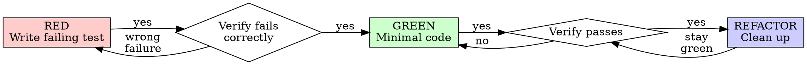

# Test-Driven Development

## Overview

Write the test first. Watch it fail. Write minimal code to pass.

**Core principle:** If you didn't watch the test fail, you don't know if it tests the right thing.

**The substance matters more than the ritual.** Watching the test fail, writing the minimal code to pass — those are what produce the design pressure. A test that "happens to be first" but wasn't watched fail isn't doing TDD's work.

## Two loops: inner red-green, outer acceptance oracle

> Spec: `archive/specs/2026-05-24-acceptance-oracle-with-teeth.md`. Sibling doctrine: `docs/wiki/writing-plans.md` § Acceptance Oracle (outer-loop).

Test-driven development at this project runs at two altitudes:

- **Inner loop (this wiki, rest of the document):** per-function red-green-refactor. The executor writes the failing test, watches it fail, writes minimal code to pass, refactors. Production code follows a failing test.
- **Outer loop — the acceptance oracle:** the plan declares its acceptance criteria as a bindable table; each criterion is either `gate-bound` to a named executable test (typed-prefix: `pytest:`, `node:`, `cargo:`, `grep:`, `cited:`) or marked `reviewer-judgment` for tone/shape qualities. A deterministic *green-gate* at the merge boundary refuses the done-verdict if any gate-bound acceptance test is red or missing. Full doctrine in `writing-plans.md` § Acceptance Oracle (outer-loop).

The two loops are **structurally coupled**: the outer-loop gate is the teeth that licenses the inner-loop carrot. Any inner-loop discipline lost to sunk-cost rationalization (a skipped test, a weakened assertion) goes RED at the authoritative merge-gate before "done" can be declared. That structural backstop is what lets the inner-loop framing be offer-shaped rather than imperative — the gate catches the failure mode the imperative would have guarded against. **"Post-review" in the outer loop means after the *plan* review, not the *code* review** — the acceptance test is still authored before its implementation; test-first at both altitudes.

## When to Use

**Always:** new features, bug fixes, refactoring, behavior changes.

**Exceptions (ask the PM):** throwaway prototypes, generated code, configuration files.

If "skip TDD just this once" is the line in your head, that's a signal worth listening to — it's the sunk-cost or shortcut instinct making its case. The TDD path is usually faster than debugging from the testing-after artifact later; let the test lead and the design pressure stays where it pays off.

## The Iron Law

> The shorthand stays "Iron Law" because the substance is iron-clad — production code follows a failing test. The framing below leads with the better path rather than an imperative; outer-loop acceptance-gate backstop (see § Two loops) is what licenses the carrot tone.

**Production code follows a failing test.** That's the practice. Watching the test fail first is what proves it tests the right thing — and writing the test first against an empty implementation is what gives you the *design pressure* (the test as the first consumer of the API) that's the actual point of TDD.

**Sunk-cost is the real moment of choice — and the warning is preserved by design.** If you've already written code before the test, you have a genuine incentive to keep it: hours feel spent, the shape looks plausible, the reference is right there. That's exactly the moment when re-deriving from a test is the cleanest path:

- Code adapted from a pre-written reference is testing-after wearing testing-first's coat. The reference primes you toward the implementation you already wrote, not the design the test would have asked for.
- Re-derivation usually takes less time than expected — the hours stayed in your head; the typing is the small part.
- The design pressure (the test as the first consumer) is what you came here for. You only get it against an empty implementation.

The cleanest path is: close the reference, write the failing test against nothing, watch it fail, write minimal code to pass. The structural backstop for any inner-loop discipline lost here is the outer-loop acceptance-gate — sunk-cost-driven shortcuts go RED at the merge boundary before "done" can be declared (`docs/wiki/writing-plans.md` § Acceptance Oracle).

## Red-Green-Refactor



### RED — Write Failing Test

One minimal test, one behavior, clear name, real code (no mocks unless unavoidable).

<Good>
```typescript
test('retries failed operations 3 times', async () => {
  let attempts = 0;
  const operation = () => {
    attempts++;
    if (attempts < 3) throw new Error('fail');
    return 'success';
  };
  const result = await retryOperation(operation);
  expect(result).toBe('success');
  expect(attempts).toBe(3);
});
```
</Good>

<Bad>
```typescript
test('retry works', async () => {
  const mock = jest.fn().mockRejectedValueOnce(...).mockResolvedValueOnce('success');
  await retryOperation(mock);
  expect(mock).toHaveBeenCalledTimes(3);
});
// Vague name, tests mock not code
```
</Bad>

### Verify RED — Watch It Fail (MANDATORY)

```bash
npm test path/to/test.test.ts
```

Confirm: test fails (not errors), failure message expected, fails because feature missing (not typos). Test passes? You're testing existing behavior — fix the test. Test errors? Fix the error and re-run until it fails correctly.

### GREEN — Minimal Code

Simplest code to pass the test. Don't add features, refactor other code, or "improve" beyond the test.

```typescript
async function retryOperation<T>(fn: () => Promise<T>): Promise<T> {
  for (let i = 0; i < 3; i++) {
    try { return await fn(); }
    catch (e) { if (i === 2) throw e; }
  }
  throw new Error('unreachable');
}
```

Don't pre-add `options?: { maxRetries?, backoff?, onRetry? }` — YAGNI.

### Verify GREEN (MANDATORY)

Test passes, other tests still pass, output pristine. Test fails? Fix code, not test. Other tests fail? Fix now.

### REFACTOR

After green: remove duplication, improve names, extract helpers. Keep tests green. Don't add behavior.

### Repeat

Next failing test for the next feature.

## Good Tests

| Quality | Good | Bad |
|---------|------|-----|
| Minimal | One thing. "and" in name? Split it. | `test('validates email and domain and whitespace')` |
| Clear | Name describes behavior | `test('test1')` |
| Shows intent | Demonstrates desired API | Obscures what code should do |

## Why Order Matters

**Tests-after pass immediately**, which proves nothing — might test the wrong thing, the implementation rather than behavior, or miss edge cases. Test-first forces you to see the test fail, proving it tests something.

**Tests-after answer "what does this do?"** Tests-first answer "what should this do?" Tests-after are biased by your implementation. Tests-first force edge case discovery before implementing.

## Common Rationalizations

| Excuse | Reality |
|--------|---------|
| "Too simple to test" | Simple code breaks. Test takes 30 seconds. |
| "I'll test after" | Tests passing immediately prove nothing. |
| "Already manually tested" | Ad-hoc ≠ systematic. No record, can't re-run. |
| "Deleting X hours is wasteful" | The hours stayed in your head — re-derivation usually takes less than expected, and the design pressure you'd lose is what you came here for. |
| "Keep as reference, write tests first" | When the reference is open, you'll adapt it; the design loop you wanted runs against an empty implementation, not a finished one. Closing the reference is the cleanest path. |
| "Test hard = design unclear" | Listen to the test. Hard to test = hard to use. |
| "TDD will slow me down" | TDD is faster than debugging. |
| "Existing code has no tests" | You're improving it. Add tests now. |

## Signals to re-derive from the test

These are the moments where TDD's value is highest — when something is tempting you toward testing-after. None of them are failures of character; they're predictable instincts the design exists to absorb:

- Code before test, or tests added "later"
- Test passes immediately on first run (no failing-test phase)
- Can't explain why a test failed
- Rationalizations: "just this once," "keep as reference," "adapt existing code," "already spent X hours," "TDD is dogmatic — I'm being pragmatic," "this is different because..."

When one of these fires, the cleanest path is to re-derive from the test: write the failing test against an empty implementation, watch it fail, write minimal code to pass. The re-derivation is usually less work than debugging from the testing-after artifact later, and it puts the design pressure back where it earns its keep. The outer-loop acceptance gate is the structural backstop if any of this slips (§ Two loops).

## Example: Bug Fix

**Bug:** empty email accepted.

**RED**
```typescript
test('rejects empty email', async () => {
  const result = await submitForm({ email: '' });
  expect(result.error).toBe('Email required');
});
```
`FAIL: expected 'Email required', got undefined` ✓

**GREEN**
```typescript
function submitForm(data: FormData) {
  if (!data.email?.trim()) return { error: 'Email required' };
  // ...
}
```
`PASS` ✓

## Verification Checklist

Before marking work complete:
- [ ] Every new function/method has a test
- [ ] Watched each test fail before implementing
- [ ] Each test failed for expected reason (feature missing, not typo)
- [ ] Wrote minimal code to pass
- [ ] All tests pass; output pristine
- [ ] Tests use real code (mocks only if unavoidable)
- [ ] Edge cases and errors covered

Can't check all boxes? You skipped TDD. Start over.

## When Stuck

| Problem | Solution |
|---------|----------|
| Don't know how to test | Write the wished-for API. Write the assertion first. Ask the PM. |
| Test too complicated | Design too complicated. Simplify interface. |
| Must mock everything | Code too coupled. Use dependency injection. |
| Test setup huge | Extract helpers. Still complex? Simplify design. |

## Test-Plan Execution as Bug-Finding Tool

**Test-plan execution surfaces bugs faster than the eventual tests do.** The act of asking "what real behavior does this assert?" against a real shell/script forces blind spots into view — bugs surface during test-writing (as executor blockers) rather than when CI runs green tests post-ship. Across a 9-workstream install-script test plan, 6 production bugs were surfaced during test-writing, not via the eventual green tests.

Conclusion: a test plan IS a bug-finding tool from the moment drafting begins, not just a specification for what tests to write later. (Source: project-rag L47) → `test-design-discipline.md` §44 (bound every run), §36 (60-second reproducer before re-firing).

## Test-Plan Drafting as Bug Discovery

Drafting the test plan often surfaces bugs faster than the tests themselves do. The act of enumerating *what should be tested* forces a walk of the actual surface: the producer's outputs, the consumer's expected shapes, the edge cases the code claims to handle. Each enumerated case is a hypothesis the plan author must reconcile against real code — and that reconciliation step is where latent bugs surface.

**Pattern:** when authoring a test plan, treat the plan-draft pass as the first verification gate. Read the code each enumerated test would exercise; bugs found at plan-draft time are an order of magnitude cheaper to fix than bugs found at test-execution time, because the plan author still holds full context.

**Apply when:** drafting an AC table, writing a regression-net plan for a refactor, or scoping a contract test for a new producer/consumer seam. The drafting pass is not bureaucracy — it's the cheapest empirical pass available.

## Debugging Integration

Bug found? Write failing test reproducing it. Follow TDD cycle. Test proves fix and prevents regression. Never fix bugs without a test.

## The TDD signature

The clean signature of TDD work: every production change has a test that failed first, the failure was watched, the minimal code passed it. When the inner loop runs cleanly, the outer-loop acceptance-gate stays green naturally — the two altitudes are designed to compose.

```
Production code → test exists and failed first
```

Throwaway prototypes and generated-code exceptions are scoped in § When to Use; they carry no stigma when the PM agrees they fit the exception shape.

---

# Testing Anti-Patterns

**Load this reference when:** writing or changing tests, adding mocks, or tempted to add test-only methods to production code.

## Overview

Tests must verify real behavior, not mock behavior. Mocks are a means to isolate, not the thing being tested.

**Core principle:** Test what the code does, not what the mocks do.

**Following strict TDD prevents these anti-patterns.**

## The Iron Laws

```
1. NEVER test mock behavior
2. NEVER add test-only methods to production classes
3. NEVER mock without understanding dependencies
```

## Anti-Pattern 1: Testing Mock Behavior

**The violation:**
```typescript
// ❌ BAD: Testing that the mock exists
test('renders sidebar', () => {
  render(<Page />);
  expect(screen.getByTestId('sidebar-mock')).toBeInTheDocument();
});
```

**Why this is wrong:**
- You're verifying the mock works, not that the component works
- Test passes when mock is present, fails when it's not
- Tells you nothing about real behavior

**The PM's correction:** "Are we testing the behavior of a mock?"

**The fix:**
```typescript
// ✅ GOOD: Test real component or don't mock it
test('renders sidebar', () => {
  render(<Page />);  // Don't mock sidebar
  expect(screen.getByRole('navigation')).toBeInTheDocument();
});

// OR if sidebar must be mocked for isolation:
// Don't assert on the mock - test Page's behavior with sidebar present
```

### Gate Function

```
BEFORE asserting on any mock element:
  Ask: "Am I testing real component behavior or just mock existence?"

  IF testing mock existence:
    STOP - Delete the assertion or unmock the component

  Test real behavior instead
```

## Anti-Pattern 2: Test-Only Methods in Production

**The violation:**
```typescript
// ❌ BAD: destroy() only used in tests
class Session {
  async destroy() {  // Looks like production API!
    await this._workspaceManager?.destroyWorkspace(this.id);
    // ... cleanup
  }
}

// In tests
afterEach(() => session.destroy());
```

**Why this is wrong:**
- Production class polluted with test-only code
- Dangerous if accidentally called in production
- Violates YAGNI and separation of concerns
- Confuses object lifecycle with entity lifecycle

**The fix:**
```typescript
// ✅ GOOD: Test utilities handle test cleanup
// Session has no destroy() - it's stateless in production

// In test-utils/
export async function cleanupSession(session: Session) {
  const workspace = session.getWorkspaceInfo();
  if (workspace) {
    await workspaceManager.destroyWorkspace(workspace.id);
  }
}

// In tests
afterEach(() => cleanupSession(session));
```

### Gate Function

```
BEFORE adding any method to production class:
  Ask: "Is this only used by tests?"

  IF yes:
    STOP - Don't add it
    Put it in test utilities instead

  Ask: "Does this class own this resource's lifecycle?"

  IF no:
    STOP - Wrong class for this method
```

## Anti-Pattern 3: Mocking Without Understanding

**The violation:**
```typescript
// ❌ BAD: Mock breaks test logic
test('detects duplicate server', () => {
  // Mock prevents config write that test depends on!
  vi.mock('ToolCatalog', () => ({
    discoverAndCacheTools: vi.fn().mockResolvedValue(undefined)
  }));

  await addServer(config);
  await addServer(config);  // Should throw - but won't!
});
```

**Why this is wrong:**
- Mocked method had side effect test depended on (writing config)
- Over-mocking to "be safe" breaks actual behavior
- Test passes for wrong reason or fails mysteriously

**The fix:**
```typescript
// ✅ GOOD: Mock at correct level
test('detects duplicate server', () => {
  // Mock the slow part, preserve behavior test needs
  vi.mock('MCPServerManager'); // Just mock slow server startup

  await addServer(config);  // Config written
  await addServer(config);  // Duplicate detected ✓
});
```

### Gate Function

```
BEFORE mocking any method:
  STOP - Don't mock yet

  1. Ask: "What side effects does the real method have?"
  2. Ask: "Does this test depend on any of those side effects?"
  3. Ask: "Do I fully understand what this test needs?"

  IF depends on side effects:
    Mock at lower level (the actual slow/external operation)
    OR use test doubles that preserve necessary behavior
    NOT the high-level method the test depends on

  IF unsure what test depends on:
    Run test with real implementation FIRST
    Observe what actually needs to happen
    THEN add minimal mocking at the right level

  Red flags:
    - "I'll mock this to be safe"
    - "This might be slow, better mock it"
    - Mocking without understanding the dependency chain
```

## Anti-Pattern 4: Incomplete Mocks

**The violation:**
```typescript
// ❌ BAD: Partial mock - only fields you think you need
const mockResponse = {
  status: 'success',
  data: { userId: '123', name: 'Alice' }
  // Missing: metadata that downstream code uses
};

// Later: breaks when code accesses response.metadata.requestId
```

**Why this is wrong:**
- **Partial mocks hide structural assumptions** - You only mocked fields you know about
- **Downstream code may depend on fields you didn't include** - Silent failures
- **Tests pass but integration fails** - Mock incomplete, real API complete
- **False confidence** - Test proves nothing about real behavior

**The Iron Rule:** Mock the COMPLETE data structure as it exists in reality, not just fields your immediate test uses.

**The fix:**
```typescript
// ✅ GOOD: Mirror real API completeness
const mockResponse = {
  status: 'success',
  data: { userId: '123', name: 'Alice' },
  metadata: { requestId: 'req-789', timestamp: 1234567890 }
  // All fields real API returns
};
```

### Gate Function

```
BEFORE creating mock responses:
  Check: "What fields does the real API response contain?"

  Actions:
    1. Examine actual API response from docs/examples
    2. Include ALL fields system might consume downstream
    3. Verify mock matches real response schema completely

  Critical:
    If you're creating a mock, you must understand the ENTIRE structure
    Partial mocks fail silently when code depends on omitted fields

  If uncertain: Include all documented fields
```

## Anti-Pattern 5: Integration Tests as Afterthought

**The violation:**
```
✅ Implementation complete
❌ No tests written
"Ready for testing"
```

**Why this is wrong:**
- Testing is part of implementation, not optional follow-up
- TDD would have caught this
- Can't claim complete without tests

**The fix:**
```
TDD cycle:
1. Write failing test
2. Implement to pass
3. Refactor
4. THEN claim complete
```

## When Mocks Become Too Complex

**Warning signs:**
- Mock setup longer than test logic
- Mocking everything to make test pass
- Mocks missing methods real components have
- Test breaks when mock changes

**The PM's question:** "Do we need to be using a mock here?"

**Consider:** Integration tests with real components often simpler than complex mocks

## TDD Prevents These Anti-Patterns

**Why TDD helps:**
1. **Write test first** → Forces you to think about what you're actually testing
2. **Watch it fail** → Confirms test tests real behavior, not mocks
3. **Minimal implementation** → No test-only methods creep in
4. **Real dependencies** → You see what the test actually needs before mocking

**If you're testing mock behavior, you violated TDD** - you added mocks without watching test fail against real code first.

## Quick Reference

| Anti-Pattern | Fix |
|--------------|-----|
| Assert on mock elements | Test real component or unmock it |
| Test-only methods in production | Move to test utilities |
| Mock without understanding | Understand dependencies first, mock minimally |
| Incomplete mocks | Mirror real API completely |
| Tests as afterthought | TDD - tests first |
| Over-complex mocks | Consider integration tests |

## Red Flags

- Assertion checks for `*-mock` test IDs
- Methods only called in test files
- Mock setup is >50% of test
- Test fails when you remove mock
- Can't explain why mock is needed
- Mocking "just to be safe"

## The Bottom Line

**Mocks are tools to isolate, not things to test.**

If TDD reveals you're testing mock behavior, you've gone wrong.

Fix: Test real behavior or question why you're mocking at all.
