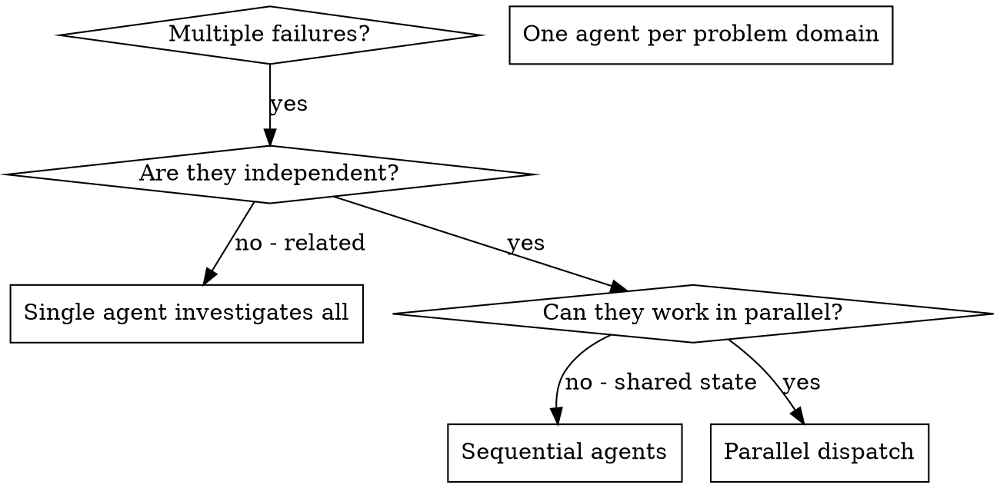

# Dispatching Parallel Agents

## Overview

When you have multiple unrelated failures (different test files, different subsystems, different bugs), investigating them sequentially wastes time. Each investigation is independent and can happen in parallel.

**Core principle:** Dispatch one agent per independent problem domain. Let them work concurrently.

## Concurrency Budget

**Hard cap: 6-8 concurrent background agents in a single dispatch wave.** Exceeding this risks platform-level crashes — each Opus orchestrator spawns sub-agents, so a wave of orchestrators can inflate to 200+ real agents under the hood.

**Rules:**
- If any agents in the wave are themselves orchestrators (Opus delegating to subagents), divide the budget by the expected fanout before dispatching. A wave of 4 orchestrators each spawning 6 sub-agents is a 24-agent wave, not a 4-agent wave.
- Use an explicit **pilot → expand ramp**: launch 4-6 agents, observe completion and stability, then expand to the next wave. Do not pre-schedule the full batch.
- Batches that would breach the cap (after fanout adjustment) are a **PM call, not an EM call** — the cost and stability tradeoffs belong at that level.

This rule is a heuristic calibrated from observed crash thresholds, not a platform-documented limit. Treat it as a ceiling, not a target.

## Anti-Pattern: Dedicated Mechanical-Merge Slots

**Do not allocate a team slot to an agent whose only job is dedup/concat/reformat.** Mechanical merge does not justify a team slot.

When an agent's entire brief is "take these N specialist outputs and combine them," fold that work into the producers (via adversarial peer alignment) or the consumer (the one with judgment — e.g., the Opus synthesizer or the EM directly). A team slot must justify itself with judgment work, not bookkeeping.

**Empirical basis:** In one measured pipeline run, the dedicated consolidator added 4+ minutes wall-clock and was beaten to completion by the downstream sweep that read raw specialist outputs directly.

If you find yourself writing a specialist brief that includes "then consolidate the outputs," stop and ask: does that consolidation require judgment (edge-case resolution, contradiction reconciliation, cross-domain synthesis)? If yes, give it to the consumer-with-judgment. If no, eliminate the role.

## Background by Default

**Any autonomous agent expected to run >2 minutes should be dispatched with `run_in_background: true`.** The EM gets notified on completion and processes results then — it doesn't need to block watching agent output scroll by.

This applies to:
- Enricher agents (10-15 min each)
- Executor agents (5-15 min each)
- Research scouts and verifiers (Haiku/Sonnet phases within pipelines)
- Top-level orchestrator agents (research --mode=structured, architecture-survey)
- Code health reviewers

**Exceptions** (keep foreground):
- Agents whose results you need *immediately* to make the next decision (e.g., a quick Haiku lookup before choosing an approach)
- Agents in a strictly sequential pipeline where the next dispatch depends on the previous result AND you have no other work to do while waiting

When dispatching N independent agents in background, you'll be notified as each completes. Process results as they arrive — don't wait for all N before starting.

## When to Use



**Use when:**
- 3+ test files failing with different root causes
- Multiple subsystems broken independently
- Each problem can be understood without context from others
- No shared state between investigations
- Mechanical drift cleanup across many single-file edits — narrow per-file briefs run ~5x faster than serial.
- Surgical follow-ups to a novel cluster — full ceremony on the novel item, direct dispatch on the rest with explicit file-scope partitioning.

**Don't use when:**
- Failures are related (fix one might fix others)
- Need to understand full system state
- Agents would interfere with each other

## EM File-Overlap Pre-Dispatch Pass

Plans that claim "fully independent files" are **hypothesis, not ground truth** — the executor brief is the EM's contract, and the EM owns the overlap audit. Before fanning out N parallel executors:

1. **List every file each task will touch** (read the per-task scope explicitly, don't infer from task titles).
2. **Compute the intersection across pairs.** Any file touched by ≥2 tasks is an overlap — fold those tasks into one executor or sequence them.
3. **Re-derive parallelism from stub footprints, not README dispatch graphs.** A plan's high-level dispatch diagram describes intended seams, not actual file mutations. The stubs are the contract; the diagram is hypothesis. When the two disagree, the stub footprints win — re-derive the wave map from the actual touched-file sets each stub will produce.

The failure mode this prevents: two parallel executors silently overwriting each other's edits on a "theoretically non-conflicting" shared file (different sections, different functions — still the same file, still a clobber under concurrent fan-out).

## Dispatch-Gate Taxonomy — Narrative Causality Is Not a Gate

The opposite failure of the file-overlap pass: over-sequencing parallel-safe work because the *narrative* of the plan implies an order. A plan with the structure "Chunk 1 explains the root cause; Chunks 2-8 fix the downstream symptoms" tempts the EM to gate Chunks 2-8 on Chunk 1's completion. The plan's narrative is hypothesis about *causation*, not contract about *dispatch order*.

**The only true dispatch gates between parallel-wave executors are:**

1. **File-write overlap.** Two executors editing the same path. (Covered by § EM File-Overlap Pre-Dispatch Pass above.)
2. **Output-consumption.** Executor B reads a file Executor A writes. (Covered by `coordinator/CLAUDE.md` § Pre-Dispatch Verification: "Dispatch-brief task ordering must be explicit when later tasks reference earlier outputs.")
3. **Contract-change dependency.** Executor A bumps a schema, helper signature, or shared API that downstream executors will misread if dispatched before A lands. Promote shared-API work to a predecessor wave (see § Shared-API Gap in Parallel Waves below).

**Things that are NOT dispatch gates:**

- **Narrative / explanatory causality.** "Cluster A is the root cause of the symptoms in Cluster B" describes why both matter — it does not say B's executor cannot start until A's commits. If their file footprints are disjoint and neither consumes the other's output, they parallelize.
- **Aesthetic ordering of landings.** "I'd rather the fix land before the doc that describes it" is preference, not dependency. At minutes-of-wall-clock scale with per-commit traceability on the workstream branch, cosmetic out-of-order landings cost effectively nothing. A docs commit announcing a forthcoming fix telegraphs the shape and is cheaply re-readable in git log if it lands first.
- **"Review Chunk 1 before fanning out the rest" intuition.** The plan-review gate already approved the plan; re-reviewing the first executor's output before dispatching peers is gating-on-confidence, not gating-on-dependency. Spot-check after the wave returns.
- **"Feels cleaner if A goes first."** If the gate question can't be expressed as a *concrete artifact B would read of A's*, it is not a gate.

**Wall-clock is the goal; per-executor budget is the constraint.** Aim to keep each executor's scope to ~15-25 minutes on a single coherent surface. Per-executor overload (60-min Sonnet on a sprawling rename, compaction risk, single-failure-loses-batch) is the opposing failure to under-parallelization. The two failures are not symmetric — under-parallelization wastes wall-clock at every dispatch, while over-loading wastes wall-clock only on the failure path. But "always more parallel" is wrong when the executor would meaningfully exceed the budget on a single surface.

**Trigger for the gate-graph computation:** at the seam between plan-review-approved and first dispatch. Before authoring the first dispatch brief, the EM enumerates each task's touched files, marks the three real gate types above, and writes the wave map. This is a few-minute mechanical exercise; it is also exactly the work the EM tends to skip in flow.

**Empirical motivation.** 2026-05-20, self: a plan with 15 enriched chunks across disjoint file scopes was dispatched as "Wave A = Chunk 1, then Waves B+B' = 8 parallel" — gated on the explanatory framing that Chunk 1 was the upstream cause. Chunks 2, 3, 4, 5, 12, 14, 15 had disjoint file scopes from each other and from Chunk 1; the correct shape was a 8-way first wave, not 1+8.

## Peer-Scope Prohibition in Parallel-Wave Prompts

Concurrent executors see disk state, not each other's intent. When Executor B is dispatched for Chunk 5 in parallel with Executor A for Chunk 3, B may "helpfully" extend scope on noticing Chunk 3's expected output not yet on disk — either redoing A's work, fixing what looks broken at A's seam, or papering over an unfinished contract. The result is overlapping writes on what was meant to be disjoint scope.

**Mitigation:** every dispatch prompt in a parallel wave carries an explicit **In-scope / Out-of-scope** block that names peer chunks by ID:

```
## In-scope
- <files this executor owns>
- <output this executor produces>

## Out-of-scope — peer work, do NOT touch
- Chunk 3 (files: <list>) — concurrent executor handles this
- Chunk 5 (files: <list>) — concurrent executor handles this
- ...

If a peer's expected output appears missing on disk, assume a peer is on it — do NOT extend scope to "fix" it, do NOT touch peer files even if your work seems blocked by their absence. If genuinely blocked, return with a blocker report.
```

This composes with the existing destructive-action prohibition and the disk-first verification preamble. All three are non-optional in parallel-wave prompts.

**Why this is structural, not cosmetic:** Sonnet executors at wave-time are pattern-matching for "what does this codebase expect to exist." A missing file at a known path reads as "broken state, fix it" rather than "peer wave hasn't landed yet, unrelated." The prompt is the only signal that distinguishes the two.

## Worktree vs. Same-Worktree Dispatch

**Default: dispatch into the current worktree.** Do NOT create separate git worktrees for parallel agents unless there is a genuine need for branch-level isolation (e.g., separate PRs targeting different base branches).

**Decision rule:**
- **Disjoint file sets → parallel, same worktree.** Agents write to different files; the filesystem is the coordination mechanism. No merge ceremony needed.
- **Overlapping files → sequential, same worktree.** Run agents one after another so each sees the previous agent's changes. This is almost always cheaper than worktree creation + merge conflict resolution at agent execution speed.
- **Overlapping files with different insertion points** (e.g., appending to different sections of the same file) → still sequential. "Theoretically non-conflicting" edits in the same file are fragile; sequential execution eliminates the risk for negligible time cost.
- **True branch isolation needed** (different base branches, separate PRs, long-lived parallel features) → worktrees are forbidden; use sequential execution on the active workstream branch instead.

**Why not worktrees by default?** Worktrees solve a human-scale problem: needing days of isolation on parallel features. At agent execution speed, the merge overhead (branch creation, conflict resolution, integration verification) exceeds the time saved by parallelism. Sequential execution on overlapping files is almost always the cheaper path.

## The Pattern

### 1. Identify Independent Domains

Group failures by what's broken:
- File A tests: Tool approval flow
- File B tests: Batch completion behavior
- File C tests: Abort functionality

Each domain is independent - fixing tool approval doesn't affect abort tests.

### 2. Create Focused Agent Tasks

Each agent gets:
- **Specific scope:** One test file or subsystem
- **Clear goal:** Make these tests pass
- **Constraints:** Don't change other code
- **Expected output:** Summary of what you found and fixed

### 3. Dispatch in Parallel

```typescript
// In Claude Code / AI environment
Task("Fix agent-tool-abort.test.ts failures")
Task("Fix batch-completion-behavior.test.ts failures")
Task("Fix tool-approval-race-conditions.test.ts failures")
// All three run concurrently
```

### 4. Review and Integrate

When agents return:
- Read each summary
- Verify fixes don't conflict
- Run full test suite
- Integrate all changes

## Agent Prompt Structure

Good agent prompts are:
1. **Focused** - One clear problem domain
2. **Self-contained** - All context needed to understand the problem
3. **Specific about output** - What should the agent return?

```markdown
Fix the 3 failing tests in src/agents/agent-tool-abort.test.ts:

1. "should abort tool with partial output capture" - expects 'interrupted at' in message
2. "should handle mixed completed and aborted tools" - fast tool aborted instead of completed
3. "should properly track pendingToolCount" - expects 3 results but gets 0

These are timing/race condition issues. Your task:

1. Read the test file and understand what each test verifies
2. Identify root cause - timing issues or actual bugs?
3. Fix by:
   - Replacing arbitrary timeouts with event-based waiting
   - Fixing bugs in abort implementation if found
   - Adjusting test expectations if testing changed behavior

Do NOT just increase timeouts - find the real issue.

Return: Summary of what you found and what you fixed.
```

## Common Mistakes

**❌ Too broad:** "Fix all the tests" - agent gets lost
**✅ Specific:** "Fix agent-tool-abort.test.ts" - focused scope

**❌ No context:** "Fix the race condition" - agent doesn't know where
**✅ Context:** Paste the error messages and test names

**❌ No constraints:** Agent might refactor everything
**✅ Constraints:** "Do NOT change production code" or "Fix tests only"

**❌ Vague output:** "Fix it" - you don't know what changed
**✅ Specific:** "Return summary of root cause and changes"

**❌ Verb-style mechanical brief:** "Read file A, then Write the same content to file B"
**✅ Shell idiom:** "Run `cp A B`" — bulk file ops belong in shell, not Read+Write verbs.

**❌ Hidden shared API:** parallel waves edit callers of an unwritten helper, surfacing as footprint violations
**✅ Promote shared API to predecessor wave:** land the shared surface before fanning out callers.

## When NOT to Use

**Related failures:** Fixing one might fix others — investigate together first
**Need full context:** Understanding requires seeing entire system
**Exploratory debugging:** You don't know what's broken yet
**Overlapping files:** Agents editing the same files — run sequentially instead (see Worktree vs. Same-Worktree Dispatch above)

## Real Example from Session

**Scenario:** 6 test failures across 3 files after major refactoring

**Failures:**
- agent-tool-abort.test.ts: 3 failures (timing issues)
- batch-completion-behavior.test.ts: 2 failures (tools not executing)
- tool-approval-race-conditions.test.ts: 1 failure (execution count = 0)

**Decision:** Independent domains - abort logic separate from batch completion separate from race conditions

**Dispatch:**
```
Agent 1 → Fix agent-tool-abort.test.ts
Agent 2 → Fix batch-completion-behavior.test.ts
Agent 3 → Fix tool-approval-race-conditions.test.ts
```

**Results:**
- Agent 1: Replaced timeouts with event-based waiting
- Agent 2: Fixed event structure bug (threadId in wrong place)
- Agent 3: Added wait for async tool execution to complete

**Integration:** All fixes independent, no conflicts, full suite green

**Time saved:** 3 problems solved in parallel vs sequentially

## Coordinator-Supervised Sequential Pattern

For chunks that are too large for any single executor but have natural seam boundaries, use the **coordinator-supervised sequential** pattern instead of pure parallel dispatch.

**When to use:**
- Stub has 10+ human-indexed hours of estimated work
- The work has natural seam boundaries (independent API endpoints, separable subsystems)
- Each sub-part is independently correct but the whole must cohere
- A single executor would run out of context

**The pattern — Opus tech lead with Sonnet executors:**
1. **Dispatch a dedicated Opus agent as tech lead** — not the coordinator itself. The coordinator's context is the scarcest resource in the system; don't fill it with sub-task orchestration for one deliverable. Think of it like an EM delegating to a senior technical lead rather than managing individual contributors directly.
2. The tech lead holds the full enriched spec and owns the deliverable:
   - Decomposes into sequential sub-tasks at seam boundaries
   - Dispatches Sonnet executors one at a time for each sub-task
   - Verifies each executor's output against the master spec before dispatching the next
   - Makes micro-decisions within the spec's intent without escalating
   - Can handle a complex sub-task directly if a Sonnet executor would struggle
3. The tech lead reports back to the coordinator with a single completion report
4. Escalation to coordinator only for: spec ambiguity, out-of-scope architectural decisions, or PM-level blockers

**Why not supervise from the coordinator directly?** The coordinator session may have many parallel workstreams, an ongoing PM conversation, and portfolio-level context. Routing every sub-task completion through that session fragments its attention on implementation minutiae. A dispatched Opus tech lead has fresh context, full focus on one deliverable, and the judgment to make micro-calls autonomously.

**When NOT to use this — use a single Sonnet executor instead:**
- The stub is small enough for one executor (the common case)
- The system is tightly coupled but the enriched spec has exact code sketches — a single Sonnet can follow a well-specified blueprint regardless of coupling
- If the spec is genuinely incomplete, fix the spec first or have the EM handle it directly — don't dispatch an Opus executor (see `docs/wiki/delegate-execution.md` Phase 2 rubric)

See `docs/wiki/delegate-execution.md` Phase 2 for the full model selection rubric.

## Long-Running Dispatched Process

> See coordinator/CLAUDE.md § Subagent Dispatch for background dispatch doctrine.

When a dispatched agent spawns a background shell process (installer, pipeline runner, long-running executor) that must run beyond the agent's own turn, that process needs machine-parseable progress output — not just a log file the EM reads at the end.

**Why prose logs aren't enough:** the EM can't interrupt a running background process to ask "where are you?" It polls a status artifact. If the artifact only contains prose, the EM has to parse it. If parsing fails or the format drifts, the EM can't distinguish "still running — phase 3 of 7" from "hung silently."

**Required pattern for long-running dispatched processes:**

1. **Status file** — the process writes a structured status file at a known path (e.g., `<output-dir>/install-status.json` or `tasks/<slug>/status.json`). The EM polls this file.

2. **Heartbeat** — the process updates a `last_heartbeat_utc` (or similar) timestamp every N seconds. A stale heartbeat is the EM's signal that the process has hung or crashed — distinct from "still running but quiet."

3. **Tagged stdout** — every phase boundary emits a parseable tag:
   - `PHASE-START:<phase-name>` — phase is beginning.
   - `PHASE-END:<phase-name>` — phase completed successfully.
   - `PHASE-SKIP:<phase-name>:<reason>` — phase was skipped (idempotency, precondition not met, etc.).

   These tags enable the EM to reconstruct "what has run, what is pending, what was skipped" from a log tail without parsing prose.

**Status file schema (minimum):**

```json
{
  "phase": "<current-phase-name>",
  "status": "running | success | failed | skipped",
  "last_heartbeat_utc": "<ISO-8601>",
  "phases_completed": ["phase-1", "phase-2"],
  "phases_skipped": [],
  "error": null
}
```

**EM polling protocol:**
- Poll `last_heartbeat_utc` — if stale by >2× the expected heartbeat interval, treat as hung.
- Check `status` field before reading `phases_completed` — a `failed` status with a non-empty `phases_completed` means partial work was done; use this to resume from the last checkpoint, not re-run from scratch.
- Do NOT derive status from log file size or line count — these are unreliable proxies.

**Empirical source:** `tasks/lessons.md:358` — generalizes the `install_status_writer` pattern from the holodeck plugin installer, 2026-05-07.

## Shared-API Gap in Parallel Waves

*2026-04-29, claude-unreal-holodeck.* When a parallel wave dispatches executors that all call a shared helper that hasn't been written yet, the executors surface the gap as footprint violations — each tries to create or reference the missing surface and collides. This is the diagnostic signal, not a wave-sequencing failure.

**Rule:** Promote shared-API work to the predecessor wave. The shared surface must land and be verified before any consumer executor fans out. Never schedule shared-API work parallel-with-consumers — the writes will interleave against an absent contract.

**Diagnosis:** if a fan-out wave produces footprint violations across multiple independent executors touching the same path, the likely cause is a missing shared surface that each executor assumed was already present.

## Parallel Executor Fan-Out on Same Test File Races

*2026-05-17, project-rag-ue-addon.* When N parallel executors all edit the same test file, their writes interleave regardless of how disjoint the logical sections are. The result is a partially-written file where the last writer wins and earlier writes are silently lost. Standard worktree vs. same-worktree analysis (see § Worktree vs. Same-Worktree Dispatch) applies — but test files are a recurring collision point because executors often add test cases to a shared suite file rather than creating new files.

**Rule:** when dispatching parallel executors that all need to extend the same test file, choose one of:

1. **Per-class test files** — the cleanest break. Assign each executor its own test file; no overlap, no ceremony. This is the preferred approach when the test suite is new or the executor scope maps naturally to a class boundary.
2. **Serialize the test-file edits** — sequence the executors so each sees the previous executor's test additions before writing its own. Adds latency but eliminates the race for an existing test file that can't be easily split.

Do NOT dispatch N executors with "append to `tests/foo.test.ts`" in parallel. The overlap analysis in § EM File-Overlap Pre-Dispatch Pass applies — test files are files.

## Key Benefits

1. **Parallelization** - Multiple investigations happen simultaneously
2. **Focus** - Each agent has narrow scope, less context to track
3. **Independence** - Agents don't interfere with each other
4. **Speed** - 3 problems solved in time of 1

## Dispatch-Prompt Convention: `expected_branch`

When dispatching an executor that will commit, the EM **must** capture the active branch
at dispatch time and inject it into the prompt. This is the input that feeds the helper-
level deterministic gate (`coordinator-safe-commit --expected-branch <name>`) — the only
thing that fails closed if the branch flips mid-dispatch.

**EM-side** (at dispatch authoring):

```bash
# Capture current branch at dispatch time
EXPECTED_BRANCH=$(git branch --show-current)

# Include in the prompt body verbatim
prompt="""
... (your task brief) ...

expected_branch: ${EXPECTED_BRANCH}
"""
```

**Executor-side** (Standing Order in `agents/executor.md`): if the dispatch prompt
includes `expected_branch: <name>`, pass `--expected-branch <name>` to every
`coordinator-safe-commit` invocation in this dispatch. The helper aborts before staging
on mismatch (current vs expected) — load-bearing deterministic gate, not LLM-side
discipline.

**Why:** the working tree is shared across concurrent EM sessions and (per `One branch
per machine per day, always` policy) sibling sessions can flip the active branch via
`/workday-start`. Without `--expected-branch`, an executor's commits land on whatever
branch is active at commit time — which may not be the branch the dispatching EM
intended. The helper flag is the deterministic gate; doctrine alone is insufficient
because executors are LLM agents and prose instructions can be dropped under context
pressure.

Source plan: `archive/specs/2026-05-05-issue-b-expected-branch-flag.md`.

## Wall-Time Cap and Chunking Threshold for Bulk-Mechanical Dispatches

*2026-05-17, project-rag.* A single executor handed >5 files of mechanical edits accumulates wall-clock latency and context risk linearly. At >10 files, a single mid-run failure costs the entire batch.

**Default policy for bulk-mechanical dispatches** (rename, refactor pattern, doctrine sweep, format conversion):

- **Chunk at ≤5 files per executor.** Any batch whose unit-of-work is file-bounded and exceeds 5 units gets split before dispatch.
- **Dispatch in parallel waves of 5–10 executors.** Executors cannot observe their own wall-clock latency from inside the dispatch — wall-time caps written into briefs are unenforceable. The real leverage is file-count chunking (≤5 files per executor) plus an EM-side wave-level timeout: the EM sees elapsed wall-clock at dispatch time and re-dispatches survivors with a smaller chunk on slow waves. A CHECKPOINT-file recovery protocol is a future direction, not a current primitive.
- **EM serializes only the commit step.** Parallel executors write their files; the EM performs one scoped commit per wave after all executors in the wave return. Never let parallel executors each invoke a commit helper (→ § Concurrent-EM Git Operations rule: "Parallel executors must NOT each call a touched-files-aware commit helper").

**Generalizes to:** any task whose unit-of-work is a file (or file-bounded chunk) and whose total exceeds 5 units. Prefer fan-out + EM-serial-commit over single-executor sequential.

**Source:** `tasks/lessons.md:1057` (2026-05-17).

## Parallel Wiki-Append Fan-Out

*2026-05-18, self.* Parallel executor waves for wiki-append work scale cleanly when each executor edits exactly one wiki and does no queue touches and no commits. The EM holds the queue-delete + commit step serially after each wave. Wiki-append briefs are short (1-3 lines of doctrine appended to a named section), making per-executor work small but parallelism gains substantial when ~30+ named-destination entries need landing.

**Rule:** for `learn-lessons` central-clear runs with ≥10 wiki-append entries across ≥5 distinct destination wikis, prefer fan-out over EM-direct serial editing. Each executor's brief:
- Names the exact wiki path and section anchor.
- Carries the substance to append verbatim.
- Explicitly forbids queue edits and commits.
- Returns `DONE: <wiki-path>` after `ls -la` verification.

The EM-side post-wave step deletes the corresponding queue entries and commits once. This is the wiki-append generalization of the bulk-mechanical dispatch pattern in § Wall-Time Cap and Chunking Threshold.

## Verification

After agents return:
1. **Review each summary** - Understand what changed
2. **Check for conflicts** - Did agents edit same code?
3. **Run full suite** - Verify all fixes work together
4. **Spot check** - Agents can make systematic errors
