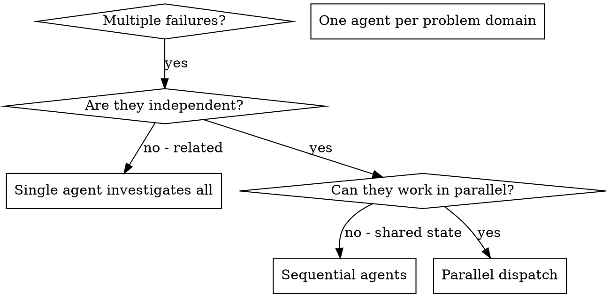

# Dispatching Parallel Agents

## Overview

When you have multiple unrelated failures (different test files, different subsystems, different bugs), investigating them sequentially wastes time. Each investigation is independent and can happen in parallel.

**Core principle:** Dispatch one agent per independent problem domain. Let them work concurrently.

## Concurrency Budget

**No fixed numeric cap.** There is no cross-session accounting and no flat wave-size limit. Each EM session reasons only about its own dispatches; the human governs aggregate device load organically across open windows.

**Two surviving hard rules:**

**(a) Ramp, don't pre-batch.** This is the expected scaling path, not a timidity gate. Launch a pilot wave, observe *this session's own* responsiveness, and expand until the EM sees its own degradation signal. Pre-scheduling the full batch bypasses the feedback loop that makes ramp-up safe. The pilot→expand shape is the governance mechanism.

**(b) Count your own fanout.** If any agents in the wave are themselves orchestrators (an Opus session delegating to subagents), multiply before dispatching — a wave of 4 orchestrators each spawning 6 sub-agents is a 24-agent wave you own, not a 4-agent wave. Most leaf workers (executors, reviewers, simple file-scoped scouts) spawn nothing and count at face value. Pipeline runners (architecture-survey, bug-sweep), research scouts running web or codebase surveys, and any deep-research subagent ARE orchestrators for counting purposes — apply rule (b) to them. The original "6-8" fear was always about orchestrator-multiplication, not about leaf-worker load; rule (b) addresses the actual risk.

**The `min(16, cpu_cores - 2)` cap is real but scoped to Workflow scripts only.** It is platform-enforced by the Workflow runtime on `agent()` calls inside a Workflow script, per the Workflow tool contract. It does NOT apply to the manual fan-out path (`fan-out-dispatch.sh` / Agent-tool). The manual path has **no automatic structural backstop on concurrency** now that the numeric cap-breach HARD STOP was removed (§ Concurrency Budget, 2026-05-30) — rules (a) and (b) plus the cores-scaled NOTE below are the guards, by design (PM-affirmed 2026-05-30). (This is distinct from the chunk-shape suitability HARD STOP at § Executing a Fan-Out Wave → Step 0.5, which is about *what* a chunk contains, not *how many* agents run.) Do NOT let the Workflow cap appear to cover a path it does not.

**Maximize utilization; memory is the real ceiling, not cores.** Because we optimize for speed, the target is to **maximize** hardware utilization without degrading the machine — not to stay under some agent count. Core count is not a cap: a CPU time-slices far more than `cores` concurrent tasks, so past `~n` agents you do not stop, you begin paying a scheduling-contention tax (returns taper, they don't cliff). CPU and GPU parallelize gracefully under that tax; the dimension that actually degrades the machine is **memory commit (RAM and VRAM)**. So the resource to be careful about is memory, and CPU/GPU saturation is fine. The cores-scaled threshold below is a first-cut proxy for "where parallel returns start tapering"; its higher-value successor — a memory-commit-aware signal — now ships as `bin/probe-memory-headroom.sh` (cross-platform best-effort RAM/VRAM read), wired into `fan-out-dispatch.sh` as the "headroom tight" NOTE below.

**Large-wave NOTE (a speed-taper advisory, not a gate).** When a wave reaches the machine-local `fan_out.large_wave_threshold` (set once at `coordinator:setup` as `3 × logical_cores`, overridable via `LARGE_WAVE_THRESHOLD` env var, fallback `16` pre-setup), `fan-out-dispatch.sh` emits a soft NOTE recommending the pilot→expand ramp and reminding the EM to count orchestrator fanout. **The threshold is an advisory, not a cap** — it marks where parallel returns *may start tapering* (per the principle above), a prompt to watch throughput (and memory), not a ceiling to stop at. On the manual fan-out path — which has no automatic structural backstop — this NOTE is the sole hardware-legible signal the EM gets; framed as an offer-shaped nudge per `docs/wiki/eager-agent-calibration.md` (design-as-offers), never a HARD STOP demanding PM authorisation. The **only** HARD GATE in the fan-out path is the file-overlap collision (§ EM File-Overlap Pre-Dispatch Pass) — a real correctness gate unrelated to concurrency.

**Headroom-tight NOTE (the memory-commit-aware successor signal).** Alongside the cores-proxy NOTE, `fan-out-dispatch.sh` runs `bin/probe-memory-headroom.sh` and emits a *distinct* soft NOTE — phrased "memory headroom is tight", never "large wave" — whenever free RAM or free VRAM is below a floor (`fan_out.min_ram_headroom_mb` / `fan_out.min_vram_headroom_mb`, env-overridable via `FAN_OUT_MIN_{RAM,VRAM}_HEADROOM_MB`; defaults 4096 / 2048 MB). This is the higher-value signal because it fires on what *actually* degrades the machine — a loaded machine trips it regardless of wave size, so a 2-agent wave on a memory-starved box gets the nudge a core-count proxy would miss.

*Why no setup-time capture for the floor keys (unlike `large_wave_threshold`):* the cores threshold is `3 × logical_cores`, so it must be machine-derived at `coordinator:setup`. The memory floors are *absolute* safety margins — a healthy machine should keep ~4 GB RAM / ~2 GB VRAM free no matter how big it is — so a hardcoded universal default is correct and a per-machine capture helper would be ceremony. Operators tune via the env vars or a one-line `machine-local set` only if their workload's per-agent footprint differs. When the cores-proxy NOTE fires, it now also appends the live headroom readout. The probe degrades gracefully: an unsupported platform or absent GPU yields `unknown` and the path falls back to the cores proxy alone. VRAM is NVIDIA-only (`nvidia-smi`); the two NOTE phrasings are kept disjoint by design so the cores-proxy regression net stays valid on a tight CI runner.

## Anti-Pattern: Dedicated Mechanical-Merge Slots

**Do not allocate a team slot to an agent whose only job is dedup/concat/reformat.** Mechanical merge does not justify a team slot.

When an agent's entire brief is "take these N specialist outputs and combine them," fold that work into the producers (via adversarial peer alignment) or the consumer (the one with judgment — e.g., the Opus synthesizer or the EM directly). A team slot must justify itself with judgment work, not bookkeeping.

**Empirical basis:** In one measured pipeline run, the dedicated consolidator added 4+ minutes wall-clock and was beaten to completion by the downstream sweep that read raw specialist outputs directly.

If you find yourself writing a specialist brief that includes "then consolidate the outputs," stop and ask: does that consolidation require judgment (edge-case resolution, contradiction reconciliation, cross-domain synthesis)? If yes, give it to the consumer-with-judgment. If no, eliminate the role.

## Background by Default

**Any autonomous agent expected to run >2 minutes should be dispatched with `run_in_background: true`.** The EM gets notified on completion and processes results then — it doesn't need to block watching agent output scroll by.

This applies to:
- Enricher agents (10-15 min each)
- Executor agents (5-15 min each)
- Research scouts and verifiers (Haiku/Sonnet phases within pipelines)
- Top-level orchestrator agents (research --mode=structured, architecture-survey)
- Code health reviewers

**Exceptions** (keep foreground):
- Agents whose results you need *immediately* to make the next decision (e.g., a quick Haiku lookup before choosing an approach)
- Agents in a strictly sequential pipeline where the next dispatch depends on the previous result AND you have no other work to do while waiting

When dispatching N independent agents in background, you'll be notified as each completes. Process results as they arrive — don't wait for all N before starting.

**Pass a bare command to `run_in_background` — no `nohup`, no trailing `&`.** `run_in_background: true` already detaches the process and hands the EM a poll handle. Wrapping the command in `nohup … &` double-detaches it: the harness loses the handle to the now-orphaned worker, so the EM can neither poll its status nor reap it on completion. The orphan keeps running with no completion signal. The background flag IS the detach mechanism; adding shell-level backgrounding on top severs the only channel the EM has back to the process. (2026-05-26, project-rag.)

## When to Use



**Use when:**
- 3+ test files failing with different root causes
- Multiple subsystems broken independently
- Each problem can be understood without context from others
- No shared state between investigations
- Mechanical drift cleanup across many single-file edits — narrow per-file briefs run ~5x faster than serial.
- Surgical follow-ups to a novel cluster — full ceremony on the novel item, direct dispatch on the rest with explicit file-scope partitioning.

**Don't use when:**
- Failures are related (fix one might fix others)
- Need to understand full system state
- Agents would interfere with each other

## EM File-Overlap Pre-Dispatch Pass

Plans that claim "fully independent files" are **hypothesis, not ground truth** — the executor brief is the EM's contract, and the EM owns the overlap audit. Before fanning out N parallel executors:

1. **List every file each task will touch** (read the per-task scope explicitly, don't infer from task titles).
2. **Compute the intersection across pairs.** Any file touched by ≥2 tasks is an overlap — fold those tasks into one executor or sequence them.
3. **Re-derive parallelism from stub footprints, not README dispatch graphs.** A plan's high-level dispatch diagram describes intended seams, not actual file mutations. The stubs are the contract; the diagram is hypothesis. When the two disagree, the stub footprints win — re-derive the wave map from the actual touched-file sets each stub will produce.

The failure mode this prevents: two parallel executors silently overwriting each other's edits on a "theoretically non-conflicting" shared file (different sections, different functions — still the same file, still a clobber under concurrent fan-out).

## Dispatch-Gate Taxonomy — Narrative Causality Is Not a Gate

The opposite failure of the file-overlap pass: over-sequencing parallel-safe work because the *narrative* of the plan implies an order. A plan with the structure "Chunk 1 explains the root cause; Chunks 2-8 fix the downstream symptoms" tempts the EM to gate Chunks 2-8 on Chunk 1's completion. The plan's narrative is hypothesis about *causation*, not contract about *dispatch order*.

**The only true dispatch gates between parallel-wave executors are:**

1. **File-write overlap.** Two executors *editing* the same path. (Covered by § EM File-Overlap Pre-Dispatch Pass above. Only writes gate — reads never do; see § Read-Overlap Is NOT Write-Overlap below.)
2. **Output-consumption.** Executor B reads a file Executor A writes. (Covered by `coordinator/CLAUDE.md` § Pre-Dispatch Verification: "Dispatch-brief task ordering must be explicit when later tasks reference earlier outputs.")
3. **Contract-change dependency.** Executor A bumps a schema, helper signature, or shared API that downstream executors will misread if dispatched before A lands. Promote shared-API work to a predecessor wave (see § Shared-API Gap in Parallel Waves below).

   **Contract-format changes ripple beyond the import graph — grep producer mocks, not just symbol importers.** When the changed contract is a *serialization format* (CSV column order, JSON envelope shape, wire protocol) rather than a callable signature, the consumers that break are not only the modules that `import` the producer — they include every test that hand-rolls a *mock* of the producer's output (fixture files, inline string literals, `responses`/`nock` stubs). These mocks live outside the symbol-reference graph, so an importer-only impact scan misses them and the format change ships green until the mock-backed test runs against the new shape. The contract-change gate's impact enumeration must grep for the *format markers* (column headers, JSON keys, the literal delimiter) across test/fixture dirs, not just `grep` the producer symbol. (2026-05-27, claude-central.)

### Read-Overlap Is NOT Write-Overlap

Gate 1 is *write* overlap: two executors *editing* the same path. Two — or seven — executors that all *read* a common source module and *write* to entirely disjoint targets have zero write-overlap and parallelize freely. The same holds for a shared *import interface*: when N new modules all import a *pinned* contract (a signature/schema written down per § Author vs. verify), importing it is a read, not a write, and does not serialize their authoring. **The recurring misclassification:** a plan justifies "one executor, N modules, file-overlap blocks parallelism" when the only thing shared is a read-only source plus a pinned import — that is read-overlap dressed as write-overlap, and the correct shape is an N-way fan-out, not one fat executor. The discriminating question is never "do these chunks touch a common file?" but "do these chunks *write* a common file?" — only the second is a gate.

**Empirical motivation.** 2026-05-29, claude-central: a plan handed one executor 7 new modules sharing only a read-only `semantic.py` and an inventory-pinned import interface; the "file-overlap → serial" framing was accepted without challenge until the PM flagged it. The fix added a per-chunk fan-out-suitability gate at both plan-authoring time (`skills/plan/SKILL.md` Branch C) and fan-out-dispatch time (§ Executing a Fan-Out Wave → Step 0.5, below), plus a mechanical fat-chunk NOTE in `fan-out-dispatch.sh`.

**Author vs. verify — output-consumption and contract-change gate *verification*, not *authoring*.**

Gates 2 and 3 are routinely over-applied as hard serial gates on the *whole* of B. They are not. "Does B depend on A" hides two different questions:

- *Can B be authored before A lands?* — **Yes, if the interface is pinned** (a written contract both A and B read: a function signature, a schema, an envelope shape — recorded in the plan or a stub, stable for the wave).
- *Can B be verified green before A lands?* — **No.** B's tests can't pass until A's real surface exists on disk.

So gates 2 and 3 do not force serial *execution* — they force serial *verification*. The aggressive shape they unlock: pin the interface as a written contract, fan out A *and* its consumers concurrently, and **concentrate verification at the merge point** after the wave lands. (Gate 1, file-write overlap, is the only *unconditional* serial gate — pinning an interface doesn't let two agents write the same file.)

**The guard — the interface must be *pinned*, not merely *intended*.** Parallel-authoring B against an interface still in flux produces churn: A changes the signature, B's authored-against-the-old-shape work is now wrong. *Pinned* means the full signature is written down — name, parameter types and names, return shape, and the error/empty contract — at a precision a consumer author could code against **without asking the producer author a question.** A prose sketch ("adds a helper that takes a kwarg") is NOT pinned; a stub carrying the actual signature and docstring IS. **The test:** could you hand the interface artifact *alone* (not the producer's chunk) to the consumer executor and expect green-on-real-surface authoring? If no, it's *intended*, not *pinned* — gates 2/3 are real serial gates; fall back to the predecessor-wave shape.

**Default vs. fallback — this narrows gates 2/3, it doesn't dissolve them.** The default is **concurrent-with-pinned-interface, verify-at-merge**: pin the shared interface as a written contract, fan out the producer and all consumers in one wave, and concentrate verification at the merge point. At agent speed with cheap reverts, the serialization a predecessor wave costs at *every* dispatch outweighs the occasional merge-point mismatch it would have isolated — so reach for the concurrent shape first. **Fall back to the predecessor wave** — land the shared surface (`C0`), verify it, *then* fan out self-verifying consumers — only when either (a) the interface can't be confidently pinned (still in flux; the producer's design isn't settled), or (b) the surface is high-stakes enough that per-chunk blast-radius isolation (a mismatch surfaces in one chunk, not the whole wave — see § Coupling Rules Out Concurrency) is worth paying the serialization for. The cost the default accepts: no chunk self-verifies, so a contract mismatch surfaces all at once at the merge point instead of per-chunk — which is why the pinned-interface guard (above) is the *hard gate* on the default, not advisory. No pinnable interface, no concurrent authoring.

**Empirical motivation.** 2026-05-27, self: a refactor with a shared `host_probes` surface and three consumers was dispatched fully serial because each consumer "imports C1." Output-consumption was read as a hard gate on *both* authoring and verification; the interface could have been pinned and all three consumers authored concurrently, with verification concentrated after the merge. The serial dispatch obeyed the plan's prose annotation ("C2 depends on C1 → serial") instead of re-deriving from the taxonomy — the plan pre-committed the EM to serial, and conservative self-verification bias (each executor proving itself green is "safer") did the rest.

**Things that are NOT dispatch gates:**

- **Narrative / explanatory causality.** "Cluster A is the root cause of the symptoms in Cluster B" describes why both matter — it does not say B's executor cannot start until A's commits. If their file footprints are disjoint and neither consumes the other's output, they parallelize.
- **Aesthetic ordering of landings.** "I'd rather the fix land before the doc that describes it" is preference, not dependency. At minutes-of-wall-clock scale with per-commit traceability on the workstream branch, cosmetic out-of-order landings cost effectively nothing. A docs commit announcing a forthcoming fix telegraphs the shape and is cheaply re-readable in git log if it lands first.
- **"Review Chunk 1 before fanning out the rest" intuition.** The plan-review gate already approved the plan; re-reviewing the first executor's output before dispatching peers is gating-on-confidence, not gating-on-dependency. Spot-check after the wave returns.
- **"Feels cleaner if A goes first."** If the gate question can't be expressed as a *concrete artifact B would read of A's*, it is not a gate.

**Wall-clock is the goal; per-executor budget is the constraint.** Aim to keep each executor's scope to ~5-10 minutes on a single coherent surface, with 15 minutes as a hard ceiling. Per-executor overload (a sprawling rename, compaction risk, single-failure-loses-batch) is the opposing failure to under-parallelization. The two failures are not symmetric — under-parallelization wastes wall-clock at every dispatch, while over-loading wastes wall-clock only on the failure path. But "always more parallel" is wrong when the executor would meaningfully exceed the budget on a single surface.

**Trigger for the gate-graph computation:** at the seam between plan-review-approved and first dispatch. Before authoring the first dispatch brief, the EM enumerates each task's touched files, marks the three real gate types above, and writes the wave map. This is a few-minute mechanical exercise; it is also exactly the work the EM tends to skip in flow.

**Empirical motivation.** 2026-05-20, self: a plan with 15 enriched chunks across disjoint file scopes was dispatched as "Wave A = Chunk 1, then Waves B+B' = 8 parallel" — gated on the explanatory framing that Chunk 1 was the upstream cause. Chunks 2, 3, 4, 5, 12, 14, 15 had disjoint file scopes from each other and from Chunk 1; the correct shape was a 8-way first wave, not 1+8.

## Coupling Rules Out Concurrency, Not Decomposition

> **Rule of thumb:** a series of small-remit executors beats one executor with a large remit — every time. Ideally the small executors run in parallel; when the gates forbid it, the answer is *more small executors for sub-chunks in sequence*, never one executor for the big task. Small-and-many is the default; large-and-one is the failure mode.

The per-executor budget (~5-10 min on one coherent surface, 15 min hard ceiling) and the parallelism gates are **orthogonal axes**, not one decision. The file-overlap pass answers "can these run *concurrently*?" — it does NOT answer "how many dispatches?" When overlap forces serial execution, the budget axis still applies: a coupled body of work that exceeds the per-executor budget gets split into a **sequence** of dispatches with EM verification between each — not collapsed into one open-ended mega-dispatch.

**"Can't parallelize" ≠ "must be one dispatch."** Coupling removes *concurrency*; it does not remove *decomposition*. Sequencing IS the chunking mechanism when parallelism is unavailable. The shape is `dispatch fresh agent for B2 → EM verifies → dispatch fresh agent for C1 → EM verifies → dispatch fresh agent for C2/D` — **a new agent per chunk, not one agent handed chunk after chunk.** The EM holds the verify-and-commit step between dispatches; each chunk runs on a clean context window.

**One agent grinding a sequence of chunks is itself the antipattern — the overload in slow motion.** A long-lived executor accumulating chunk after chunk piles up context (compaction risk), grows its own blast radius with every chunk, and degrades judgment as its window fills. Prefer a fresh per-chunk agent every time. **Exception — when the only coupling is a pinned-interface dependency (not file-overlap), the default is to author consumers concurrently with verification concentrated at merge** (see § Dispatch-Gate Taxonomy → Author vs. verify), *not* to serialize them. This section's fresh-per-chunk-agent shape governs *genuine* serial coupling — file-overlap, or an interface that can't be confidently pinned. With that carve-out, the rest holds: this is not a fallback for when parallelism fails — it is the default shape for coupled serial work, and it buys back the three things a monolithic or long-lived dispatch throws away:

- **Clean context per chunk** — each agent boots fresh on one coherent surface; no accumulation, no compaction risk, full judgment.
- **Blast radius** — a single failing dispatch reverts one coherent surface, not five chunks' worth of interleaved edits across six files.
- **Visibility** — the EM sees and verifies each surface as it lands, instead of receiving one giant diff to reverse-engineer.

**Empirical motivation.** 2026-05-26, self: five chunks across ~6 coupled files plus a contract test were handed to a single open-ended executor. The reasoning was "the files are shared, so I can't parallelize" — correct about concurrency, but it silently concluded "therefore one dispatch." The file-overlap gate fired and consumed the whole sizing decision; the per-executor budget check dropped out because there was no parallel wave left to "split within." The correct shape was 2-3 sequential dispatches with verification between. This is the serial twin of the over-sequencing failure above: there, narrative causality wrongly *added* a gate; here, a real overlap gate wrongly *absorbed* the budget axis.

**Where the budget check belongs:** after the wave map is computed, walk each serial position (whether forced by overlap, output-consumption, or contract-change) and ask the budget question independently of the parallelism question. A serial chain of one over-budget executor is the same overload as a single over-budget wave — split it the same way, just sequentially instead of concurrently.

## Load-Bearing Scalars — Pin Shared Fan-Out Constants in the Serial Keystone

When a fan-out wave shares a numeric constant across chunks — a concurrency cap, a per-executor
file budget, a chunk count, a token threshold — that scalar is **load-bearing**: if two chunks
disagree on its value, the wave's budget model is silently wrong. The failure mode is each chunk's
brief (or each integrator filling a chunk's cell) carrying its own copy of the number, which drifts.

**Rule:** pin every shared fan-out scalar ONCE as a named constant in the serial keystone — the
single artifact the whole wave reads (the plan's wave-map table, or the `fan-out-dispatch.sh`
TSV header). Downstream chunks and integrators *reference* the named constant; they do not restate
its value. **Integrators fill cells against the pinned authority; the EM owns the budget model** —
changing a load-bearing scalar is an EM-level edit to the keystone, not a per-chunk edit. This is
the scalar analog of the pinned-interface rule (§ Dispatch-Gate Taxonomy → Author vs. verify): a
shared value, like a shared interface, must be written down in one authoritative place before the
wave fans out, or concurrent authors drift against an unstated number.

## Executing a Fan-Out Wave — The Canonical Mechanism

**Fan-out is a methodology execution follows, not a skill to invoke.** There is no `/fan-out`
command — that verb collided with native Claude Code vocabulary and was demoted (2026-05-30). The
dispatch ceremony lives in two places: the compiler (`fan-out-dispatch.sh`, a bin script) and
*these steps*, which the EM follows from `execute-plan` Phase 1.5 (the plan-mediated path) or
inline whenever it has ≥2 independent tasks with no plan doc (the ad-hoc path). Both paths run the
same steps; only the entry differs.

**Do not author fan-out prompts by hand.** The compiler does the mechanical ceremony:

- **`fan-out-dispatch.sh` (compiler)** — takes a TSV wave-spec (one row per chunk: `<chunk-id>\t<brief-or-@file>\t<comma-separated-files>`), runs the file-overlap intersection and fails loud on any collision, then emits paste-ready scoped executor prompts — each containing the chunk brief, an In/Out-of-scope peer block (sourced from `snippets/peer-scope-block.md`), the destructive-action prohibition, the disk-first verification preamble, and `expected_branch: <current-branch>`. Run once per wave; paste the emitted blocks as executor dispatch prompts.

Running the helper collapses the ceremony (overlap audit, peer-block authoring, branch capture,
large-wave NOTE) into one EM-side call — the path of least resistance is the correct path. The
helper cannot call `Agent`, so the dispatch and the EM-serial commit are the EM's steps below.

### The Steps

**Step 0 — Collect the wave spec.** One TSV row per chunk. If invoked from `execute-plan`
Phase 1.5, the spec is that phase's gate-graph output. If ad-hoc, decompose the work into chunks
of ~5–10 min on one coherent surface (15 min hard ceiling) and mark the three real gate types
(file-write overlap / output-consumption / contract-change — § Dispatch-Gate Taxonomy). Budget-
sizing is EM judgment the helper cannot do: small-remit-and-many beats large-remit-and-one.

**Step 0.5 — Fan-out suitability gate (HARD STOP — re-chunk before dispatch).** Before running
the helper, scan **every chunk** for the **fat-chunk** shape: one chunk handing ONE executor
multiple independent deliverables (N modules, N disjoint files, N separable sub-tasks whose
**write** targets do not overlap). This is the "yeet one executor at 7 deliverables" failure — a
fan-out candidate masquerading as a single dispatch. **For each chunk, ask: does its remit
decompose into ≥2 deliverables with disjoint WRITE targets?** The ONLY legitimate reasons to keep
a multi-deliverable chunk as one dispatch are (a) genuine write-overlap (and even then it is a
*sequence* of small dispatches, never one fat executor) or (b) an unpinnable shared interface.
**Read-overlap is NOT write-overlap** — a shared read-only source or a pinned import is a read,
not a gate (§ Read-Overlap Is NOT Write-Overlap). **If a fat chunk is found, STOP and re-chunk
into N chunks before dispatch** — never dispatch it whole; if it arrived from a plan, the plan's
chunking was wrong (re-split inline, or route a larger substrate drift back through
`coordinator:plan` Branch D). This is the gate whose absence produced the **2026-05-29 "one agent
authors 7 modules" failure** (a plan handed one executor 7 modules sharing only a read-only
`semantic.py` + a pinned import; see § Read-Overlap Is NOT Write-Overlap). The mechanical backstop:
`fan-out-dispatch.sh` emits a per-chunk `NOTE:` when a chunk lists ≥4 files — a soft offer-shaped
prompt to confirm coherence or re-chunk. **The plan-authoring twin of this gate lives in
`skills/plan/SKILL.md` Branch C** (caught at plan-write time); this is the dispatch-time twin.

**Step 1 — Run the overlap pass.** `bash fan-out-dispatch.sh --spec <spec-file>` (or pipe TSV).
**HARD GATE:** non-zero exit = file-overlap collision — print the report, STOP, do NOT dispatch;
the only valid next actions are revise-the-spec-and-re-run or split into sequenced waves. This is
the only HARD GATE in the fan-out path (a correctness gate, unrelated to concurrency).

**Step 2 — Organic ramp (pilot→observe→expand, soft).** Small wave (≤ the machine-local large-
wave threshold) → dispatch all at once. Larger wave → dispatch a pilot cohort (3–5 chunks),
verify output quality and executor health, then expand. **Count your own fanout** — an
orchestrator chunk that spawns sub-agents multiplies the concurrent load (§ Concurrency Budget).
No fixed numeric cap; the large-wave `NOTE:` is an advisory speed-taper signal, never a HARD STOP
demanding PM auth.

**Step 3 — Dispatch the wave.** One `Agent` call per compiled prompt block, **all concurrent** —
do not await one before firing the next. Verify each emitted block carries the destructive-action
prohibition before dispatching. Dispatch all with `mode: "acceptEdits"`.

**Step 4 — EM-serial commit (after the wave returns).** Collect every file each executor touched
(verify with `git status`); verify each output **on disk** (non-trivial size, correct content —
never accept a `DONE` chat message as proof). Commit the wave as one scoped commit with plain
`git add -- <paths>` — **never `git add -A` / `git add .`** (sibling sessions may have unrelated
dirty files). **Executors do NOT commit;** if one reports it did, inspect `git log` and revert
out-of-scope additions before the wave commit.

**Step 5 — Next wave (if any).** Verify the prior wave satisfied the gate that made the next wave
serial (output-consumption: the expected file exists and is non-trivial; contract-change: the
shared surface is updated correctly), then return to Step 0 with the next wave's spec.

**Spec backlinks:** `docs/plans/2026-05-27-fan-out-default-doctrine.md §Chunk 4` (the compiler +
canonical-mechanism origin); `docs/plans/2026-05-30-fan-out-skill-to-methodology-demotion.md`
(the skill→methodology demotion these steps absorbed).

## Peer-Scope Prohibition in Parallel-Wave Prompts

Concurrent executors see disk state, not each other's intent. When Executor B is dispatched for Chunk 5 in parallel with Executor A for Chunk 3, B may "helpfully" extend scope on noticing Chunk 3's expected output not yet on disk — either redoing A's work, fixing what looks broken at A's seam, or papering over an unfinished contract. The result is overlapping writes on what was meant to be disjoint scope.

**Mitigation:** every dispatch prompt in a parallel wave carries an explicit **In-scope / Out-of-scope** block that names peer chunks by ID. The canonical template for this block lives at `snippets/peer-scope-block.md` — `fan-out-dispatch.sh` injects it automatically. When authoring prompts manually, source the block from that snippet rather than duplicating it inline.

This composes with the existing destructive-action prohibition and the disk-first verification preamble. All three are non-optional in parallel-wave prompts.

**Plan frontmatter is also peer-scope — OOS it explicitly.** When N executors fan out from a single governing plan, they will race on the plan's frontmatter `status:`/`progress:` lines unless those fields are named out-of-scope in every brief. EM owns the plan's status; executors own only their declared in-scope files. Empirical (2026-05-28 distill-manifests, 3× in one session): every chunk whose brief omitted the plan-doc OOS line flipped `status:`; the one chunk that included it did not. **Structural fix:** `fan-out-dispatch.sh` injects `docs/plans/<this-plan>.md` (frontmatter especially) into the DEFAULT out-of-scope block automatically — don't rely on EM-per-brief discipline under fan-out load.

**Why this is structural, not cosmetic:** Sonnet executors at wave-time are pattern-matching for "what does this codebase expect to exist." A missing file at a known path reads as "broken state, fix it" rather than "peer wave hasn't landed yet, unrelated." The prompt is the only signal that distinguishes the two.

**Translate reviewer risk warnings into per-executor preambles, not just integrated spec text.** When a reviewer flags a rule-specific risk (e.g. "this matcher requires CXXMemberCallExpr traversal — verify framework support before implementing") and the next wave is a parallel fan-out, integrating the warning into the shared spec body is insufficient. Executors re-derive implications under their own context budget and can miss it. Add an explicit "Special handling for rule-X" section *inline* in the affected executor briefs, naming the `file:line` the executor must read before deciding. Cost: ~100 words per affected executor. Payoff: prevents post-execution rework on highest-risk rules. (2026-05-27, project-rag-ue-addon tc-2 V1.1 W-C'.)

## Worktree vs. Same-Worktree Dispatch

**Default: dispatch into the current worktree.** Do NOT create separate git worktrees for parallel agents unless there is a genuine need for branch-level isolation (e.g., separate PRs targeting different base branches).

**Decision rule:**
- **Disjoint file sets → parallel, same worktree.** Agents write to different files; the filesystem is the coordination mechanism. No merge ceremony needed.
- **Overlapping files → sequential, same worktree.** Run agents one after another so each sees the previous agent's changes. This is almost always cheaper than worktree creation + merge conflict resolution at agent execution speed.
- **Overlapping files with different insertion points** (e.g., appending to different sections of the same file) → still sequential. "Theoretically non-conflicting" edits in the same file are fragile; sequential execution eliminates the risk for negligible time cost.
- **True branch isolation needed** (different base branches, separate PRs, long-lived parallel features) → worktrees are forbidden; use sequential execution on the active workstream branch instead.

**Why not worktrees by default?** Worktrees solve a human-scale problem: needing days of isolation on parallel features. At agent execution speed, the merge overhead (branch creation, conflict resolution, integration verification) exceeds the time saved by parallelism. Sequential execution on overlapping files is almost always the cheaper path.

## The Pattern

### 1. Identify Independent Domains

Group failures by what's broken:
- File A tests: Tool approval flow
- File B tests: Batch completion behavior
- File C tests: Abort functionality

Each domain is independent - fixing tool approval doesn't affect abort tests.

### 2. Create Focused Agent Tasks

Each agent gets:
- **Specific scope:** One test file or subsystem
- **Clear goal:** Make these tests pass
- **Constraints:** Don't change other code
- **Expected output:** Summary of what you found and fixed

### 3. Dispatch in Parallel

```typescript
// In Claude Code / AI environment
Task("Fix agent-tool-abort.test.ts failures")
Task("Fix batch-completion-behavior.test.ts failures")
Task("Fix tool-approval-race-conditions.test.ts failures")
// All three run concurrently
```

### 4. Review and Integrate

When agents return:
- Read each summary
- Verify fixes don't conflict
- Run full test suite
- Integrate all changes

## Agent Prompt Structure

Good agent prompts are:
1. **Focused** - One clear problem domain
2. **Self-contained** - All context needed to understand the problem
3. **Specific about output** - What should the agent return?

```markdown
Fix the 3 failing tests in src/agents/agent-tool-abort.test.ts:

1. "should abort tool with partial output capture" - expects 'interrupted at' in message
2. "should handle mixed completed and aborted tools" - fast tool aborted instead of completed
3. "should properly track pendingToolCount" - expects 3 results but gets 0

These are timing/race condition issues. Your task:

1. Read the test file and understand what each test verifies
2. Identify root cause - timing issues or actual bugs?
3. Fix by:
   - Replacing arbitrary timeouts with event-based waiting
   - Fixing bugs in abort implementation if found
   - Adjusting test expectations if testing changed behavior

Do NOT just increase timeouts - find the real issue.

Return: Summary of what you found and what you fixed.
```

## Brief Shape Determines Finding Shape

*2026-05-19, claude-unreal-holodeck.* An explicit brief *mention* of an under-covered axis does not guarantee the dispatched agent covers it. "Also look at the error-handling paths" / "pay attention to the concurrency story" reads as a hint the agent satisfies with a sentence, not a sweep. The finding shape mirrors the brief shape: prose hints produce prose acknowledgements; concrete enumeration produces concrete findings.

**Rule:** when an axis matters, ship the *exact* greps, globs, and file-lists the agent should run — not "also look at" language. `Grep for \bFooBar\b across plugin/commands/ and tests/fixtures/` produces a real sweep; "consider the command surface too" produces a hand-wave. The precision of the instruction is the floor on the precision of the finding. This is the dispatch-brief analog of `pre-dispatch-verification.md` § Reference-Sweeps Must Enumerate ALL Context Shapes — the EM enumerates the shapes, the brief carries them verbatim.

## Read-Only Auditor Outputs Need EM-Side Persistence at Dispatch-Completion

*2026-05-19, claude-unreal-holodeck.* A read-only auditor (Explore, a review scout, any agent without Write) returns its findings inline — there is no file on disk. Those findings must be persisted by the EM **at the dispatch-completion checkpoint**, not "when I get to it." The failure mode: the EM reads the inline findings, mentally notes them, continues other work, and the findings evaporate under context pressure before they land anywhere durable.

**Rule:** the moment a read-only auditor returns, the EM's next action is a persistence step — `TaskCreate` (one task per actionable finding) or a write to the relevant tracker/findings file. Treat dispatch-completion as the trigger, the same way an executor's commit is a trigger. Pairs with `coordinator/CLAUDE.md` § Scouts and Disk-First Verification ("Verify worker's tool surface … Read-only agents produce legitimate inline output — accept and persist EM-side").

## Common Mistakes

**❌ Too broad:** "Fix all the tests" - agent gets lost
**✅ Specific:** "Fix agent-tool-abort.test.ts" - focused scope

**❌ No context:** "Fix the race condition" - agent doesn't know where
**✅ Context:** Paste the error messages and test names

**❌ No constraints:** Agent might refactor everything
**✅ Constraints:** "Do NOT change production code" or "Fix tests only"

**❌ Vague output:** "Fix it" - you don't know what changed
**✅ Specific:** "Return summary of root cause and changes"

**❌ Verb-style mechanical brief:** "Read file A, then Write the same content to file B"
**✅ Shell idiom:** "Run `cp A B`" — bulk file ops belong in shell, not Read+Write verbs.

**❌ Hidden shared API:** parallel waves edit callers of an unwritten helper, surfacing as footprint violations
**✅ Promote shared API to predecessor wave:** land the shared surface before fanning out callers.

## When NOT to Use

**Related failures:** Fixing one might fix others — investigate together first
**Need full context:** Understanding requires seeing entire system
**Exploratory debugging:** You don't know what's broken yet
**Overlapping files:** Agents editing the same files — run sequentially instead (see Worktree vs. Same-Worktree Dispatch above)

## Real Example from Session

**Scenario:** 6 test failures across 3 files after major refactoring

**Failures:**
- agent-tool-abort.test.ts: 3 failures (timing issues)
- batch-completion-behavior.test.ts: 2 failures (tools not executing)
- tool-approval-race-conditions.test.ts: 1 failure (execution count = 0)

**Decision:** Independent domains - abort logic separate from batch completion separate from race conditions

**Dispatch:**
```
Agent 1 → Fix agent-tool-abort.test.ts
Agent 2 → Fix batch-completion-behavior.test.ts
Agent 3 → Fix tool-approval-race-conditions.test.ts
```

**Results:**
- Agent 1: Replaced timeouts with event-based waiting
- Agent 2: Fixed event structure bug (threadId in wrong place)
- Agent 3: Added wait for async tool execution to complete

**Integration:** All fixes independent, no conflicts, full suite green

**Time saved:** 3 problems solved in parallel vs sequentially

## Coordinator-Supervised Sequential Pattern

For chunks that are too large for any single executor but have natural seam boundaries, use the **coordinator-supervised sequential** pattern instead of pure parallel dispatch.

**When to use:**
- Stub has 10+ human-indexed hours of estimated work
- The work has natural seam boundaries (independent API endpoints, separable subsystems)
- Each sub-part is independently correct but the whole must cohere
- A single executor would run out of context

**The pattern — Opus tech lead with Sonnet executors:**
1. **Dispatch a dedicated Opus agent as tech lead** — not the coordinator itself. The coordinator's context is the scarcest resource in the system; don't fill it with sub-task orchestration for one deliverable. Think of it like an EM delegating to a senior technical lead rather than managing individual contributors directly.
2. The tech lead holds the full enriched spec and owns the deliverable:
   - Decomposes into sequential sub-tasks at seam boundaries
   - Dispatches Sonnet executors one at a time for each sub-task
   - Verifies each executor's output against the master spec before dispatching the next
   - Makes micro-decisions within the spec's intent without escalating
   - Can handle a complex sub-task directly if a Sonnet executor would struggle
3. The tech lead reports back to the coordinator with a single completion report
4. Escalation to coordinator only for: spec ambiguity, out-of-scope architectural decisions, or PM-level blockers

**Why not supervise from the coordinator directly?** The coordinator session may have many parallel workstreams, an ongoing PM conversation, and portfolio-level context. Routing every sub-task completion through that session fragments its attention on implementation minutiae. A dispatched Opus tech lead has fresh context, full focus on one deliverable, and the judgment to make micro-calls autonomously.

**When NOT to use this — use a single Sonnet executor instead:**
- The stub is small enough for one executor (the common case)
- The system is tightly coupled but the enriched spec has exact code sketches — a single Sonnet can follow a well-specified blueprint regardless of coupling
- If the spec is genuinely incomplete, fix the spec first or have the EM handle it directly — don't dispatch an Opus executor (see `docs/wiki/delegate-execution.md` Phase 2 rubric)

See `docs/wiki/delegate-execution.md` Phase 2 for the full model selection rubric.

## Long-Running Dispatched Process

> See coordinator/CLAUDE.md § Subagent Dispatch for background dispatch doctrine.

When a dispatched agent spawns a background shell process (installer, pipeline runner, long-running executor) that must run beyond the agent's own turn, that process needs machine-parseable progress output — not just a log file the EM reads at the end.

**Why prose logs aren't enough:** the EM can't interrupt a running background process to ask "where are you?" It polls a status artifact. If the artifact only contains prose, the EM has to parse it. If parsing fails or the format drifts, the EM can't distinguish "still running — phase 3 of 7" from "hung silently."

**Required pattern for long-running dispatched processes:**

1. **Status file** — the process writes a structured status file at a known path (e.g., `<output-dir>/install-status.json` or `tasks/<slug>/status.json`). The EM polls this file.

2. **Heartbeat** — the process updates a `last_heartbeat_utc` (or similar) timestamp every N seconds. A stale heartbeat is the EM's signal that the process has hung or crashed — distinct from "still running but quiet."

3. **Tagged stdout** — every phase boundary emits a parseable tag:
   - `PHASE-START:<phase-name>` — phase is beginning.
   - `PHASE-END:<phase-name>` — phase completed successfully.
   - `PHASE-SKIP:<phase-name>:<reason>` — phase was skipped (idempotency, precondition not met, etc.).

   These tags enable the EM to reconstruct "what has run, what is pending, what was skipped" from a log tail without parsing prose.

**Status file schema (minimum):**

```json
{
  "phase": "<current-phase-name>",
  "status": "running | success | failed | skipped",
  "last_heartbeat_utc": "<ISO-8601>",
  "phases_completed": ["phase-1", "phase-2"],
  "phases_skipped": [],
  "error": null
}
```

**EM polling protocol:**
- Poll `last_heartbeat_utc` — if stale by >2× the expected heartbeat interval, treat as hung.
- Check `status` field before reading `phases_completed` — a `failed` status with a non-empty `phases_completed` means partial work was done; use this to resume from the last checkpoint, not re-run from scratch.
- Do NOT derive status from log file size or line count — these are unreliable proxies.

**Empirical source:** `state/lessons.md:358` — generalizes the `install_status_writer` pattern from the holodeck plugin installer, 2026-05-07.

## Shared-API Gap in Parallel Waves

*2026-04-29, claude-unreal-holodeck.* When a parallel wave dispatches executors that all call a shared helper that hasn't been written yet, the executors surface the gap as footprint violations — each tries to create or reference the missing surface and collides. This is the diagnostic signal, not a wave-sequencing failure.

**Rule:** Promote shared-API work to the predecessor wave. The shared surface must land and be verified before any consumer executor fans out. Never schedule shared-API work parallel-with-consumers — the writes will interleave against an absent contract.

**Diagnosis:** if a fan-out wave produces footprint violations across multiple independent executors touching the same path, the likely cause is a missing shared surface that each executor assumed was already present.

## Parallel Executor Fan-Out on Same Test File Races

*2026-05-17, project-rag-ue-addon.* When N parallel executors all edit the same test file, their writes interleave regardless of how disjoint the logical sections are. The result is a partially-written file where the last writer wins and earlier writes are silently lost. Standard worktree vs. same-worktree analysis (see § Worktree vs. Same-Worktree Dispatch) applies — but test files are a recurring collision point because executors often add test cases to a shared suite file rather than creating new files.

**Rule:** when dispatching parallel executors that all need to extend the same test file, choose one of:

1. **Per-class test files** — the cleanest break. Assign each executor its own test file; no overlap, no ceremony. This is the preferred approach when the test suite is new or the executor scope maps naturally to a class boundary.
2. **Serialize the test-file edits** — sequence the executors so each sees the previous executor's test additions before writing its own. Adds latency but eliminates the race for an existing test file that can't be easily split.

Do NOT dispatch N executors with "append to `tests/foo.test.ts`" in parallel. The overlap analysis in § EM File-Overlap Pre-Dispatch Pass applies — test files are files.

**Per-class test files break the race cleanly; sequential consolidation wave handles the shared suite.** When 3+ scanner-shaped waves each produce an independent test class, assign each its own `tests/test_<feature>_<scanner>.py`. A final consolidation wave (single executor, sequential) adds the end-to-end integration test to the shared file — the only append that can't be parallelized. Waves that share a test-file seam only in the consolidation step can run in parallel for the bulk of work. (2026-05-27, project-rag-ue-addon tc-7 Waves B W3/W4/W5.)

## Don't Delegate Opaque Long Test-Runs — Background In-House + Branch-Check Before Dispatch

**Running a long test suite has no judgment content — don't delegate it; background and monitor it in-house.** A dispatched executor running a test suite runs opaque for 20-30 minutes, can't be interrupted, and may conflict with concurrent peer work on the same shared branch. Use `run_in_background` + Monitor instead, keeping results in hand for the fix-wave dispatch (where judgment actually is needed).

**Check the shared branch before any dispatch.** Before dispatching any executor on the shared `work/{machine}/{date}` branch, run `git log --oneline` since session start. Adjacency on a shared branch is collision, not coincidence — a concurrent peer working the same surface invalidates the executor's baseline. (2026-05-28.)

## Fan-Out Fuzzy-Boundary Classifications Must Be Pinned Verbatim in Every Brief

**Fan-out boundary classifications drift between workers and survive review — only executable assertions force the contradiction to the surface.** When a parallel wave classifies items (nodes, events, assets, layers) into categories, the category *definitions* must be pinned **verbatim** in every worker brief, not described in prose or referenced by name only. Prose drifts under paraphrase; verbatim pinning holds. Add a cross-worker consistency assertion to the regression net so future drifts surface at CI, not at reviewer-review.

*2026-05-27, claude-unreal-holodeck.*

## Haiku Subagents Do NOT Inherit the Parent's 1M-Context Flag

*Source: holodeck state/lessons.md:5, 2026-05-29. [universal]*

**Only Opus has a 1M-context tier.** A parent session running with the 1M-context flag does NOT pass that flag to Haiku subagents — Haiku operates at its standard context ceiling regardless of the parent's tier. This is distinct from the billing-gate bypass (Haiku bypasses the 1M-context billing gate that blocks Sonnet/Opus subagent dispatch) — the bypass is about *dispatch permission*, not *context window size*.

**Implication:** size Haiku dispatch prompts to fit within Haiku's actual context ceiling. A prompt that works when dispatched as Sonnet under a 1M-context parent may silently fail or be truncated when the same parent dispatches it as Haiku. Enumerate tool schemas and long context payloads carefully; lean on tool-bounded subagent types rather than catch-all dispatch when the prompt envelope is large.

## Mechanical Multi-File Migrations Fan Out, Never Serial

*Source: rag-ue-addon state/lessons.md:14, 2026-05-29. [universal]*

When migrating, renaming, or reformatting N files with the same mechanical transformation (move + path-update, rename + import-fix, format-convert), **fan out across files in parallel, never assign one executor to grind them serially**. One executor handed a list of 10 files and told "do each in sequence" accumulates context, extends its blast radius with every file, and degrades judgment as the window fills — the overload in slow motion.

The correct shape: break into file-bounded chunks of ≤5 files per executor, dispatch in parallel waves, EM commits serially after each wave. This is the mechanical-migration instance of the HARD RULE ("small-remit-and-many beats large-remit-and-one, every time"). Serial is correct only when files have a content dependency (file B imports the renamed symbol from file A and must see the updated name). Content-independent renames and format conversions have no such gate — parallelize by default.

## Haiku Dispatch on `claude` Catch-All Fails With "Prompt Is Too Long"

**Haiku scout/inventory dispatch on the `claude` catch-all subagent_type fails with "Prompt is too long" — the ~250-tool deferred-MCP schema surface overruns Haiku's system-prompt headroom; Sonnet is unaffected.** This is the same root cause as the `general-purpose` Haiku envelope ceiling: Haiku has no 1M context tier, so a parent session with a heavy MCP tool envelope (100+ deferred tools) pushes the effective system-prompt past Haiku's limit before the first tool call.

**Rule:** For Haiku scouts and inventory dispatches, default to a tool-bounded subagent type (`deep-research:repo-scout` or similar) rather than the `claude` catch-all. Reserve the `claude` catch-all for Sonnet/Opus dispatches where the context headroom is sufficient.

*2026-05-28, project-rag (`state/lessons.md:67`) and claude-unreal-holodeck (companion entry, same root cause).*

## Chunk-Size Signal — 14-Minute Single-Executor Run Is Under-Decomposed

**A 14-min single-executor run is the primary signal of under-decomposition.** The EM owns the gate-graph at dispatch time — split a plan "chunk" further when it spans multiple distinct surfaces or concerns. A chunk that touches 6 files across 3 concerns in ~14 min is at minimum 2-3 separate dispatches; "the plan called it one chunk" is not a reason to dispatch it whole. Target ~5-10 min on ONE coherent surface — 15 min is the hard ceiling, and a run approaching it (like this 14-min example) is already the signal to split; the plan's chunk boundaries are a starting point for the overlap/gate-graph analysis, not the final word. (2026-05-28, git-root-resolution Wave 2.)

## Inspiration-Audit / "Compare to Upstream X" — The Three-Agent Fan-Out Recipe

*2026-05-30, central-promoted from sibling-repo `state/lessons.md`.* For "compare our work to upstream X" / inspiration-audit tasks — auditing our coverage against an external reference system, skill suite, plugin, or body of prior art — the natural shape is a **three-agent parallel fan-out into a synthesizer**, not one agent grinding the comparison serially. The three reads are independent (disjoint sources, no write-overlap, none consumes another's output) so they parallelize freely under § Dispatch-Gate Taxonomy.

**The three parallel agents:**

1. **Upstream deep-read.** Read the full reference corpus — every `SKILL.md` (or equivalent unit) plus its assets — and extract what it does, its themes, and its coverage.
2. **Our-coverage audit.** Audit *our* coverage across the enumerated themes — which the upstream deep-read names, or which the brief pins — surfacing what we have, what we lack, and where we diverge.
3. **Prior-meta-research check.** Check what has *already been said* about this comparison (existing wikis, research docs, lessons, decision records) so the audit doesn't re-derive settled ground.

**The synthesizer.** A single synthesizer reads all three outputs **from disk** and writes the audit document, the relevant INDEX entry, and a recheck marker (`tasks/*-recheck-due-YYYY-MM-DD.md`) if the comparison should be revisited. Per § Synthesis Discipline it assesses/fills/frames — it does not re-author the three specialists' content.

**Disk-first hand-off is load-bearing here.** Each of the three agents writes its output to a known path and the synthesizer reads from disk, not chat. In the source run this kept TEXT-ONLY hallucination at zero (see `coordinator/CLAUDE.md` § Scouts and Disk-First Verification). When any of the three is a read-only auditor (Explore), persist its inline output EM-side at dispatch-completion (§ Read-Only Auditor Outputs Need EM-Side Persistence).

**Note on provenance.** The skill that originally embodied this recipe was retired; the *dispatch shape* is reusable and is documented here as a named fan-out recipe so future "compare to upstream" tasks reach for the three-agent-into-synthesizer shape rather than reinventing it.

## Key Benefits

1. **Parallelization** - Multiple investigations happen simultaneously
2. **Focus** - Each agent has narrow scope, less context to track
3. **Independence** - Agents don't interfere with each other
4. **Speed** - 3 problems solved in time of 1

## Dispatch-Prompt Convention: `expected_branch`

When dispatching an executor that will commit, the EM **must** capture the active branch
at dispatch time and inject it into the prompt. This is the input that feeds the helper-
level deterministic gate (`coordinator-safe-commit --expected-branch <name>`) — the only
thing that fails closed if the branch flips mid-dispatch.

**EM-side** (at dispatch authoring):

```bash
# Capture current branch at dispatch time
EXPECTED_BRANCH=$(git branch --show-current)

# Include in the prompt body verbatim
prompt="""
... (your task brief) ...

expected_branch: ${EXPECTED_BRANCH}
"""
```

**Executor-side** (Standing Order in `agents/executor.md`): if the dispatch prompt
includes `expected_branch: <name>`, pass `--expected-branch <name>` to every
`coordinator-safe-commit` invocation in this dispatch. The helper aborts before staging
on mismatch (current vs expected) — load-bearing deterministic gate, not LLM-side
discipline.

**Why:** the working tree is shared across concurrent EM sessions and (per `One branch
per machine per day, always` policy) sibling sessions can flip the active branch via
`/workday-start`. Without `--expected-branch`, an executor's commits land on whatever
branch is active at commit time — which may not be the branch the dispatching EM
intended. The helper flag is the deterministic gate; doctrine alone is insufficient
because executors are LLM agents and prose instructions can be dropped under context
pressure.

Source plan: `archive/specs/2026-05-05-issue-b-expected-branch-flag.md`.

## Wall-Time Cap and Chunking Threshold for Bulk-Mechanical Dispatches

*2026-05-17, project-rag.* A single executor handed >5 files of mechanical edits accumulates wall-clock latency and context risk linearly. At >10 files, a single mid-run failure costs the entire batch.

**Default policy for bulk-mechanical dispatches** (rename, refactor pattern, doctrine sweep, format conversion):

- **Chunk at ≤5 files per executor.** Any batch whose unit-of-work is file-bounded and exceeds 5 units gets split before dispatch.
- **Dispatch in parallel waves of 5–10 executors.** Executors cannot observe their own wall-clock latency from inside the dispatch — wall-time caps written into briefs are unenforceable. The real leverage is file-count chunking (≤5 files per executor) plus an EM-side wave-level timeout: the EM sees elapsed wall-clock at dispatch time and re-dispatches survivors with a smaller chunk on slow waves. A CHECKPOINT-file recovery protocol is a future direction, not a current primitive.
- **EM serializes only the commit step.** Parallel executors write their files; the EM performs one scoped commit per wave after all executors in the wave return. Never let parallel executors each invoke a commit helper (→ § Concurrent-EM Git Operations rule: "Parallel executors must NOT each call a touched-files-aware commit helper").

**Generalizes to:** any task whose unit-of-work is a file (or file-bounded chunk) and whose total exceeds 5 units. Prefer fan-out + EM-serial-commit over single-executor sequential.

**Source:** `state/lessons.md:1057` (2026-05-17).

**One executor = one coherent task; split by *kind of work*, not just file count.** A chunk that fuses judgment/design + wide mechanical sweep + docs into one dispatch is under-decomposed even if file count is below 5. The tell: a long, hard-to-spot-check tail AND a completion criterion that requires three different verification methods (probe test + sync-inventory test + doc grep). That is three chunks, not one. Split at dispatch time — judgment as its own chunk, wide N-surface mechanical sync as its own, docs as its own — each sized to ~5-10 min (15 min hard ceiling) and independently verifiable by a single method. (2026-05-28, unified-unreal-path-seeding Chunk 5: 32-min bundled dispatch vs 10-15 min peers.)

## Parallel Wiki-Append Fan-Out

*2026-05-18, self.* Parallel executor waves for wiki-append work scale cleanly when each executor edits exactly one wiki and does no queue touches and no commits. The EM holds the queue-delete + commit step serially after each wave. Wiki-append briefs are short (1-3 lines of doctrine appended to a named section), making per-executor work small but parallelism gains substantial when ~30+ named-destination entries need landing.

**Rule:** for `learn-lessons` central-clear runs with ≥10 wiki-append entries across ≥5 distinct destination wikis, prefer fan-out over EM-direct serial editing. Each executor's brief:
- Names the exact wiki path and section anchor.
- Carries the substance to append verbatim.
- Explicitly forbids queue edits and commits.
- Returns `DONE: <wiki-path>` after `ls -la` verification.

The EM-side post-wave step deletes the corresponding queue entries and commits once. This is the wiki-append generalization of the bulk-mechanical dispatch pattern in § Wall-Time Cap and Chunking Threshold.

## Review the Convention-Locking Template BEFORE Fanning Out the Copies — Blast-Radius N Sets the Review Tier

**Review the convention-locking artifact BEFORE fanning out the copies — the propagation factor outweighs normal review-budget discipline.** When N future units will copy a just-built artifact by template, the review tier is set by N (the blast radius), not by the artifact's own size — a one-subsystem diff that 10 siblings inherit earns Opus depth even though budget discipline would normally say one reviewer. Sequence: review + harden the template, THEN fan out.

*2026-05-27, claude-unreal-holodeck.* The handoff listed widget-extract as step 1, but the foundation (H-2 classifier + bt-extract) was the template the other 10 extractors would copy by convention. The predecessor warned "4 reviewer greens each hid a real defect." Running the waived foundation review first — before any fan-out — the Game Dev Reviewer (Opus) returned REQUIRES_CHANGES with 3 P1 + 4 minor, including two masked-skip tests (vacuous green) and a doc gap where `Classify(->GetClass())` (class-provenance) vs `Classify(asset)` (asset-provenance) emit structurally different payloads from "the same locked convention." A single uncaught convention defect would have been miscopied 10×.

Also: de-escalate cross-repo wire-contract findings by reading the consumer's actual parse path — if the consumer keyed off field-presence rather than schema_version, a version-field divergence is a doc-only fix, not a wire break.

## Pre-Derive and Commit the Load-Bearing Design Before Fan-Out — Park with Links on Supersession, Never Orphan

**Pre-derive the load-bearing design before fan-out so a mid-flight supersession leaves reference, not waste — then park-with-links, never orphan or delete.** Commit the Opus-tier design artifact (frontmatter-graph, interface stubs, budget model) before dispatching cheap Sonnet executor bodies; when supersession strikes, it costs only the executor bodies, not the architecture. On stand-down, relocate uncommitted artifacts OUT of `state/handoffs/` into the roadmap/plan dir, add a README with provenance and supersession note, and bidirectionally link from the canonical surviving spec.

*2026-05-26, claude-unreal-holodeck.* A roadmap Phase-2 session committed the per-stub frontmatter-graph template BEFORE dispatching stub-body executors. When a concurrent EM absorbed the workstream and the PM pivoted to build-now, the design survived as durable reference; the half-written stubs were relocated into the roadmap dir and cross-linked from surviving canonical surfaces. Relocating-and-linking (vs deleting or leaving in-queue) preserved a head-start without polluting the concurrent session's `/workday-start` triage with contradictory live items.

## Load-Bearing Scalar Shared Across Parallel Chunks Must Be Pinned in the Serial Keystone

**A load-bearing scalar shared across parallel fan-out chunks must be PINNED as a named constant in the serial keystone before the wave dispatches — never left to per-executor derivation.**

*2026-05-27, project-rag-ue-addon (whoami-consolidation).* The aggregate-commit invariant's `fraction` was used in 5 chunks but undefined; the Staff Engineer caught that two parallel executors would each pick a different fraction for the same commit pool. Worse, the review-integrator, asked to "pin it," invented contradictory numbers (`LIBCLANG_FLEET_FRACTION=0.50` / `CLANG_BATCH_FRACTION=0.20`) because it modeled two nested budgets as two independent fractions of one pool.

Three corollaries:

- **(a)** Any quantity referenced by ≥2 parallel chunks gets a single named-constant authority module (e.g., `lib/capacity_budget.py`) pinned in the keystone predecessor.
- **(b)** When a nested resource relationship exists, size the inner budget FROM the outer (containment by construction) — don't reconcile two independent fractions post-hoc.
- **(c)** When an integrator pins numbers, the EM verifies the model against the real spawn topology — integrators fill cells, they don't design budget models.

**Nested-resource containment.** When two budgets have a containment relationship (the inner fleet lives *inside* the outer resource ceiling), sizing them as independent fractions of a shared pool produces guaranteed over-commitment. Containment by construction — inner derived from outer — is the only shape that can't produce a contradiction, no matter how the integrator fills the cells. If a review integrator is asked to "pin the numbers" and returns two fractions without checking containment, the EM must verify the model against the real spawn topology before landing the value.

## Sizing pass before deep research saves multiple Pipeline B runs

**Dispatch parallel sizing scouts before committing to full deep-research pipelines — converts "unknown depth per candidate" into "decided depth per candidate" cheaply.**
**Why:** Three parallel sizing sweeps in one session matched each candidate repo to its right intervention shape (catalog→prototype, system→port, off-domain→skip). Pipeline B is heavyweight; running it on all candidates before sizing wastes 2-3× the token budget.
**How to apply:** before `/deep-research --pipeline=repo`, dispatch a sizing scout (`general-purpose` Sonnet, ~30 min, structured brief) per candidate. Fire full deep research only where sizing recommends. Scout briefs should produce a structured verdict (RECOMMEND_PIPELINE_B / PROTOTYPE_ONLY / SKIP) with one-paragraph rationale.

*Source: holodeck `state/lessons.md` (holodeck-L113, central-promoted 2026-05-28).*

## Load-Bearing Prose Doctrine Gets Read-and-Skipped — Convert to a Disk-Artifact Forcing Function

**A load-bearing dispatch rule expressed only as prose gets read-and-skipped under flow; the durable fix is a disk-artifact forcing function, not louder wording.** The "can't parallelize ≠ one dispatch" rule was present in doctrine and still produced a 23-minute bundled single-executor run because prose, however emphatic, competes with everything else in the EM's context and loses. Restating it louder or in more places does not change the read-and-skip dynamic. What changes behaviour is a **mechanical artifact the EM must produce and a checker can verify** — e.g. a mandatory dispatch ledger written into the plan file whose invariant (`#dispatches == #chunks`) is machine-checkable, so a bundled-everything run is structurally impossible to file as "done."

**Rule:** when a load-bearing dispatch/parallelization rule keeps getting violated despite being documented, stop re-wording and convert it to a forcing function: a required on-disk artifact (ledger, wave-map TSV, per-chunk dispatch record) plus a checker that fails when the artifact contradicts the rule. Audit the other load-bearing prose rules in this wiki for the same conversion. This is the dispatch-discipline instance of the general "doctrine alone is not enough — guard at the tool boundary" principle (`tool-output-flakiness-protocol.md` § the enforcement floor). (2026-05-30, claude-central.)

## Parallel Fan-Out Into One New Package Dir Bleeds Scope — Reconcile EM-Side or Predecessor-Skeleton First

**A parallel wave that fans out into a single *new* package directory bleeds scope even with disjoint write-targets and explicit out-of-scope blocks — the first-started executor scaffolds the whole tree (package `__init__`, shared config, dir skeleton) and collides with its peers.** The standard file-overlap pass clears this wave (each executor's *named* write-target is disjoint), but a brand-new package has implicit shared substrate no executor owns: the directory itself, the package marker, the shared `conftest`/`index`/`mod.rs`. Whichever executor starts first creates them; the rest either duplicate or clobber. Disjoint *declared* targets + a nonexistent shared parent = hidden write-overlap on the scaffolding.

**Rule:** for a fan-out whose targets all live in a not-yet-existing package/module dir, pick one:
1. **Predecessor-skeleton-then-fan-out** (preferred) — a tiny predecessor wave lands the package skeleton (dir, `__init__`/marker, shared config) and is verified, *then* the consumer executors fan out into the now-existing tree with no scaffolding ambiguity. This is the § Shared-API Gap pattern applied to *directory* substrate rather than a symbol.
2. **EM-side reconcile** — let the wave run, then the EM resolves the duplicated/clobbered scaffolding files at merge via `git` (dedup the `__init__`, pick one shared config) before the wave commit.

The tell at plan time: every chunk's write path shares a parent directory that does not yet exist on disk. (2026-05-30, claude-central.)

## Verification

After agents return:
1. **Review each summary** - Understand what changed
2. **Check for conflicts** - Did agents edit same code?
3. **Run full suite** - Verify all fixes work together
4. **Spot check** - Agents can make systematic errors

**Validation floors must derive from emission shape, not author intuition.** Dispatch briefs that gate executor completion on `≥N items emitted` invite false-negatives when the floor is set from "feels about right" rather than from the actual emission path. Before setting a count floor: trace the emission path end-to-end and pick the number from the actual cardinality of what flows through — not the feeling of "should be a lot." A floor derived from the wrong emitter level (e.g. class bodies when the pipeline emits one dict per class, not one entry per field) produces a false-fail even when the executor is correct. (2026-05-27, project-rag-ue-addon tc-8 Phase E.)
