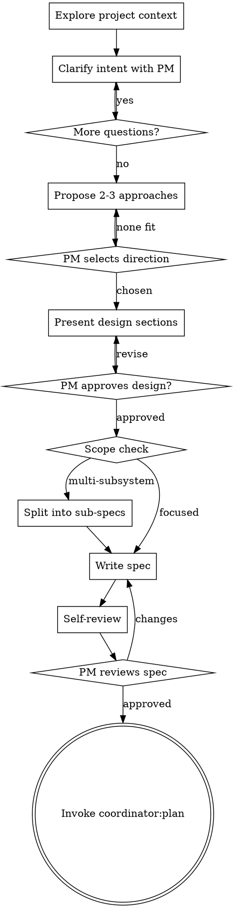

# Brainstorming

Turn the PM's intent into a design spec through collaborative dialogue. The PM decides what to
build; the EM shapes feasibility, flags constraints, proposes approaches. Output: a committed spec
that feeds `coordinator:plan`.

**Announce at start:** "Using brainstorming to explore the design before we plan implementation."

**When NOT to invoke:** a well-scoped next step on a known shape goes straight to
`coordinator:plan`, or just do it if trivial. Brainstorming is for genuine ambiguity in shape —
if the request would take 2+ rounds of "what is this even?" clarifying questions, it applies.

**vs. `coordinator:shape`:** siblings, not twins. Brainstorming is for *not knowing what to
build* (produces a solution artifact). `shape` is for *converging on a problem the PM already
holds*. Discriminator: PM wants confirmation you understood a problem → `shape`; PM doesn't know
what to build → `brainstorming`. Both terminate in `coordinator:plan`.

<HARD-GATE>
Once started, do NOT invoke any implementation skill, write code, scaffold a project, or dispatch
an executor until the spec is written and PM-approved. The only exit is a completed spec that
transitions to `coordinator:plan`. If the PM arrived with a clear spec, skip brainstorming
entirely — but once started, see it through.
</HARD-GATE>

The design can be lightweight — a few sentences for simple work — but it must exist and be
PM-approved before implementation. Simple-looking requests are where unexamined assumptions cause
the most rework; "we discussed it earlier" doesn't survive context compaction, the written spec
does.

## Process



**Terminal state:** the ONLY next step after brainstorming is `coordinator:plan`.

## Understanding Intent

<!-- BEGIN project-rag-preamble (synced from snippets/project-rag-preamble.md) -->
**Project-rag is project-scoped.** It indexes ONE specific codebase, configured at install time.
Before reaching for `mcp__*project-rag*` tools, confirm they index the codebase you're
investigating. If your target has no project-rag index, skip this preamble and use grep/Explore.

**If `mcp__*project-rag*` tools are available AND index your target, prefer them over
grep/Explore for code-shaped lookups.** Symbol-shaped → `project_cpp_symbol` /
`project_semantic_search`. Subsystem-shaped → `project_subsystem_profile`. Impact-shaped →
`project_referencers` depth=2. Fall through to grep/Explore only if RAG returns nothing and
staleness is plausible.
<!-- END project-rag-preamble -->

Check accumulated project knowledge first (architecture atlas, wikis, repo map) before reading
source. Clarifying questions: one per message, multiple choice when the decision space is
bounded, probing constraints rather than basics the PM has likely considered. Raise technical
concerns directly — honest counsel, not silent compliance. Independent subsystems each get their
own spec/plan/execution cycle — decompose first, then deep-dive each piece.

## Domain Language Discipline

If `CONTEXT.md` exists at the project root, read it before the first clarifying question; if
absent, proceed silently. Use its canonical terms; when the PM uses an `_Avoid_:`-listed synonym,
substitute and confirm: *"You said X — you mean &lt;canonical-term&gt;?"*

When the PM resolves a term during dialogue, update `CONTEXT.md` inline (don't batch): a `##
Terms` section, `**<Canonical term>** — one-sentence definition.` plus an `_Avoid_:` line of
synonyms actually seen. Lazily create the file on the first resolved term if it doesn't exist —
never scaffold it empty.

## Exploring Approaches, Presenting the Design

2-3 approaches with trade-offs (more creates decision paralysis), leading with your
recommendation — one sentence each on the idea, the trade-off, and when you'd choose it; say so
if one is clearly superior; flag a significant drawback even in a favored option. Scale each
design section to its complexity (a few sentences to ~300 words); ask after each whether it looks
right — incremental approval, not monolithic review. Cover as applicable: architecture,
components, data flow, interfaces, error handling, testing strategy. In existing codebases,
follow established patterns.

## Writing the Spec

**Save to:** `docs/specs/YYYY-MM-DD-<topic>-design.md` (create `docs/` if absent). Must carry
enough context for a cold-start agent to implement without conversation history.

**Self-review before presenting** (fix inline, no separate pass): no TBD/TODO/vague requirements;
no internal contradictions; scope focused enough for a single plan (split now if not); no
requirement readable two ways; `CONTEXT.md` updated for any term resolved in dialogue.

**Commit the spec**, then:

> "Spec written and committed to `<path>`. Please review — I'll hold on implementation until you
> approve."

Wait for PM response; apply changes and re-run self-review if requested.

## Spec Template

```markdown
# [Feature Name] Design Spec

**Date:** YYYY-MM-DD
**Status:** Draft | PM-Approved
**Goal:** [One sentence]

## Context
[What exists today, what problem this solves, why now.]

## Requirements
- [Requirement 1 — concrete, testable]

### Out of Scope
- [Thing we're NOT building and why]

## Design
### Architecture
### Components
### Interfaces
### Error Handling

## Trade-offs
| Decision | Chosen | Alternative | Why |

## Testing Strategy

## Open Questions
[Should be empty before PM approval.]
```

## Transition

Once the PM approves: **REQUIRED SUB-SKILL** `coordinator:plan`, spec file as input. No other
skill is a valid next step.
